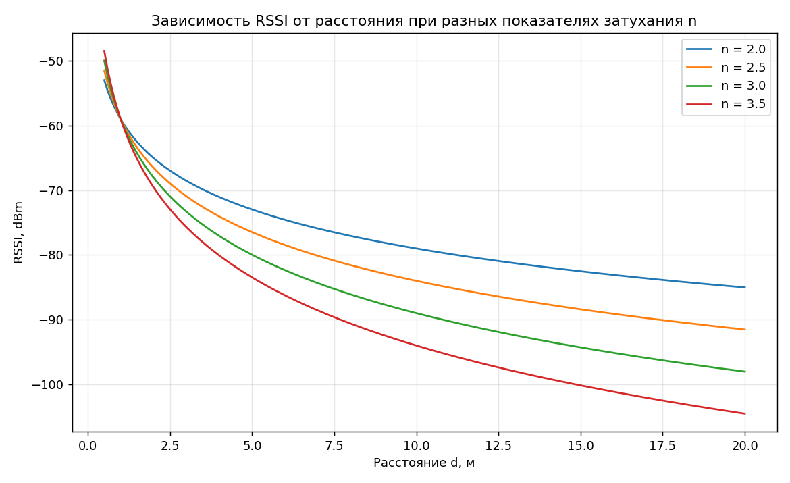
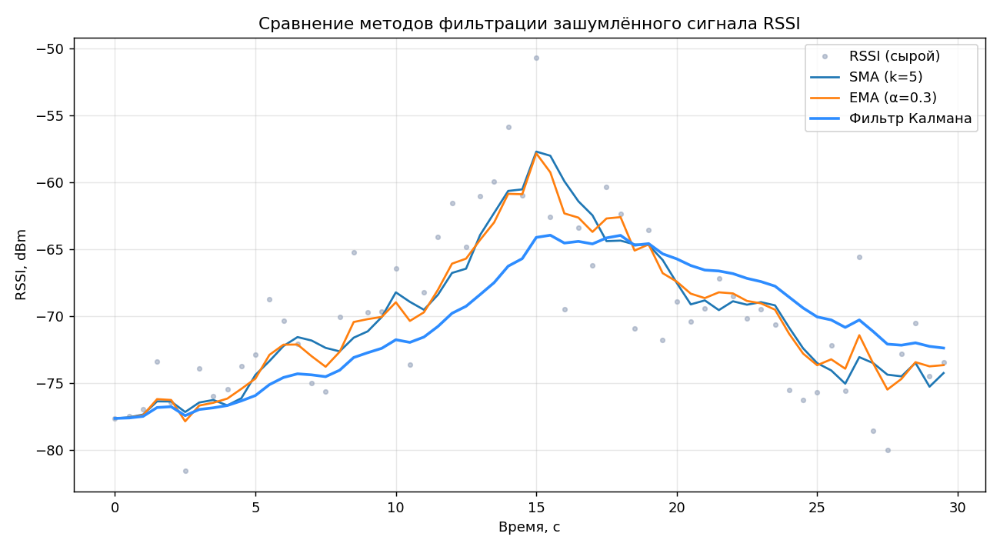
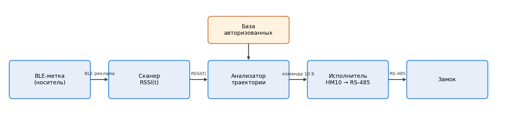
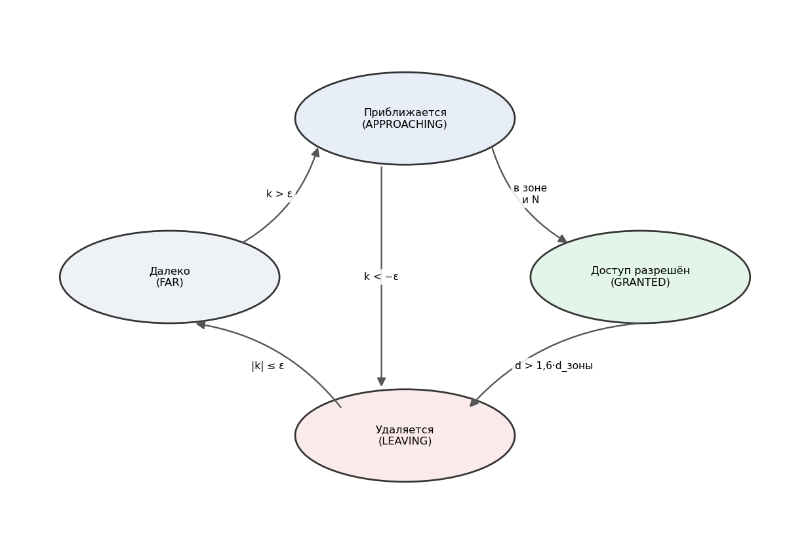
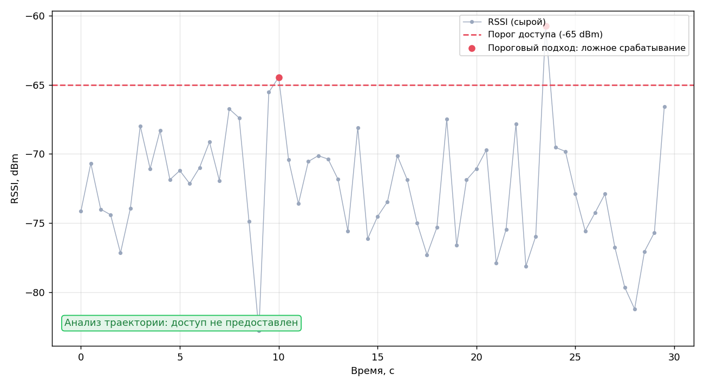
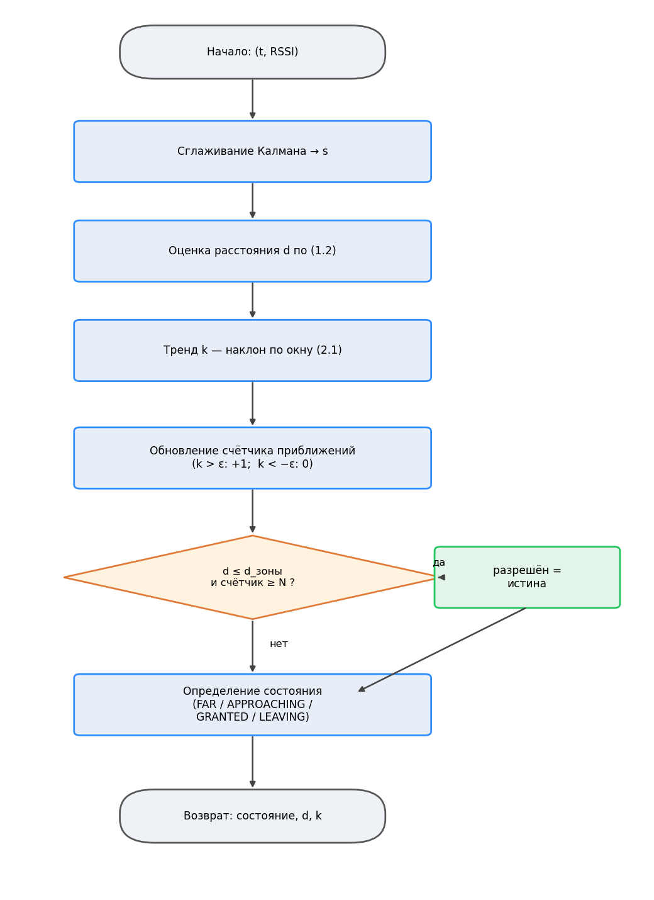
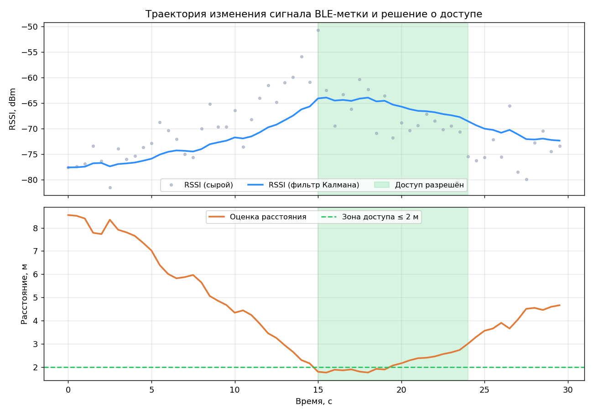

# Разработка системы контроля удалённого доступа на основе анализа траектории изменения сигнала BLE-меток

> Черновик пояснительной записки (Markdown). В конце конвертируется в .docx
> с оформлением по ГОСТ 7.32-2017 (Times New Roman 14, интервал 1.5).

---

## РЕФЕРАТ

Выпускная квалификационная работа изложена на ____ страницах, содержит 9 рисунков,
6 таблиц, 30 использованных источников и 3 приложения.

КОНТРОЛЬ ДОСТУПА, BLUETOOTH LOW ENERGY, BLE-МЕТКА, RSSI, ТРАЕКТОРИЯ СИГНАЛА, ФИЛЬТР
КАЛМАНА, ОЦЕНКА РАССТОЯНИЯ, КОНЕЧНЫЙ АВТОМАТ, СКУД

Объект исследования — системы контроля и управления удалённым доступом,
использующие беспроводные BLE-метки. Предмет исследования — методы и алгоритмы
анализа траектории изменения сигнала (RSSI) BLE-меток для принятия решения о
доступе.

Цель работы — разработать систему контроля удалённого доступа, принимающую решение
на основе анализа траектории изменения сигнала BLE-метки, и подтвердить её
работоспособность.

В результате работы разработаны архитектура и алгоритм системы, сочетающий
фильтрацию Калмана, оценку расстояния по модели затухания и конечный автомат
принятия решения на основе устойчивого тренда приближения. Реализованы программные
компоненты (сканер и генератор меток, анализатор траектории, мобильное приложение,
модуль управления замком) и проведено тестирование, подтвердившее работоспособность
системы и её устойчивость к ложным срабатываниям по сравнению с пороговым подходом.

---

## ABSTRACT

The graduation qualification work comprises ____ pages, 9 figures, 6 tables,
30 references and 3 appendices.

ACCESS CONTROL, BLUETOOTH LOW ENERGY, BLE TAG, RSSI, SIGNAL TRAJECTORY, KALMAN
FILTER, DISTANCE ESTIMATION, FINITE STATE MACHINE, ACCESS CONTROL SYSTEM

The object of research is remote access control systems based on wireless BLE tags.
The subject of research is methods and algorithms for analysing the trajectory of
BLE tag signal (RSSI) changes for access decision-making.

The aim of the work is to develop a remote access control system that makes the
access decision based on the analysis of the BLE tag signal trajectory, and to
verify its operability.

As a result, the architecture and the algorithm of the system have been developed,
combining Kalman filtering, distance estimation by a path-loss model and a finite
state machine that grants access upon a sustained approach trend. The software
components (tag scanner and generator, trajectory analyser, mobile application, lock
control module) have been implemented and tested, confirming the operability of the
system and its robustness against false triggering compared with the threshold
approach.

---

## СОДЕРЖАНИЕ

ТЕРМИНЫ И ОПРЕДЕЛЕНИЯ

ПЕРЕЧЕНЬ СОКРАЩЕНИЙ И ОБОЗНАЧЕНИЙ

ВВЕДЕНИЕ

1 АНАЛИЗ ПРЕДМЕТНОЙ ОБЛАСТИ И МЕТОДОВ ОБРАБОТКИ СИГНАЛА BLE-МЕТОК
- 1.1 Технология Bluetooth Low Energy и BLE-метки
- 1.2 Уровень принимаемого сигнала (RSSI) и модели оценки расстояния
- 1.3 Методы фильтрации сигнала и подходы к контролю доступа на основе BLE
- Выводы по главе 1

2 ПРОЕКТИРОВАНИЕ СИСТЕМЫ КОНТРОЛЯ ДОСТУПА НА ОСНОВЕ АНАЛИЗА ТРАЕКТОРИИ СИГНАЛА
- 2.1 Архитектура системы и взаимодействие компонентов
- 2.2 Алгоритм анализа траектории изменения сигнала и принятия решения о доступе
- 2.3 Протокол управления исполнительным устройством и сравнение с пороговым подходом
- Выводы по главе 2

3 ПРОГРАММНАЯ РЕАЛИЗАЦИЯ И ТЕСТИРОВАНИЕ СИСТЕМЫ
- 3.1 Реализация генератора и сканера BLE-меток
- 3.2 Реализация анализатора траектории и модуля принятия решения о доступе
- 3.3 Мобильное приложение, исполнительный модуль и тестирование системы
- Выводы по главе 3

ЗАКЛЮЧЕНИЕ

СПИСОК ИСПОЛЬЗОВАННЫХ ИСТОЧНИКОВ

ПРИЛОЖЕНИЕ А. Техническое задание
ПРИЛОЖЕНИЕ Б. Программа и методика испытаний
ПРИЛОЖЕНИЕ В. Листинг исходного кода

---

## ТЕРМИНЫ И ОПРЕДЕЛЕНИЯ

В настоящей работе применяются следующие термины с соответствующими определениями:

**Bluetooth Low Energy (BLE)** — энергоэффективная технология беспроводной передачи
данных малого радиуса действия.

**BLE-метка (маяк)** — устройство, периодически рассылающее рекламные пакеты с
уникальным идентификатором.

**Рекламный пакет (advertising)** — широковещательное сообщение BLE, передаваемое
без установления соединения.

**RSSI** — показатель уровня принимаемого радиосигнала, выраженный в
децибел-милливаттах.

**Траектория сигнала** — последовательность изменения уровня сигнала метки во
времени.

**Фильтр Калмана** — рекурсивный алгоритм оптимального оценивания состояния по
зашумлённым измерениям.

**Модель затухания (path loss)** — зависимость уровня принимаемого сигнала от
расстояния до источника.

**Конечный автомат** — модель поведения в виде набора состояний и переходов между
ними.

**Зона доступа** — область вблизи считывателя, при устойчивом входе в которую
предоставляется доступ.

**Система контроля и управления доступом (СКУД)** — совокупность программно-аппаратных
средств, обеспечивающих разграничение доступа.

---

## ПЕРЕЧЕНЬ СОКРАЩЕНИЙ И ОБОЗНАЧЕНИЙ

В настоящей выпускной квалификационной работе применяют следующие сокращения и
обозначения:

API — программный интерфейс приложения (Application Programming Interface)

BLE — Bluetooth Low Energy

GAP — профиль доступа (Generic Access Profile)

GATT — профиль атрибутов (Generic Attribute Profile)

ISM — диапазон для промышленных, научных и медицинских применений

MAC — адрес управления доступом к среде (Media Access Control)

RSSI — показатель уровня принимаемого сигнала (Received Signal Strength Indicator)

UUID — универсальный уникальный идентификатор

дБм — децибел-милливатт

МНК — метод наименьших квадратов

СКУД — система контроля и управления доступом

RS-485 — стандарт интерфейса последовательной передачи данных

---

## ВВЕДЕНИЕ

**Актуальность темы.** Развитие технологий интернета вещей и повсеместное
распространение энергоэффективной беспроводной связи привели к активному
внедрению бесконтактных систем контроля и управления доступом (СКУД).
Традиционные средства идентификации — контактные карты, радиочастотные брелоки,
PIN-коды — требуют осознанного действия пользователя, подвержены копированию и
передаче третьим лицам, а также не позволяют реализовать сценарий
«доступ по присутствию», когда вход предоставляется носителю идентификатора
автоматически при приближении к точке доступа.

Технология Bluetooth Low Energy (BLE) является удобной основой для построения
подобных систем: она поддерживается практически всеми современными смартфонами,
отличается низким энергопотреблением и позволяет использовать как специализированные
BLE-метки, так и пользовательские устройства в качестве носителей идентификатора.
Оценка близости носителя к считывателю традиционно выполняется по уровню
принимаемого сигнала (RSSI, Received Signal Strength Indicator).

Однако величина RSSI существенно зашумлена и нестабильна: на неё влияют
переотражения сигнала, экранирование телом человека, ориентация антенны и помехи
от других радиоустройств. Вследствие этого решение о предоставлении доступа,
принимаемое по одному мгновенному значению RSSI или по простому порогу,
оказывается ненадёжным — возникают ложные срабатывания, система чувствительна к
случайным всплескам сигнала и не отличает целенаправленное приближение носителя
от статичного присутствия метки поблизости или поднесения сигнала извне.

В связи с этим актуальной является задача принятия решения о доступе не по
мгновенному значению, а по **траектории изменения сигнала во времени**. Анализ
динамики RSSI (сглаживание, оценка дистанции, выявление устойчивого тренда
приближения) позволяет повысить устойчивость системы к шуму и несанкционированным
срабатываниям, что и определяет тему настоящей работы.

**Объект исследования** — системы контроля и управления удалённым доступом,
использующие беспроводные BLE-метки.

**Предмет исследования** — методы и алгоритмы анализа траектории изменения уровня
сигнала (RSSI) BLE-меток во времени для принятия решения о предоставлении доступа.

**Цель работы** — разработать систему контроля удалённого доступа, принимающую
решение на основе анализа траектории изменения сигнала BLE-метки, и подтвердить
её работоспособность.

Для достижения поставленной цели решаются следующие **задачи**:
1. провести обзор технологии BLE, методов оценки расстояния по RSSI и существующих
   подходов к контролю доступа; выполнить их классификацию и обосновать выбор
   метода анализа траектории сигнала;
2. разработать модель и архитектуру системы контроля доступа на основе анализа
   траектории сигнала BLE-метки;
3. разработать алгоритм анализа траектории RSSI: сглаживание сигнала, оценку
   дистанции, определение тренда приближения и конечный автомат принятия решения;
4. реализовать программные компоненты системы — генератор и сканер BLE-меток,
   анализатор траектории, мобильное приложение и исполнительный модуль управления
   замком;
5. провести тестирование системы и оценить её работоспособность на основе
   имитационного моделирования и натурных измерений.

**Научная новизна** заключается в применении анализа траектории изменения RSSI
(сочетание фильтрации Калмана, оценки дистанции по модели затухания и конечного
автомата на основе тренда приближения) для принятия решения о доступе, что
повышает устойчивость к шуму и несанкционированным срабатываниям по сравнению с
пороговым методом.

**Практическая значимость** состоит в том, что разработан программный комплекс,
включающий генератор и сканер BLE-меток, анализатор траектории сигнала, мобильное
приложение и исполнительный модуль управления электронным замком по каналу
BLE → RS-485, пригодный для построения систем контроля удалённого доступа.

**Структура работы.** Работа состоит из введения, трёх глав, заключения, списка
использованных источников и приложений. В первой главе проводится анализ
предметной области и методов обработки сигнала BLE-меток. Во второй главе
разрабатываются архитектура системы и алгоритм анализа траектории. В третьей главе
описывается программная реализация и приводятся результаты тестирования.

---

## 1 АНАЛИЗ ПРЕДМЕТНОЙ ОБЛАСТИ И МЕТОДОВ ОБРАБОТКИ СИГНАЛА BLE-МЕТОК

Настоящая глава носит обзорно-теоретический характер. В ней рассматривается
технология Bluetooth Low Energy как основа построения систем контроля доступа,
анализируются типы BLE-меток и форматы рекламных пакетов, исследуется природа
показателя уровня принимаемого сигнала (RSSI) и модели оценки расстояния по нему,
а также проводится классификация методов фильтрации сигнала и подходов к принятию
решения о доступе. На основе проведённого анализа обосновывается выбор метода
анализа траектории изменения сигнала, используемого в последующих главах.

### 1.1 Технология Bluetooth Low Energy и BLE-метки

#### 1.1.1 Принципы технологии Bluetooth Low Energy

Bluetooth Low Energy (BLE) — энергоэффективная разновидность технологии
беспроводной передачи данных малого радиуса действия, представленная в
спецификации Bluetooth Core 4.0 (2010 г.) и получившая дальнейшее развитие в
версиях 4.1–5.x [1]. В отличие от классического Bluetooth (BR/EDR),
ориентированного на потоковую передачу данных, BLE спроектирован для устройств с
жёсткими ограничениями по энергопотреблению — датчиков, носимой электроники,
меток, — которые передают небольшие порции данных через значительные интервалы
времени и большую часть времени находятся в спящем режиме [2].

BLE использует нелицензируемый диапазон 2,4 ГГц (ISM), разделённый на 40 каналов
шириной 2 МГц. Три из них (с индексами 37, 38 и 39) выделены под передачу
рекламных пакетов (advertising) и расположены в спектре так, чтобы минимизировать
взаимные помехи с распространёнными каналами Wi-Fi; остальные 37 каналов
используются для передачи данных в установленном соединении [1].

Профиль доступа к атрибутам (GAP, Generic Access Profile) определяет четыре роли
устройств: широковещатель (broadcaster) и наблюдатель (observer) — для режима без
установления соединения, а также периферийное (peripheral) и центральное
(central) устройства — для режима соединения. Таким образом, BLE поддерживает два
принципиально разных режима взаимодействия:

- **рекламный (широковещательный) режим** — устройство периодически рассылает
  рекламные пакеты по трём каналам; любой наблюдатель в радиусе действия может их
  принять, не устанавливая соединения;
- **режим соединения** — между центральным и периферийным устройствами
  устанавливается двунаправленный канал обмена данными по протоколу GATT.

Для систем, основанных на BLE-метках, ключевым является именно рекламный режим:
метка выступает широковещателем и периодически рассылает идентифицирующие пакеты,
а считыватель (сканер) выступает наблюдателем, принимает эти пакеты и измеряет
уровень их сигнала. Поскольку соединение не устанавливается, одна точка приёма
способна одновременно обслуживать большое число меток, что обеспечивает
масштабируемость и низкое энергопотребление меток [3].

#### 1.1.2 BLE-метки и форматы рекламных пакетов

BLE-метка (маяк, beacon) — это устройство, периодически рассылающее рекламные
пакеты с уникальным идентификатором. Содержимое рекламного пакета формируется в
соответствии с одним из стандартизированных форматов. Наибольшее распространение
получили следующие форматы [4]:

- **iBeacon** (Apple) — закрытый, но широко поддерживаемый формат. Полезная
  нагрузка передаётся в поле производителя (Manufacturer Specific Data) и включает
  128-битный идентификатор UUID, два 16-битных поля Major и Minor, а также
  калиброванное значение мощности TxPower (RSSI на расстоянии 1 м). Идентификация
  метки выполняется по комбинации UUID/Major/Minor;
- **Eddystone** (Google) — открытый формат, передаваемый в поле служебных данных
  (Service Data, UUID 0xFEAA). Поддерживает несколько типов кадров: UID
  (идентификатор пространства имён и экземпляра), URL (сжатый веб-адрес), TLM
  (телеметрия — напряжение батареи, температура) и EID (шифрованный
  идентификатор);
- **AltBeacon** — открытая альтернатива iBeacon, не привязанная к конкретному
  производителю;
- **пользовательские форматы** — произвольные данные, размещаемые в полях
  Manufacturer Specific Data или Service Data; применяются, когда требуется
  передавать прикладную информацию, отличную от стандартных схем.

Сравнительная характеристика основных форматов приведена в таблице 1.1.

Таблица 1.1 — Сравнение форматов BLE-меток

| Формат | Разработчик | Состав идентификатора | Открытость | Особенности |
|--------|-------------|------------------------|------------|-------------|
| iBeacon | Apple | UUID + Major + Minor + TxPower | Закрытый | Широкая поддержка, простая идентификация |
| Eddystone | Google | UID / URL / TLM / EID | Открытый | Несколько типов кадров, телеметрия |
| AltBeacon | Radius Networks | произвольный (до 20 байт) | Открытый | Гибкость, не привязан к вендору |
| Пользовательский | — | задаётся разработчиком | Открытый | Передача прикладных данных |

Независимо от формата, общим для всех меток является принцип работы: метка
периодически (как правило, с интервалом от 100 мс до нескольких секунд) рассылает
рекламные пакеты, а считыватель при приёме каждого пакета фиксирует идентификатор
метки и измеряет уровень сигнала RSSI. Именно динамика RSSI во времени является
исходными данными для анализа траектории, рассматриваемого в настоящей работе.

#### 1.1.3 Области применения и классификация BLE-меток

Технология BLE-меток применяется в широком спектре задач [3, 5]:

- навигация и позиционирование внутри помещений (indoor positioning), где
  отсутствует сигнал спутниковых систем;
- проксимити-маркетинг — выдача контента при приближении пользователя к товару
  или зоне;
- учёт и отслеживание материальных активов (asset tracking);
- определение присутствия и контроль доступа — предоставление доступа носителю
  метки при его приближении к точке прохода.

BLE-метки можно классифицировать по нескольким признакам:

- по формату рекламного пакета — iBeacon, Eddystone, AltBeacon, пользовательские;
- по типу носителя — специализированные аппаратные метки и программные метки на
  базе смартфона, выступающего широковещателем;
- по мощности передатчика и дальности — от меток ближнего радиуса (доли метра) до
  меток с дальностью в десятки метров.

Настоящая работа ориентирована на сценарий контроля доступа, в котором носителем
метки может выступать как аппаратная метка, так и смартфон, а решение принимается
по динамике уровня сигнала, измеряемого одним считывателем.

#### 1.1.4 Стек протоколов и структура рекламного пакета

Архитектура BLE построена по уровневому принципу и разделена на контроллер и хост.
Контроллер включает физический уровень (PHY) и канальный уровень (Link Layer);
хост — протокол адаптации и управления логическими каналами (L2CAP), протокол
атрибутов (ATT), профиль обобщённых атрибутов (GATT) и профиль доступа (GAP).
Физический уровень использует гауссову частотную манипуляцию (GFSK) и обеспечивает
базовую скорость 1 Мбит/с. Канальный уровень формирует пакеты, управляет
состояниями устройства (ожидание, реклама, сканирование, соединение) и реализует
адаптивную перестройку частоты в режиме соединения.

Рекламный пакет канального уровня содержит заголовок и полезную нагрузку, размер
которой в базовом режиме не превышает 31 байта. Полезная нагрузка состоит из
последовательности структур данных AD (Advertising Data), каждая из которых
включает поле длины, поле типа и значение. Идентификатор метки размещается в
структуре типа Manufacturer Specific Data (для формата iBeacon) или Service Data
(для формата Eddystone). Ограничение в 31 байт определяет максимальный объём
идентифицирующей информации, передаваемой меткой в одном пакете, что учитывалось
при выборе формата идентификатора носителя в настоящей работе.

#### 1.1.5 Эволюция версий BLE и параметры вещания

Технология BLE последовательно развивалась от версии 4.0 к версии 5.x. Версия 4.2
повысила защищённость соединений и эффективность передачи данных. Версия 5.0
ввела режим 2M PHY с удвоенной скоростью передачи, режим Coded PHY (LE Long Range)
с увеличенной дальностью за счёт помехоустойчивого кодирования, а также расширенную
рекламу (Extended Advertising), снимающую ограничение в 31 байт и позволяющую
передавать больший объём данных в рекламном режиме. Эти возможности расширяют
область применения BLE-меток, однако для задачи контроля доступа достаточно
базового рекламного режима.

Важным параметром вещания является интервал рекламы (advertising interval) —
период рассылки рекламных пакетов, который согласно спецификации может составлять
от 20 мс до 10,24 с. Меньший интервал ускоряет обнаружение метки и повышает частоту
обновления значений RSSI, что благоприятно для анализа траектории, но увеличивает
энергопотребление метки. Таким образом, выбор интервала вещания представляет собой
компромисс между быстротой реакции системы и временем автономной работы метки. Для
анализа траектории существенно, чтобы частота обновления RSSI обеспечивала
достаточное число измерений за время прохождения носителя через зону доступа.

### 1.2 Уровень принимаемого сигнала (RSSI) и модели оценки расстояния

#### 1.2.1 Понятие RSSI и его связь с расстоянием

Показатель уровня принимаемого сигнала (RSSI, Received Signal Strength Indicator) —
это измеряемая приёмником величина мощности принятого радиосигнала, выражаемая в
децибел-милливаттах (dBm). Для BLE типичные значения RSSI лежат в диапазоне
примерно от −30 dBm (метка вплотную к приёмнику) до −100 dBm (метка на границе
зоны приёма) [6].

Физической основой оценки расстояния по RSSI является затухание мощности
радиосигнала по мере удаления от источника: чем дальше метка, тем слабее
принимаемый сигнал. Эта зависимость описывается логарифмической моделью затухания
в среде с потерями (log-distance path loss model) [6, 7]:

RSSI(d) = RSSI(d₀) − 10·n·lg(d / d₀),     (1.1)

где RSSI(d) — уровень сигнала на расстоянии d, dBm; RSSI(d₀) — уровень сигнала на
опорном расстоянии d₀ (обычно d₀ = 1 м), dBm; n — показатель затухания среды
(path-loss exponent); d — расстояние до метки, м.

Приняв в качестве опорного расстояние d₀ = 1 м и обозначив RSSI(1) = A
(калиброванная мощность, TxPower), из выражения (1.1) можно получить формулу
оценки расстояния по измеренному RSSI:

d = 10^((A − RSSI) / (10·n)).     (1.2)

Параметр A соответствует значению RSSI, измеренному на расстоянии 1 м от метки, и
зависит от конкретного устройства (типичное значение около −59 dBm). Показатель
затухания n характеризует среду распространения: в свободном пространстве n ≈ 2, в
помещениях с переотражениями и препятствиями n принимает значения от 2 до 4 [7].
Зависимость RSSI от расстояния при различных значениях n приведена на рисунке 1.1.



Рисунок 1.1 — Зависимость уровня сигнала RSSI от расстояния при различных
показателях затухания среды n

#### 1.2.2 Факторы, влияющие на точность оценки

На практике оценка расстояния по формуле (1.2) обладает значительной
погрешностью, обусловленной рядом факторов [6, 8]:

- **многолучевое распространение и замирания** — сигнал достигает приёмника по
  нескольким путям (прямой и переотражённые), что приводит к интерференции и
  колебаниям RSSI;
- **экранирование телом человека** — поглощение сигнала телом носителя метки
  может снижать RSSI на 10 dBm и более;
- **ориентация и положение антенн** — диаграмма направленности антенн метки и
  приёмника неидеальна, поэтому при одном и том же расстоянии RSSI зависит от
  взаимной ориентации устройств;
- **помехи в диапазоне 2,4 ГГц** — сети Wi-Fi, другие устройства Bluetooth,
  бытовая техника создают помехи;
- **неоднородность среды** — мебель, стены, люди изменяют эффективное значение n.

Вследствие перечисленных факторов измеряемый RSSI представляет собой
нестационарный зашумлённый сигнал с дисперсией в несколько dBm даже при
неподвижной метке. Прямое применение формулы (1.2) к «сырому» RSSI даёт оценку
расстояния, скачкообразно меняющуюся в широких пределах, что недопустимо для
надёжного принятия решения о доступе. Это обуславливает необходимость
предварительной фильтрации сигнала и анализа его динамики во времени.

#### 1.2.3 Методы определения местоположения по RSSI

В литературе выделяют несколько групп методов определения местоположения по RSSI
[5, 8]:

- **трилатерация** — оценка координат по расстояниям до трёх и более
  приёмников с известными положениями; требует развёрнутой инфраструктуры
  считывателей;
- **метод опорных точек (fingerprinting)** — предварительное построение карты
  значений RSSI в характерных точках и последующее сопоставление текущих измерений
  с картой; требует трудоёмкого этапа калибровки;
- **проксимити-методы (по близости)** — определение факта нахождения метки вблизи
  одного считывателя без вычисления точных координат.

Для задачи контроля доступа, в которой существенен не точный расчёт координат, а
факт целенаправленного приближения носителя к точке прохода, наиболее
рационален проксимити-подход с одним считывателем, дополненный анализом динамики
сигнала во времени. Такой подход не требует развёртывания нескольких приёмников и
трудоёмкой калибровки карты, что определяет его практическую применимость.

#### 1.2.4 Стохастическая модель сигнала и калибровка параметров

Детерминированная модель (1.1) описывает лишь средний уровень сигнала на заданном
расстоянии. Реальный RSSI подвержен случайным отклонениям от среднего, которые
учитываются логнормальной моделью теневого затухания:

RSSI(d) = A − 10·n·lg(d) + X,

где X — гауссова случайная величина с нулевым математическим ожиданием и
среднеквадратическим отклонением σ (теневое затухание), отражающая влияние
переотражений и экранирования. Типичные значения σ в помещениях составляют
4–10 dBm. Наличие случайной составляющей означает, что при фиксированном расстоянии
измеренный RSSI образует распределение, а не единственное значение.

Из логарифмического характера модели следует важное свойство: погрешность оценки
расстояния возрастает с увеличением расстояния. Вблизи метки изменение RSSI на
1 dBm соответствует малому изменению расстояния, тогда как на большом удалении то же
изменение RSSI соответствует значительному изменению оценки расстояния. Это
обуславливает выбор небольшого радиуса зоны доступа, в пределах которого оценка
расстояния наиболее точна.

Параметры модели подлежат калибровке. Значение A определяется измерением RSSI на
расстоянии 1 м от метки, показатель n — по серии измерений на известных
расстояниях с последующей аппроксимацией. Следует учитывать, что значения RSSI
могут различаться по трём рекламным каналам (37, 38, 39), а также зависеть от
конкретного экземпляра приёмопередатчика, что вносит дополнительную погрешность и
усиливает необходимость фильтрации и анализа динамики сигнала, а не отдельных
измерений.

### 1.3 Методы фильтрации сигнала и подходы к контролю доступа на основе BLE

#### 1.3.1 Методы фильтрации RSSI

Для подавления шума измеряемого RSSI применяются различные методы цифровой
фильтрации [8, 9]:

- **скользящее среднее (SMA)** — усреднение последних k измерений; просто в
  реализации, но вносит запаздывание, пропорциональное размеру окна, и слабо
  подавляет выбросы;
- **экспоненциальное скользящее среднее (EMA)** — рекурсивное сглаживание с
  весовым коэффициентом α: s_t = α·z_t + (1 − α)·s_{t−1}; не требует хранения
  окна, но требует подбора α как компромисса между сглаживанием и
  запаздыванием;
- **медианный фильтр** — замена значения медианой окна; эффективно устраняет
  одиночные выбросы, но также вносит запаздывание;
- **фильтр Калмана** — рекурсивный оптимальный (в смысле минимума
  среднеквадратической ошибки) алгоритм оценивания, рассматривающий RSSI как
  зашумлённое наблюдение скрытого состояния. На каждом шаге выполняются прогноз и
  коррекция оценки с учётом дисперсий шума процесса (q) и шума измерения (r). Для
  одномерного случая коэффициент Калмана и обновление оценки имеют вид:

  K = p / (p + r),     s_t = s_{t−1} + K·(z_t − s_{t−1}),     (1.3)

  где p — дисперсия ошибки оценки, обновляемая на каждом шаге. Фильтр Калмана
  обеспечивает хорошее подавление шума при меньшем запаздывании, чем скользящее
  среднее, и не требует хранения окна измерений, что делает его удобным для
  потоковой обработки RSSI [9].

Сравнение методов фильтрации приведено в таблице 1.2, иллюстрация их работы на
зашумлённом сигнале — на рисунке 1.2.

Таблица 1.2 — Сравнение методов фильтрации RSSI

| Метод | Подавление шума | Запаздывание | Память | Сложность |
|-------|------------------|--------------|--------|-----------|
| Скользящее среднее (SMA) | Среднее | Высокое | Окно k | Низкая |
| Экспоненциальное (EMA) | Среднее | Среднее | Нет | Низкая |
| Медианный фильтр | Высокое (выбросы) | Среднее | Окно k | Средняя |
| Фильтр Калмана | Высокое | Низкое | Нет | Средняя |



Рисунок 1.2 — Сравнение методов фильтрации зашумлённого сигнала RSSI

#### 1.3.2 Подходы к принятию решения о доступе

Анализ литературы и существующих решений позволяет выделить следующие подходы к
принятию решения о предоставлении доступа на основе сигнала BLE-метки [5, 10]:

- **пороговый подход** — доступ предоставляется, если мгновенное значение RSSI
  превышает заданный порог. Подход предельно прост, однако крайне чувствителен к
  шуму: случайный всплеск RSSI вызывает ложное срабатывание, а экранирование —
  ложный отказ. Кроме того, пороговый подход не различает направление движения
  носителя и уязвим к удержанию метки вблизи считывателя или к ретрансляции
  сигнала;
- **накопление выборок с гистерезисом** — доступ предоставляется при выполнении
  условия в течение нескольких последовательных измерений; снижает число ложных
  срабатываний по сравнению с однократным порогом, но по-прежнему основан на
  статическом уровне сигнала и не учитывает его динамику;
- **анализ траектории (динамики) сигнала** — решение принимается на основе
  изменения сглаженного сигнала во времени: выявляется устойчивый тренд
  приближения носителя к считывателю и факт входа в зону доступа. Подход устойчив
  к одиночным выбросам и статичному присутствию метки, а также затрудняет
  несанкционированный доступ, поскольку требует именно характерной траектории
  приближения;
- **методы машинного обучения** — классификация состояния доступа по признакам
  сигнала с помощью алгоритмов (k ближайших соседей, деревья решений, нейронные
  сети); обеспечивают высокую точность, но требуют сбора обучающей выборки и
  обладают большей вычислительной сложностью.

Сравнение подходов приведено в таблице 1.3.

Таблица 1.3 — Сравнение подходов к принятию решения о доступе

| Подход | Устойчивость к шуму | Учёт динамики | Защита от ложных срабатываний | Сложность |
|--------|---------------------|---------------|-------------------------------|-----------|
| Пороговый | Низкая | Нет | Низкая | Низкая |
| Накопление выборок | Средняя | Частично | Средняя | Низкая |
| Анализ траектории | Высокая | Да | Высокая | Средняя |
| Машинное обучение | Высокая | Да | Высокая | Высокая |

#### 1.3.3 Проблема несанкционированного доступа

Отдельного внимания заслуживает устойчивость системы к попыткам
несанкционированного доступа. Для систем на основе RSSI характерны угрозы
удержания метки вблизи считывателя, копирования идентификатора метки, а также
атаки ретрансляции (relay), при которых сигнал метки усиливается или
ретранслируется на расстояние [10]. Пороговые методы практически не защищены от
подобных воздействий, так как реагируют на сам факт наличия достаточно сильного
сигнала. Анализ траектории повышает устойчивость к части этих угроз: для
предоставления доступа требуется не просто сильный сигнал, а характерная динамика
приближения, которую сложнее воспроизвести случайно или искусственно.

#### 1.3.4 Требования к системе контроля доступа и критерии выбора метода

На основании проведённого анализа сформулированы требования к разрабатываемой
системе. Функциональные требования: приём рекламных пакетов и измерение RSSI во
времени; подавление шума измерений; оценка расстояния до носителя; определение
факта устойчивого приближения; проверка полномочий носителя; формирование команды
управления исполнительным устройством. Нефункциональные требования: устойчивость к
случайным колебаниям сигнала и отсутствие ложных срабатываний; приемлемая задержка
принятия решения; умеренная вычислительная сложность, допускающая работу на
маломощных устройствах; масштабируемость по числу одновременно сопровождаемых
носителей.

Выбор метода принятия решения выполнен по совокупности критериев: устойчивость к
шуму, учёт направления движения носителя, защищённость от ложных и
несанкционированных срабатываний, вычислительная сложность и потребность в обучающей
выборке. Пороговый метод и накопление выборок просты, но не учитывают динамику
сигнала. Методы машинного обучения обеспечивают высокую точность, однако требуют
сбора и разметки данных и большего объёма вычислений. Метод анализа траектории
обеспечивает компромисс: он учитывает динамику сигнала, устойчив к шуму и ложным
срабатываниям, не требует обучающей выборки и реализуем с умеренными вычислительными
затратами. Совокупность указанных критериев определила его выбор в качестве
основного метода настоящей работы.

### Выводы по главе 1

В результате анализа предметной области установлено следующее.

1. Технология Bluetooth Low Energy благодаря низкому энергопотреблению, широкой
   поддержке мобильными устройствами и рекламному режиму работы является
   рациональной основой для построения систем контроля удалённого доступа по
   присутствию носителя метки. В качестве исходных данных система использует
   динамику уровня сигнала RSSI, измеряемого считывателем.

2. Оценка расстояния по RSSI описывается логарифмической моделью затухания
   (выражения (1.1), (1.2)), однако измеряемый сигнал является зашумлённым и
   нестационарным вследствие многолучевого распространения, экранирования и помех.
   Поэтому решение о доступе по мгновенному значению RSSI ненадёжно и требует
   предварительной фильтрации и анализа динамики сигнала.

3. Сравнительный анализ методов фильтрации показал, что для потоковой обработки
   RSSI предпочтителен фильтр Калмана, обеспечивающий хорошее подавление шума при
   малом запаздывании и без хранения окна измерений.

4. Сравнение подходов к принятию решения о доступе показало, что пороговый подход
   и простое накопление выборок не учитывают динамику сигнала и слабо защищены от
   ложных и несанкционированных срабатываний, тогда как анализ траектории
   изменения сигнала обеспечивает более высокую устойчивость к шуму и попыткам
   несанкционированного доступа при умеренной вычислительной сложности.

На основании изложенного в качестве метода принятия решения о доступе в настоящей
работе выбран анализ траектории изменения сигнала BLE-метки, сочетающий фильтрацию
Калмана, оценку расстояния по модели затухания и определение устойчивого тренда
приближения. Разработке архитектуры системы и алгоритма на основе данного метода
посвящена вторая глава.

---

## 2 ПРОЕКТИРОВАНИЕ СИСТЕМЫ КОНТРОЛЯ ДОСТУПА НА ОСНОВЕ АНАЛИЗА ТРАЕКТОРИИ СИГНАЛА

В настоящей главе рассматривается предмет исследования — методы и алгоритмы
анализа траектории изменения сигнала BLE-метки для принятия решения о доступе.
Разрабатывается архитектура системы и определяется взаимодействие её компонентов,
формализуется алгоритм анализа траектории и принятия решения, описывается протокол
управления исполнительным устройством, а также проводится сравнительный анализ
предложенного подхода с пороговым.

### 2.1 Архитектура системы и взаимодействие компонентов

#### 2.1.1 Функциональные требования к системе

На основании выводов первой главы к разрабатываемой системе контроля удалённого
доступа предъявляются следующие основные функциональные требования:

- приём рекламных пакетов BLE-метки и измерение уровня сигнала RSSI во времени;
- идентификация носителя метки и проверка его полномочий по базе авторизованных
  устройств;
- принятие решения о доступе на основе анализа траектории изменения сигнала
  (устойчивого приближения носителя в зону доступа), а не по мгновенному значению
  RSSI;
- устойчивость к шуму измерений и к ложным срабатываниям;
- формирование команды управления исполнительным устройством (электронным замком)
  при предоставлении доступа.

#### 2.1.2 Состав и структура системы

Система строится по модульному принципу и включает пять основных компонентов:

1. **BLE-метка (носитель доступа)** — аппаратная метка или смартфон, периодически
   рассылающий рекламные пакеты с идентификатором носителя;
2. **Сканер (считыватель)** — устройство, принимающее рекламные пакеты, выделяющее
   идентификатор метки и измеряющее RSSI при каждом приёме, формируя временной ряд
   значений сигнала;
3. **Анализатор траектории** — программный модуль, выполняющий сглаживание RSSI
   фильтром Калмана, оценку расстояния, вычисление тренда и принятие решения о
   доступе посредством конечного автомата;
4. **Модуль авторизации** — проверяет идентификатор носителя по базе авторизованных
   устройств; решение о доступе принимается только для разрешённых носителей;
5. **Исполнительный модуль** — преобразователь BLE → RS-485 (модуль HM10) и
   подключённый к шине контроллер замка, выполняющий команду открытия.

Структурная схема системы и потоки данных между компонентами приведены на
рисунке 2.1.



Рисунок 2.1 — Структурная схема системы контроля доступа

#### 2.1.3 Взаимодействие компонентов

Взаимодействие компонентов происходит по следующему сценарию. BLE-метка
непрерывно рассылает рекламные пакеты. Сканер, находясь в режиме наблюдателя,
принимает эти пакеты и для каждого фиксирует идентификатор метки и значение RSSI с
отметкой времени, формируя временной ряд. Полученный ряд поступает в анализатор
траектории, который сглаживает сигнал, оценивает расстояние и динамику приближения
и определяет текущее состояние доступа. Параллельно модуль авторизации проверяет,
входит ли идентификатор носителя в число разрешённых.

При одновременном выполнении двух условий — носитель авторизован и анализатор
зафиксировал устойчивое приближение в зону доступа — формируется команда открытия,
которая передаётся исполнительному модулю. Команда поступает на преобразователь
BLE → RS-485 (HM10) и далее по шине RS-485 — на контроллер замка. Контроллер
обращается к таблице замков: если запрашиваемый замок присутствует в таблице,
выполняется открытие; в противном случае запрос перенаправляется на центральный
узел системы. Такое построение обеспечивает локальную обработку типовых запросов и
централизованную обработку исключительных случаев.

Выбор архитектуры с одним сканером (проксимити-подход) обоснован в первой главе:
для задачи контроля доступа существенен факт целенаправленного приближения
носителя к точке прохода, а не вычисление его точных координат, что позволяет
отказаться от развёртывания нескольких приёмников и трудоёмкой калибровки.

#### 2.1.4 Маршрутизация запросов и развёртывание

Исполнительная часть системы построена с учётом возможного наличия нескольких
замков, подключённых к шине RS-485. Команда, поступающая от мобильного приложения
через преобразователь HM10, содержит номер замка, по которому контроллер на шине
определяет адресата. Предусмотрена двухуровневая логика обработки: если запрашиваемый
замок присутствует в локальной таблице контроллера, открытие выполняется локально;
если номер замка в таблице отсутствует, запрос перенаправляется на центральный узел
системы. Такое разделение обеспечивает быструю обработку типовых обращений и
централизованную обработку исключительных случаев, а также упрощает расширение
системы добавлением новых замков.

С точки зрения развёртывания считыватель и преобразователь размещаются вблизи точки
прохода. Поскольку используется один считыватель и проксимити-подход, внедрение не
требует калибровки карты сигналов и установки нескольких приёмников, что снижает его
трудоёмкость. При необходимости повышения точности локализации архитектура допускает
расширение до нескольких считывателей с применением методов трилатерации,
рассмотренных в первой главе.

### 2.2 Алгоритм анализа траектории изменения сигнала и принятия решения о доступе

Центральным элементом системы является алгоритм анализа траектории. Он
преобразует зашумлённый временной ряд RSSI в решение о доступе и состоит из
четырёх последовательных этапов: сглаживание, оценка расстояния, оценка тренда и
принятие решения конечным автоматом.

#### 2.2.1 Сглаживание сигнала и оценка расстояния

На вход алгоритма поступают пары (t, RSSI), где t — момент приёма рекламного
пакета. Каждое новое измерение RSSI обрабатывается фильтром Калмана (1.3),
формирующим сглаженную оценку уровня сигнала и подавляющим измерительный шум.
По сглаженному значению RSSI оценивается расстояние до метки согласно модели
затухания (1.2).

Применение фильтра Калмана, как показано в первой главе, обеспечивает малое
запаздывание при хорошем подавлении шума, что критично для своевременного и
устойчивого определения момента входа носителя в зону доступа.

#### 2.2.2 Оценка тренда приближения

Для определения направления движения носителя вычисляется тренд — наклон
сглаженного сигнала RSSI на окне из последних w измерений. Наклон оценивается
методом наименьших квадратов:

k = Σ(tᵢ − t̄)(sᵢ − s̄) / Σ(tᵢ − t̄)²,     (2.1)

где tᵢ, sᵢ — время и сглаженное значение RSSI i-го измерения в окне; t̄, s̄ — их
средние значения; k — наклон, dBm/с. Положительный наклон (k > ε) означает рост
уровня сигнала, то есть приближение носителя; отрицательный (k < −ε) — удаление;
значения |k| ≤ ε соответствуют отсутствию выраженного движения. Порог ε задаёт
чувствительность к движению и подавляет реакцию на малые случайные колебания.

Для подтверждения именно устойчивого (а не случайного) приближения вводится
счётчик последовательных приближений: при k > ε счётчик увеличивается, при
k < −ε — сбрасывается. Доступ может быть предоставлен только после того, как
счётчик достигнет заданного значения N, что соответствует наблюдению устойчивого
тренда приближения на протяжении нескольких измерений.

#### 2.2.3 Конечный автомат принятия решения

Решение о доступе принимается конечным автоматом с четырьмя состояниями:

- **«Далеко» (FAR)** — носитель вне зоны доступа, выраженного движения нет;
- **«Приближается» (APPROACHING)** — зафиксирован тренд приближения либо носитель
  вошёл в зону, но устойчивость подхода ещё не подтверждена;
- **«Доступ разрешён» (GRANTED)** — носитель находится в зоне доступа (d ≤ d_зоны)
  и подтверждён устойчивый подход (счётчик ≥ N);
- **«Удаляется» (LEAVING)** — зафиксирован тренд удаления.

Переход в состояние «Доступ разрешён» происходит при одновременном выполнении
условий: расстояние не превышает радиуса зоны доступа d_зоны и счётчик
последовательных приближений достиг N. Для предотвращения «дребезга» решения на
границе зоны введён гистерезис: возврат из состояния «Доступ разрешён» происходит
только после того, как расстояние превысит d_зоны с запасом (в 1,6 раза). Граф
состояний и условия переходов приведены на рисунке 2.2.



Рисунок 2.2 — Граф состояний конечного автомата принятия решения о доступе

Псевдокод алгоритма обработки одного измерения приведён в листинге 2.1.

Листинг 2.1 — Псевдокод алгоритма анализа траектории
```
вход: t, rssi
s ← Калман(rssi)                      // сглаживание
d ← 10^((A − s) / (10·n))             // оценка расстояния
k ← наклон_МНК(последние w точек s)   // тренд (2.1)

если k > ε:  счётчик ← счётчик + 1
иначе если k < −ε:  счётчик ← 0

в_зоне ← (d ≤ d_зоны)
если (не разрешён) и в_зоне и (счётчик ≥ N):
    разрешён ← истина
если разрешён и (d > 1.6·d_зоны):
    разрешён ← ложь

если разрешён:            состояние ← GRANTED
иначе если в_зоне или k>ε: состояние ← APPROACHING
иначе если k < −ε:        состояние ← LEAVING
иначе:                    состояние ← FAR
выход: состояние, d, k
```

Параметры алгоритма и их назначение приведены в таблице 2.1.

Таблица 2.1 — Параметры алгоритма анализа траектории

| Параметр | Обозначение | Назначение | Значение |
|----------|-------------|------------|----------|
| Калиброванная мощность | A | RSSI на расстоянии 1 м | −59 dBm |
| Показатель затухания | n | модель расстояния (1.2) | 2,0 |
| Шум процесса (Калман) | q | доверие к модели | 0,05 |
| Шум измерения (Калман) | r | степень сглаживания | 4,0 |
| Окно тренда | w | число точек для наклона (2.1) | 5 |
| Порог тренда | ε | чувствительность к движению | 0,2 dBm/с |
| Радиус зоны доступа | d_зоны | граница предоставления доступа | 2,0 м |
| Порог устойчивости | N | число подряд приближений | 4 |

Значения параметров подобраны эмпирически и могут уточняться под конкретные
условия эксплуатации (тип метки, помеховая обстановка, требуемый радиус зоны).

#### 2.2.4 Вычислительная сложность и выбор параметров

Алгоритм обрабатывает каждое измерение за постоянное время: шаг фильтра Калмана
выполняется за O(1), оценка тренда методом наименьших квадратов — за O(w), где w —
размер окна (единицы измерений). Объём требуемой памяти ограничен окном последних
измерений и не зависит от общего числа принятых пакетов. Тем самым алгоритм пригоден
для работы в реальном времени на маломощных устройствах и масштабируется при
одновременном сопровождении нескольких носителей, для каждого из которых ведётся
отдельный экземпляр анализатора.

Выбор параметров (таблица 2.1) определяется условиями эксплуатации. Радиус зоны
доступа d_зоны задаётся исходя из геометрии точки прохода и пересчитывается в
пороговое расстояние. Порог устойчивости N определяет компромисс между быстротой и
надёжностью: бо́льшие значения снижают вероятность ложного срабатывания, но
увеличивают задержку. Параметры фильтра Калмана q и r задают степень сглаживания:
увеличение r усиливает подавление шума ценой роста запаздывания. Порог тренда ε
подавляет реакцию на малые случайные колебания сигнала. Приведённые в таблице 2.1
значения получены эмпирически и обеспечивают устойчивую работу при типичной
помеховой обстановке.

### 2.3 Протокол управления исполнительным устройством и сравнение с пороговым подходом

#### 2.3.1 Канал и формат команды управления

Управление электронным замком осуществляется по каналу BLE → RS-485. В качестве
преобразователя используется модуль HM10, работающий в режиме прозрачного моста:
данные, записанные в характеристику FFE1 (сервис FFE0) по BLE, без изменений
передаются в линию RS-485. Это позволяет мобильному приложению формировать команду
по BLE, а контроллеру замка — принимать её по проводной шине.

Команда открытия имеет фиксированный формат длиной 10 байт, структура которого
приведена в таблице 2.2.

Таблица 2.2 — Структура команды управления (10 байт)

| Байты | Поле | Назначение |
|-------|------|------------|
| 0 | Команда | код операции (открытие) |
| 1–7 | Идентификатор | идентификатор носителя/устройства (7 байт), незанятое — 0x00 |
| 8–9 | Номер замка | адрес замка на шине, big-endian |

#### 2.3.2 Идентификация носителя

Для идентификации носителя в поле идентификатора (байты 1–7) передаётся токен
устройства. Использование MAC-адреса в качестве идентификатора нецелесообразно:
на платформе Android приложение не имеет доступа к собственному Bluetooth-адресу
(возвращается значение 02:00:00:00:00:00), а сам адрес подвергается рандомизации;
полный 128-битный UUID не помещается в отведённые 7 байт. Поэтому в качестве
идентификатора используется стабильный 7-байтовый токен (56 бит), генерируемый
устройством при первом запуске и сохраняемый между сеансами. Соответствие «токен —
носитель» хранится в базе авторизованных устройств на стороне системы.

#### 2.3.3 Сравнение анализа траектории с пороговым подходом

Принципиальное преимущество анализа траектории перед пороговым подходом
проявляется в условиях зашумлённого сигнала. На рисунке 2.3 приведён характерный
случай: метка статично расположена вне зоны доступа, однако вследствие шума и
переотражений отдельные мгновенные значения RSSI кратковременно превышают порог.
Пороговый подход в эти моменты ошибочно предоставляет доступ (ложные
срабатывания), тогда как анализ траектории не реагирует на одиночные всплески,
поскольку требует устойчивого тренда приближения, отсутствующего у статичной
метки.



Рисунок 2.3 — Сравнение порогового подхода и анализа траектории при зашумлённом
сигнале статичной метки

Таким образом, анализ траектории обеспечивает следующие преимущества:

- устойчивость к одиночным выбросам RSSI и, как следствие, отсутствие ложных
  срабатываний на статичной метке;
- учёт направления движения носителя — доступ предоставляется именно при
  приближении;
- повышенную устойчивость к попыткам несанкционированного доступа, требующую
  воспроизведения характерной траектории, а не просто сильного сигнала.

К недостаткам подхода относится необходимость накопления нескольких измерений перед
принятием решения, что вносит небольшую задержку (доли секунды — единицы секунд в
зависимости от интервала рекламы и параметра N). Для задачи контроля доступа такая
задержка несущественна и компенсируется повышением надёжности.

#### 2.3.4 Анализ защищённости и ограничения

Предложенный подход повышает защищённость системы по сравнению с пороговым, однако
имеет ограничения, которые необходимо учитывать. Анализ траектории затрудняет
несанкционированный доступ за счёт требования характерной динамики приближения, что
снижает эффективность простого удержания метки вблизи считывателя. Вместе с тем
полностью исключить атаки ретрансляции (relay), при которых сигнал метки
воспроизводится с имитацией приближения, только средствами анализа RSSI невозможно.
Для повышения защищённости целесообразно дополнять анализ траектории
криптографической аутентификацией носителя (например, динамическими
идентификаторами), что является направлением дальнейшего развития.

К ограничениям метода относятся также зависимость точности оценки расстояния от
условий среды и необходимость калибровки параметров модели затухания. Задержка
принятия решения, обусловленная накоплением измерений, хотя и невелика, должна
учитываться при проектировании сценариев прохода. Несмотря на указанные ограничения,
в рамках поставленной задачи предложенный подход обеспечивает требуемую устойчивость
и надёжность принятия решения о доступе.

### Выводы по главе 2

В результате проектирования системы получены следующие результаты.

1. Разработана модульная архитектура системы контроля удалённого доступа,
   включающая BLE-метку, сканер, анализатор траектории, модуль авторизации и
   исполнительный модуль; определены состав компонентов и порядок их
   взаимодействия (рисунок 2.1).

2. Формализован алгоритм анализа траектории изменения сигнала, объединяющий
   сглаживание фильтром Калмана, оценку расстояния по модели затухания, оценку
   тренда приближения методом наименьших квадратов (2.1) и принятие решения
   конечным автоматом из четырёх состояний с гистерезисом (рисунок 2.2,
   листинг 2.1); определён состав и назначение параметров алгоритма (таблица 2.1).

3. Определён протокол управления исполнительным устройством по каналу BLE → RS-485
   с фиксированным форматом команды (таблица 2.2) и обоснован способ идентификации
   носителя стабильным токеном вместо MAC-адреса.

4. Проведён сравнительный анализ предложенного подхода с пороговым, показавший
   устойчивость анализа траектории к ложным срабатываниям на зашумлённом сигнале
   (рисунок 2.3) при умеренной вычислительной сложности и несущественной задержке.

Разработанные архитектура и алгоритм являются основой для программной реализации
системы, которой посвящена третья глава.

---

## 3 ПРОГРАММНАЯ РЕАЛИЗАЦИЯ И ТЕСТИРОВАНИЕ СИСТЕМЫ

В настоящей главе описывается программная реализация компонентов системы,
разработанных в соответствии с архитектурой и алгоритмом второй главы,
обосновывается выбор аппаратно-программных средств, приводятся ключевые фрагменты
кода и блок-схема алгоритма, а также излагаются методика и результаты тестирования
и руководства пользователя и администратора.

### 3.1 Реализация генератора и сканера BLE-меток

#### 3.1.1 Выбор аппаратно-программных средств

При выборе средств реализации учитывались кроссплатформенность, доступность
библиотек работы с BLE и удобство разработки пользовательского интерфейса.
Принятые решения:

- **язык Python 3.10** — для настольного инструмента сканирования, генерации меток
  и анализа траектории; выбран благодаря богатой экосистеме и кроссплатформенной
  библиотеке работы с BLE;
- **библиотека bleak** — кроссплатформенный доступ к BLE (сканирование,
  подключение, запись характеристик); на Windows использует backend WinRT;
- **customtkinter** — построение графического интерфейса настольного приложения;
- **Flutter (Dart) и flutter_blue_plus** — для мобильного приложения под Android,
  выполняющего отправку команды управления замком;
- **Swift / CoreBluetooth** — для генератора метки под iOS;
- **исполнительный модуль HM10** — преобразователь BLE → RS-485 (прозрачный мост).

Настольное приложение реализовано в виде многооконного интерфейса с вкладками
«Сканер», «Генератор», «Замки» и «Шлюз», что позволяет в одном инструменте
выполнять весь цикл: генерацию метки, приём и анализ сигнала и отправку команды.
Общий вид настольного приложения приведён на рисунке 3.1.

Рисунок 3.1 — Интерфейс настольного приложения (вкладка «Сканер»)
*(вставить скриншот окна приложения)*

#### 3.1.2 Сканер BLE-меток

Сканер реализован на базе класса BleakScanner библиотеки bleak, работающего в
отдельном потоке. При приёме каждого рекламного пакета регистрируется обратный
вызов, в котором извлекаются адрес устройства, имя, набор рекламных полей и
значение RSSI. Поддерживается распознавание форматов iBeacon (по идентификатору
производителя 0x004C) и Eddystone (по служебным данным 0xFEAA). Для каждого
обнаруженного устройства формируется запись, отображаемая в интерфейсе, при этом
порядок устройств в списке фиксируется по первому появлению, а значения (RSSI,
поля) обновляются «на месте», что обеспечивает устойчивое отображение без
перескакивания строк.

Выходными данными сканера для каждого пакета являются: идентификатор метки, RSSI
и отметка времени — именно эти данные служат входом для анализатора траектории.

#### 3.1.3 Генератор BLE-меток

Генератор позволяет вещать метку для тестирования системы. В настольном приложении
вещание реализовано через WinRT API (BluetoothLEAdvertisementPublisher) и
поддерживает форматы Eddystone (URL, UID) и произвольные данные производителя.
Под iOS генератор реализован средствами CoreBluetooth. Следует отметить ограничение
платформ: вещание формата iBeacon на Windows и из приложения iOS в фоновом режиме
ограничено производителями операционных систем, что учтено при выборе форматов.

#### 3.1.4 Особенности реализации сканирования и обработки потока

Сканирование реализовано в виде асинхронного процесса, выполняемого в отдельном
потоке, что исключает блокировку пользовательского интерфейса. Каждое принятое
рекламное сообщение обрабатывается в обработчике события, где из пакета извлекаются
адрес устройства, рекламные поля и значение RSSI. Для устройств, передающих данные в
формате iBeacon, дополнительно разбираются поля UUID, Major, Minor и калиброванная
мощность; для формата Eddystone — соответствующие кадры. Результаты агрегируются по
идентификатору устройства: для каждого источника поддерживается актуальная запись, а
устаревшие записи удаляются по тайм-ауту.

Отдельное внимание уделено устойчивости отображения: список обнаруженных устройств
формируется в порядке их первого появления, а обновление значений RSSI и полей
выполняется без пересоздания элементов списка. Это устраняет «перескакивание» строк,
характерное для наивной реализации с пересортировкой по уровню сигнала, и повышает
удобство наблюдения за динамикой сигнала в ходе тестирования.

### 3.2 Реализация анализатора траектории и модуля принятия решения о доступе

#### 3.2.1 Структура модуля

Анализатор траектории реализован в модуле `trajectory.py` и включает:

- функцию оценки расстояния `rssi_to_distance` по модели затухания (1.2);
- класс одномерного фильтра Калмана `Kalman1D`;
- класс `TrajectoryAnalyzer`, реализующий конвейер обработки и конечный автомат
  принятия решения;
- функцию имитации прохода метки `simulate_pass` для тестирования.

Входными данными анализатора являются пары (время, RSSI), выходными — состояние
доступа, оценка расстояния и значение тренда. Блок-схема алгоритма обработки одного
измерения приведена на рисунке 3.2.



Рисунок 3.2 — Блок-схема алгоритма анализа траектории

#### 3.2.2 Ключевые фрагменты кода

Оценка расстояния по сглаженному значению RSSI реализована согласно формуле (1.2)
и приведена в листинге 3.1.

Листинг 3.1 — Оценка расстояния по RSSI
```python
def rssi_to_distance(rssi, tx_power=TX_POWER_1M, n=PATH_LOSS_N):
    return 10.0 ** ((tx_power - rssi) / (10.0 * n))
```

Сглаживание сигнала фильтром Калмана (этапы прогноза и коррекции, формула (1.3))
приведено в листинге 3.2.

Листинг 3.2 — Шаг фильтра Калмана
```python
def update(self, z):
    if self.x is None:
        self.x = z
        return self.x
    self.p += self.q                 # прогноз
    k = self.p / (self.p + self.r)   # коэффициент Калмана
    self.x += k * (z - self.x)       # коррекция
    self.p *= (1.0 - k)
    return self.x
```

Принятие решения конечным автоматом (обновление счётчика приближений, проверка
условия доступа с гистерезисом и определение состояния) реализовано в методе
`push` и приведено в сокращённом виде в листинге 3.3.

Листинг 3.3 — Принятие решения о доступе
```python
if trend > self.trend_eps:
    self._approach_streak += 1
elif trend < -self.trend_eps:
    self._approach_streak = 0

in_zone = dist <= self.grant_distance
if (not self._granted and in_zone
        and self._approach_streak >= self.approach_samples):
    self._granted = True
if self._granted and dist > self.grant_distance * 1.6:
    self._granted = False
```

Полный листинг модуля приведён в приложении В.

#### 3.2.3 Виртуальная база замков и идентификация устройства

Для тестирования логики доступа без физического оборудования разработана
виртуальная база, имитирующая контроллер замка: она хранит перечень замков и
авторизованных идентификаторов, принимает 10-байтовый пакет, проверяет наличие
замка и полномочия носителя и возвращает результат (открытие или ошибку). Это
позволяет проверять реакцию системы на штатные и нештатные ситуации (отсутствие
замка, неавторизованный носитель) в воспроизводимых условиях.

Идентификатор носителя реализован как стабильный 7-байтовый токен: при первом
запуске мобильного приложения генерируется случайный токен, сохраняемый в
постоянном хранилище и используемый в дальнейшем. Тем самым решается проблема
недоступности и рандомизации MAC-адреса на мобильных платформах, отмеченная во
второй главе.

#### 3.2.4 Реализация виртуальной базы и идентификатора устройства

Виртуальная база замков реализована как отдельный компонент, имитирующий контроллер
исполнительной части. Она хранит множество известных замков и множество
авторизованных идентификаторов, принимает 10-байтовый пакет, выполняет его разбор,
проверяет наличие запрашиваемого замка и полномочия носителя и возвращает результат
с кодом ответа. Компонент используется как в настольном инструменте, так и в
мобильном приложении в режиме тестирования, что позволяет проверять поведение
системы в штатных и нештатных ситуациях без подключения физического оборудования и в
полностью воспроизводимых условиях.

Идентификатор носителя реализован как стабильный токен длиной 7 байт. При первом
запуске приложения генерируется криптографически случайный токен, который сохраняется
в постоянном хранилище устройства и используется при последующих обращениях. Такое
решение устраняет зависимость от MAC-адреса, недоступного и подвергающегося
рандомизации на мобильных платформах, и обеспечивает соответствие идентификатора
ограничению в 7 байт, отведённому в формате команды. Соответствие токена и носителя
хранится в базе авторизованных устройств, что позволяет управлять правами доступа
централизованно.

### 3.3 Мобильное приложение, исполнительный модуль и тестирование системы

#### 3.3.1 Мобильное приложение и исполнительный модуль

Мобильное приложение (Flutter, Android) выполняет роль источника команды
управления замком. Приложение находит исполнительный модуль HM10 по MAC-адресу,
формирует 10-байтовый пакет (команда, идентификатор-токен, номер замка) и
записывает его в характеристику FFE1. Реализованы: привязка к модулю по
MAC-адресу, отображение журнала обмена, а также режим виртуальной базы для
тестирования без физического замка. Общий вид приложения приведён на рисунке 3.3.

Рисунок 3.3 — Интерфейс мобильного приложения
*(вставить скриншот экрана приложения)*

Исполнительный модуль HM10 работает в режиме прозрачного моста: записанные в FFE1
данные без изменений передаются в линию RS-485 на контроллер замка. Подключение
выполняется по протоколу GATT с использованием записи без подтверждения.

#### 3.3.2 Методика и результаты тестирования

Тестирование проводилось в два этапа: имитационное моделирование алгоритма анализа
траектории и натурная проверка канала управления.

**Имитационное моделирование.** С помощью функции `simulate_pass` формировалась
траектория прохода метки (приближение с 8 м до 0,5 м и удаление обратно) с
наложением гауссова шума, после чего траектория обрабатывалась анализатором.
Результат приведён на рисунке 3.4: по мере приближения метки сглаженная оценка
расстояния снижается, и при входе в зону доступа с подтверждённым трендом
приближения система предоставляет доступ; при удалении метки доступ сбрасывается.
Для статичной метки вне зоны (рисунок 2.3) доступ не предоставляется даже при
случайных всплесках RSSI, что подтверждает устойчивость к ложным срабатываниям.



Рисунок 3.4 — Результат имитационного моделирования: анализ траектории и решение
о доступе

**Натурная проверка канала управления.** Выполнялась отправка 10-байтового пакета
из мобильного приложения на реальный модуль HM10. Факт доставки команды в линию
подтверждался петлевым тестом (соединение выводов TX и RX модуля), при котором
переданные байты возвращаются по каналу уведомлений; приём отклика подтверждает
работоспособность всего тракта «приложение → BLE → HM10 → линия».

Сводные результаты тестирования приведены в таблице 3.1.

Таблица 3.1 — Результаты тестирования системы

| № | Сценарий | Ожидаемый результат | Полученный результат |
|---|----------|---------------------|----------------------|
| 1 | Метка приближается в зону доступа | Доступ разрешён | Разрешён (≈1,8 м, рис. 3.4) |
| 2 | Статичная метка вне зоны (шум) | Отказ, без ложных срабатываний | Отказ (рис. 2.3) |
| 3 | Метка удаляется из зоны | Сброс доступа | Доступ сброшен (гистерезис) |
| 4 | Отправка команды на HM10 | Доставка в FFE1 и линию | Подтверждена (петлевой тест) |
| 5 | Запрос отсутствующего замка | Ошибка «замок не найден» | Получена ошибка |
| 6 | Неавторизованный носитель | Отказ в доступе | Отказ |

Результаты подтверждают работоспособность системы и соответствие её поведения
заложенному алгоритму.

#### 3.3.3 Руководство пользователя и администратора

**Руководство пользователя.** Для предоставления доступа достаточно приблизиться с
носителем метки (смартфоном или аппаратной меткой) к точке прохода; система
автоматически распознаёт приближение и при подтверждении устойчивого подхода
выполняет открытие замка. Для ручной проверки в мобильном приложении
предусмотрена кнопка отправки команды и журнал обмена.

**Руководство администратора.** Настройка системы включает:

- запуск настольного приложения командой `python ble_app.py` (после установки
  зависимостей из `requirements.txt`);
- задание перечня авторизованных носителей и замков в базе;
- настройку параметров алгоритма (таблица 2.1) под условия эксплуатации — радиуса
  зоны доступа, порога устойчивости, параметров фильтра;
- согласование скорости обмена (бодрейта) модуля HM10 со стороной RS-485.

#### 3.3.4 Обсуждение результатов и ограничения

Результаты тестирования (таблица 3.1) подтверждают, что система корректно
предоставляет доступ при целенаправленном приближении носителя и не реагирует на
случайные всплески сигнала статичной метки, что согласуется с результатами
сравнительного анализа второй главы. Имитационное моделирование позволило проверить
поведение алгоритма в воспроизводимых условиях, а натурная проверка подтвердила
работоспособность канала управления исполнительным устройством.

Вместе с тем проведённое тестирование имеет ограничения. Имитационная модель сигнала,
основанная на модели затухания с аддитивным шумом, не воспроизводит всех особенностей
реальной радиообстановки, таких как сложные многолучевые эффекты и динамическое
экранирование. Натурные испытания выполнены для канала управления; для полной оценки
эксплуатационных характеристик системы требуется серия натурных экспериментов с
реальным перемещением носителя в различных условиях. Расширение программы испытаний,
а также оценка вероятности ложных срабатываний и пропусков на основе статистики
реальных проходов являются направлением дальнейшей работы.

### Выводы по главе 3

В результате программной реализации и тестирования получены следующие результаты.

1. Реализованы все компоненты системы: генератор и сканер BLE-меток (Python,
   Flutter, iOS), анализатор траектории с конечным автоматом принятия решения
   (модуль `trajectory.py`, рисунок 3.2, листинги 3.1–3.3), мобильное приложение и
   исполнительный модуль управления замком по каналу BLE → RS-485.

2. Обоснован выбор аппаратно-программных средств, разработана виртуальная база
   замков для воспроизводимого тестирования и решена задача идентификации носителя
   стабильным токеном вместо MAC-адреса.

3. Проведено тестирование системы (таблица 3.1): имитационное моделирование
   подтвердило корректность предоставления доступа при приближении и отсутствие
   ложных срабатываний на статичной метке (рисунки 3.4, 2.3); натурная проверка
   подтвердила работоспособность канала управления исполнительным устройством.

4. Подготовлены руководства пользователя и администратора, описывающие
   эксплуатацию и настройку системы.

Таким образом, поставленные в работе задачи решены, а разработанная система
подтвердила свою работоспособность.

---

## ЗАКЛЮЧЕНИЕ

В ходе выполнения выпускной квалификационной работы достигнута поставленная цель —
разработана система контроля удалённого доступа, принимающая решение на основе
анализа траектории изменения сигнала BLE-метки, и подтверждена её
работоспособность.

В процессе работы решены все поставленные задачи.

1. Проведён обзор технологии Bluetooth Low Energy, форматов BLE-меток, моделей
   оценки расстояния по RSSI, методов фильтрации сигнала и подходов к контролю
   доступа; выполнена их классификация. Показано, что пороговый подход ненадёжен в
   условиях зашумлённого сигнала, и обоснован выбор метода анализа траектории.

2. Разработана модульная архитектура системы, включающая BLE-метку, сканер,
   анализатор траектории, модуль авторизации и исполнительный модуль; определён
   порядок взаимодействия компонентов.

3. Разработан алгоритм анализа траектории, объединяющий фильтрацию Калмана, оценку
   расстояния по модели затухания, оценку тренда приближения методом наименьших
   квадратов и принятие решения конечным автоматом с гистерезисом.

4. Реализованы программные компоненты системы: сканер и генератор BLE-меток
   (Python, Flutter, iOS), анализатор траектории, мобильное приложение и модуль
   управления замком по каналу BLE → RS-485; решена задача идентификации носителя
   стабильным токеном.

5. Проведено тестирование системы посредством имитационного моделирования и
   натурной проверки канала управления, подтвердившее корректность предоставления
   доступа при приближении носителя, отсутствие ложных срабатываний на статичной
   метке и работоспособность тракта управления исполнительным устройством.

Научная новизна работы заключается в применении анализа траектории изменения RSSI
для принятия решения о доступе, повышающего устойчивость к шуму и
несанкционированным срабатываниям по сравнению с пороговым методом. Практическая
значимость состоит в создании программного комплекса, пригодного для построения
систем контроля удалённого доступа.

Перспективными направлениями развития системы являются: применение нескольких
приёмников для определения координат носителя, использование методов машинного
обучения для классификации траекторий, повышение устойчивости к атакам
ретрансляции, а также интеграция с существующими СКУД.

---

## СПИСОК ИСПОЛЬЗОВАННЫХ ИСТОЧНИКОВ

1. Bluetooth Core Specification, Version 5.3 / Bluetooth SIG. — 2021. — 2954 p.
2. Heydon R. Bluetooth Low Energy: The Developer's Handbook. — Upper Saddle River: Prentice Hall, 2013. — 368 p.
3. Townsend K., Cufí C., Akiba, Davidson R. Getting Started with Bluetooth Low Energy. — Sebastopol: O'Reilly Media, 2014. — 180 p.
4. Faragher R., Harle R. Location Fingerprinting With Bluetooth Low Energy Beacons // IEEE Journal on Selected Areas in Communications. — 2015. — Vol. 33, № 11. — P. 2418–2428.
5. Zafari F., Gkelias A., Leung K. K. A Survey of Indoor Localization Systems and Technologies // IEEE Communications Surveys & Tutorials. — 2019. — Vol. 21, № 3. — P. 2568–2599.
6. Kalman R. E. A New Approach to Linear Filtering and Prediction Problems // Journal of Basic Engineering. — 1960. — Vol. 82, № 1. — P. 35–45.
7. Welch G., Bishop G. An Introduction to the Kalman Filter. — Chapel Hill: University of North Carolina, 2006. — 16 p.
8. Liu H., Darabi H., Banerjee P., Liu J. Survey of Wireless Indoor Positioning Techniques and Systems // IEEE Transactions on Systems, Man, and Cybernetics. — 2007. — Vol. 37, № 6. — P. 1067–1080.
9. Lin X.-Y., Ho T.-W., Fang C.-C. et al. A Mobile Indoor Positioning System Based on iBeacon Technology // Proc. IEEE EMBC. — 2015. — P. 4970–4973.
10. Cantón Paterna V., Calveras Augé A., Paradells Aspas J., Pérez Bullones M. A. A Bluetooth Low Energy Indoor Positioning System with Channel Diversity, Weighted Trilateration and Kalman Filtering // Sensors. — 2017. — Vol. 17, № 12. — P. 2927.
11. Jianyong Z., Haiyong L., Zili C., Zhaohui L. RSSI Based Bluetooth Low Energy Indoor Positioning // Proc. IPIN. — 2014. — P. 526–533.
12. Ng P. C., She J. Denoising-Contractive Autoencoder for Robust Device-Free Occupancy Detection // IEEE Internet of Things Journal. — 2020. — Vol. 7, № 4. — P. 3187–3196.
13. Ramirez R., Huang C.-Y., Liao C.-A. et al. A Practice of BLE RSSI Measurement for Indoor Positioning // Sensors. — 2021. — Vol. 21, № 15. — P. 5181.
14. Chawathe S. S. Beacon Placement for Indoor Localization using Bluetooth // Proc. IEEE ITSC. — 2008. — P. 980–985.
15. Rappaport T. S. Wireless Communications: Principles and Practice. — 2nd ed. — Prentice Hall, 2002. — 736 p.
16. Кашкаров А. П. Современные Bluetooth-устройства. — М.: ДМК Пресс, 2019. — 208 с.
17. iBeacon : Apple Developer Documentation [Электронный ресурс]. — URL: https://developer.apple.com/ibeacon/ (дата обращения: 01.06.2026).
18. Eddystone Protocol Specification [Электронный ресурс] / Google. — URL: https://github.com/google/eddystone (дата обращения: 01.06.2026).
19. bleak: Bluetooth Low Energy platform Agnostic Klient [Электронный ресурс]. — URL: https://bleak.readthedocs.io (дата обращения: 01.06.2026).
20. flutter_blue_plus [Электронный ресурс]. — URL: https://pub.dev/packages/flutter_blue_plus (дата обращения: 01.06.2026).
21. Core Bluetooth : Apple Developer Documentation [Электронный ресурс]. — URL: https://developer.apple.com/documentation/corebluetooth (дата обращения: 01.06.2026).
22. Zhuang Y., Yang J., Li Y. et al. Smartphone-Based Indoor Localization with Bluetooth Low Energy Beacons // Sensors. — 2016. — Vol. 16, № 5. — P. 596.
23. Wang Y., Yang X., Zhao Y. et al. Bluetooth positioning using RSSI and triangulation methods // Proc. IEEE CCNC. — 2013. — P. 837–842.
24. Park J., Kim J., Kang S. A Situation-Aware Indoor Localization System Using BLE // Sensors. — 2019. — Vol. 19, № 4. — P. 931.
25. Mackey A., Spachos P., Plataniotis K. N. Smart Parking System Based on Bluetooth Low Energy Beacons with Particle Filtering // IEEE Systems Journal. — 2020. — Vol. 14, № 3. — P. 3371–3382.
26. Choudhary A., Kumar A. A Review on Bluetooth Low Energy and Its Security // Proc. IEEE ICCCNT. — 2019. — P. 1–6.
27. Cominelli M., Gringoli F., Patras P. et al. Even Black Cats Cannot Stay Hidden in the Dark: Full-band De-anonymization of Bluetooth Classic Devices // Proc. IEEE S&P. — 2020. — P. 534–548.
28. ГОСТ 34.602-2020. Информационные технологии. Комплекс стандартов на автоматизированные системы. Техническое задание на создание автоматизированной системы. — М.: Стандартинформ, 2020. — 16 с.
29. ГОСТ 7.32-2017. Система стандартов по информации, библиотечному и издательскому делу. Отчёт о научно-исследовательской работе. Структура и правила оформления. — М.: Стандартинформ, 2017. — 27 с.
30. ГОСТ 7.1-2003. Система стандартов по информации, библиотечному и издательскому делу. Библиографическая запись. Библиографическое описание. — М.: Изд-во стандартов, 2004. — 48 с.

---

## ПРИЛОЖЕНИЕ А
### Техническое задание

**А.1 Общие сведения.** Наименование системы — «Система контроля удалённого доступа
на основе анализа траектории изменения сигнала BLE-меток». Основание для разработки —
задание на выполнение выпускной квалификационной работы.

**А.2 Назначение и цели создания системы.** Система предназначена для автоматического
предоставления доступа (управления электронным замком) при приближении носителя
авторизованной BLE-метки к точке прохода. Цель создания — повышение надёжности
принятия решения о доступе за счёт анализа траектории сигнала вместо порогового
значения RSSI.

**А.3 Характеристика объекта автоматизации.** Объект автоматизации — процесс
контроля доступа в помещение/на территорию с использованием беспроводных меток.
Носителем метки выступает смартфон или аппаратная BLE-метка.

**А.4 Требования к системе.**
- к функциям: приём рекламных пакетов и измерение RSSI; сглаживание сигнала; оценка
  расстояния; определение тренда приближения; проверка авторизации носителя;
  принятие решения о доступе; формирование команды управления замком;
- к надёжности: устойчивость к шуму измерений и отсутствие ложных срабатываний на
  статичной метке;
- к видам обеспечения: программное обеспечение — кроссплатформенное (Windows,
  Android, iOS); техническое — преобразователь BLE → RS-485 (HM10) и контроллер
  замка;
- к интерфейсу: графический интерфейс настольного приложения и мобильное
  приложение с журналом обмена.

**А.5 Состав и содержание работ.** Анализ предметной области; разработка архитектуры
и алгоритма; реализация компонентов; тестирование; оформление документации.

**А.6 Порядок контроля и приёмки.** Приёмка осуществляется по результатам
имитационного моделирования и натурных испытаний согласно программе и методике
испытаний (приложение Б).

---

## ПРИЛОЖЕНИЕ Б
### Программа и методика испытаний

**Б.1 Объект испытаний** — система контроля удалённого доступа на основе анализа
траектории изменения сигнала BLE-меток.

**Б.2 Цель испытаний** — проверка корректности принятия решения о доступе и
работоспособности канала управления исполнительным устройством.

**Б.3 Средства испытаний** — настольное приложение (Python), мобильное приложение
(Android), модуль HM10, средства имитационного моделирования (функция
`simulate_pass`), виртуальная база замков.

**Б.4 Методика и порядок испытаний.**
1. Сформировать имитационную траекторию приближения метки и подать её на анализатор;
   зафиксировать момент предоставления доступа.
2. Сформировать сигнал статичной метки вне зоны с шумом; убедиться в отсутствии
   ложных срабатываний.
3. Сформировать траекторию удаления; убедиться в сбросе доступа.
4. Выполнить отправку команды на модуль HM10; подтвердить доставку петлевым тестом.
5. Запросить отсутствующий в базе замок; убедиться в получении ошибки.
6. Использовать неавторизованный идентификатор; убедиться в отказе.

**Б.5 Ожидаемые результаты** соответствуют таблице 3.1 основной части работы.

---

## ПРИЛОЖЕНИЕ В
### Листинг исходного кода

Ниже приведены ключевые фрагменты исходного кода анализатора траектории и модуля
управления исполнительным устройством. Полный исходный код всех компонентов
(сканер, генератор меток, мобильное приложение, модуль HM10) приведён в электронном
виде в репозитории проекта.

Листинг В.1 — Оценка расстояния и фильтр Калмана (`trajectory.py`)
```python
def rssi_to_distance(rssi, tx_power=TX_POWER_1M, n=PATH_LOSS_N):
    """Оценка расстояния (м) по RSSI: d = 10^((TxPower - RSSI)/(10*n))."""
    return 10.0 ** ((tx_power - rssi) / (10.0 * n))


class Kalman1D:
    def __init__(self, q=0.05, r=4.0, p=1.0):
        self.q, self.r, self.p, self.x = q, r, p, None

    def update(self, z):
        if self.x is None:
            self.x = z
            return self.x
        self.p += self.q                      # прогноз
        k = self.p / (self.p + self.r)        # коэффициент Калмана
        self.x += k * (z - self.x)            # коррекция
        self.p *= (1.0 - k)
        return self.x
```

Листинг В.2 — Анализатор траектории и принятие решения (`trajectory.py`)
```python
class TrajectoryAnalyzer:
    def __init__(self, grant_distance=2.0, approach_samples=4, window=5,
                 trend_eps=0.2, tx_power=TX_POWER_1M, n=PATH_LOSS_N):
        self.grant_distance = grant_distance
        self.approach_samples = approach_samples
        self.window, self.trend_eps = window, trend_eps
        self.tx_power, self.n = tx_power, n
        self.kalman = Kalman1D()
        self.history = []
        self._approach_streak = 0
        self._granted = False

    def _trend(self):
        pts = self.history[-self.window:]
        if len(pts) < 2:
            return 0.0
        xs = [p.t for p in pts]; ys = [p.rssi_smooth for p in pts]
        mx = sum(xs) / len(xs); my = sum(ys) / len(ys)
        num = sum((x - mx) * (y - my) for x, y in zip(xs, ys))
        den = sum((x - mx) ** 2 for x in xs) or 1e-9
        return num / den

    def push(self, t, rssi):
        s = self.kalman.update(rssi)
        d = rssi_to_distance(s, self.tx_power, self.n)
        self.history.append(Sample(t, rssi, s, d, 0.0, Access.FAR))
        k = self._trend()
        self.history[-1].trend = k
        if k > self.trend_eps:
            self._approach_streak += 1
        elif k < -self.trend_eps:
            self._approach_streak = 0
        in_zone = d <= self.grant_distance
        if (not self._granted and in_zone
                and self._approach_streak >= self.approach_samples):
            self._granted = True
        if self._granted and d > self.grant_distance * 1.6:
            self._granted = False
        if self._granted:
            state = Access.GRANTED
        elif in_zone or k > self.trend_eps:
            state = Access.APPROACHING
        elif k < -self.trend_eps:
            state = Access.LEAVING
        else:
            state = Access.FAR
        self.history[-1].state = state
        return self.history[-1]
```

Листинг В.3 — Формирование и отправка команды управления замком (`hm10.py`)
```python
def build_payload(lock_id, cmd=0x87, ident=b""):
    """10 байт: [cmd] + [7 байт идентификатора] + [lock_hi, lock_lo]."""
    ident = bytes(ident)[:7].ljust(7, b"\x00")
    return bytes([cmd]) + ident + bytes([(lock_id >> 8) & 0xFF, lock_id & 0xFF])


async def send_payload(address, payload):
    """Подключение к HM10 и запись команды в характеристику FFE1."""
    async with BleakClient(address, timeout=20) as client:
        await client.start_notify(FFE1_CHAR, lambda _c, d: None)
        await client.write_gatt_char(FFE1_CHAR, payload, response=False)
```
