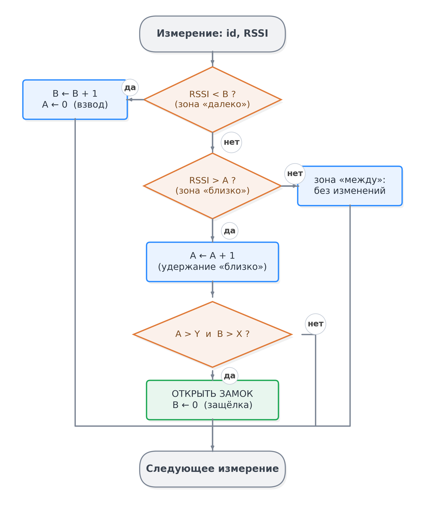
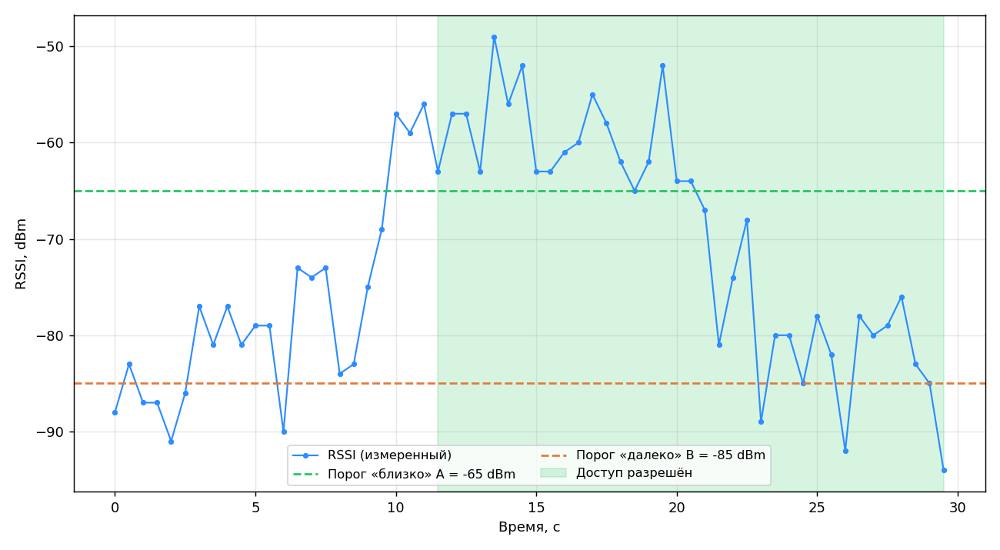

# Разработка системы контроля удалённого доступа на основе анализа траектории изменения сигнала BLE-меток

> Черновик пояснительной записки (Markdown). В конце конвертируется в .docx
> с оформлением по ГОСТ 7.32-2017 (Times New Roman 14, интервал 1.5).

---

## РЕФЕРАТ

Выпускная квалификационная работа изложена на ____ страницах, содержит 10 рисунков,
12 таблиц, 20 использованных источников и 3 приложения.

КОНТРОЛЬ ДОСТУПА, BLUETOOTH LOW ENERGY, BLE-МЕТКА, RSSI, ТРАЕКТОРИЯ СИГНАЛА,
ГИСТЕРЕЗИС ЗОН, ОЦЕНКА РАССТОЯНИЯ, КОНЕЧНЫЙ АВТОМАТ, СКУД

Объект исследования — системы контроля и управления удалённым доступом,
использующие беспроводные BLE-метки. Предмет исследования — методы и алгоритмы
анализа траектории изменения сигнала (RSSI) BLE-меток для принятия решения о
доступе.

Цель работы — разработать систему контроля удалённого доступа, принимающую решение
на основе анализа траектории изменения сигнала BLE-метки, и подтвердить её
работоспособность.

В результате работы разработаны архитектура и алгоритм системы, принимающий решение
о доступе по траектории прохождения меткой зон сигнала «далеко» и «близко» с
гистерезисом по времени удержания в зонах (без применения фильтра Калмана и
предварительной фильтрации). Реализованы программные компоненты (сканер и генератор
меток, анализатор траектории, мобильное приложение, модуль управления замком) и
проведено тестирование, подтвердившее работоспособность системы и её устойчивость к
ложным срабатываниям по сравнению с пороговым подходом.

---

## ABSTRACT

The final qualifying work comprises ____ pages, 10 figures, 12 tables,
20 references and 3 appendices.

ACCESS CONTROL, BLUETOOTH LOW ENERGY, BLE TAG, RSSI, SIGNAL TRAJECTORY, ZONE
HYSTERESIS, DISTANCE ESTIMATION, FINITE STATE MACHINE, ACCESS CONTROL SYSTEM

The object of research is remote access control systems based on wireless BLE tags.
The subject of research is methods and algorithms for analysing the trajectory of
BLE tag signal (RSSI) changes for access decision-making.

The aim of the work is to develop a remote access control system that makes the
access decision based on the analysis of the BLE tag signal trajectory, and to
verify its operability.

As a result, the architecture and the algorithm of the system have been developed;
the algorithm grants access based on the trajectory of the tag passing through the
"far" and "near" signal zones, using time-based hysteresis on the dwell time in the
zones (without a Kalman filter or signal pre-filtering). The software components (tag
scanner and generator, trajectory analyser, mobile application, lock control module)
have been implemented and tested, confirming the operability of the system and its
robustness against false triggering compared with the threshold approach.

---

## СОДЕРЖАНИЕ

ТЕРМИНЫ И ОПРЕДЕЛЕНИЯ

ПЕРЕЧЕНЬ СОКРАЩЕНИЙ И ОБОЗНАЧЕНИЙ

ВВЕДЕНИЕ

1 Анализ предметной области и методов обработки сигнала BLE-меток
- 1.1 Технология Bluetooth Low Energy и BLE-метки
- 1.2 Уровень принимаемого сигнала (RSSI) и модели оценки расстояния
- 1.3 Методы фильтрации сигнала и подходы к контролю доступа на основе BLE
- Выводы по главе 1

2 Проектирование системы контроля доступа на основе анализа траектории сигнала
- 2.1 Архитектура системы и взаимодействие компонентов
- 2.2 Алгоритм анализа траектории сигнала на основе гистерезиса зон
- 2.3 Протокол управления исполнительным устройством и сравнение с пороговым подходом
- Выводы по главе 2

3 Программная реализация и тестирование системы
- 3.1 Реализация мобильного приложения
- 3.2 Реализация алгоритма доступа и канала управления
- 3.3 Тестирование системы
- Выводы по главе 3

ЗАКЛЮЧЕНИЕ

СПИСОК ИСПОЛЬЗОВАННЫХ ИСТОЧНИКОВ

ПРИЛОЖЕНИЕ А. Техническое задание
ПРИЛОЖЕНИЕ Б. Программа и методика испытаний
ПРИЛОЖЕНИЕ В. Листинг исходного кода

---

## ТЕРМИНЫ И ОПРЕДЕЛЕНИЯ

В настоящей работе применяются следующие термины с соответствующими определениями:

**BLE-метка (маяк)** — устройство, периодически рассылающее рекламные пакеты с
уникальным идентификатором

**Bluetooth Low Energy (BLE)** — энергоэффективная технология беспроводной передачи
данных малого радиуса действия

**RSSI** — показатель уровня принимаемого радиосигнала, выраженный в
децибел-милливаттах

**Зона доступа** — область вблизи считывателя, при устойчивом входе в которую
предоставляется доступ

**Конечный автомат** — модель поведения в виде набора состояний и переходов между
ними

**Модель затухания (path loss)** — зависимость уровня принимаемого сигнала от
расстояния до источника

**Рекламный пакет (advertising)** — широковещательное сообщение BLE, передаваемое
без установления соединения

**Система контроля и управления доступом (СКУД)** — совокупность программно-аппаратных
средств, обеспечивающих разграничение доступа

**Траектория сигнала** — последовательность изменения уровня сигнала метки во
времени

**Фильтр Калмана** — рекурсивный алгоритм оптимального оценивания состояния по
зашумлённым измерениям

---

## ПЕРЕЧЕНЬ СОКРАЩЕНИЙ И ОБОЗНАЧЕНИЙ

В настоящей выпускной квалификационной работе применяют следующие сокращения и
обозначения:

API — программный интерфейс приложения (Application Programming Interface)

BLE — Bluetooth Low Energy

GAP — профиль доступа (Generic Access Profile)

GATT — профиль атрибутов (Generic Attribute Profile)

ISM — диапазон частот для промышленных, научных и медицинских применений (Industrial, Scientific and Medical)

MAC — адрес управления доступом к среде (Media Access Control)

RS-485 — стандарт интерфейса последовательной передачи данных

RSSI — показатель уровня принимаемого сигнала (Received Signal Strength Indicator)

UUID — универсальный уникальный идентификатор (Universally Unique Identifier)

дБ — децибел

дБм — децибел-милливатт

МНК — метод наименьших квадратов

СКУД — система контроля и управления доступом

---

## ВВЕДЕНИЕ

**Актуальность темы.** Развитие технологий интернета вещей и повсеместное
распространение энергоэффективной беспроводной связи привели к активному
внедрению бесконтактных систем контроля и управления доступом (СКУД).
Традиционные средства идентификации — контактные карты, радиочастотные брелоки,
PIN-коды — требуют осознанного действия пользователя, подвержены копированию и
передаче третьим лицам, а также не позволяют реализовать сценарий
«доступ по присутствию», когда вход предоставляется носителю идентификатора
автоматически при приближении к точке доступа.

Технология Bluetooth Low Energy (BLE) является удобной основой для построения
подобных систем: она поддерживается практически всеми современными смартфонами,
отличается низким энергопотреблением и позволяет использовать как специализированные
BLE-метки, так и пользовательские устройства в качестве носителей идентификатора.
Оценка близости носителя к считывателю традиционно выполняется по уровню
принимаемого сигнала (RSSI, Received Signal Strength Indicator).

Однако величина RSSI существенно зашумлена и нестабильна: на неё влияют
переотражения сигнала, экранирование телом человека, ориентация антенны и помехи
от других радиоустройств. Вследствие этого решение о предоставлении доступа,
принимаемое по одному мгновенному значению RSSI или по простому порогу,
оказывается ненадёжным — возникают ложные срабатывания, система чувствительна к
случайным всплескам сигнала и не отличает целенаправленное приближение носителя
от статичного присутствия метки поблизости или ретрансляции сигнала извне.

В связи с этим актуальной является задача принятия решения о доступе не по
мгновенному значению, а по **траектории изменения сигнала во времени**. Анализ
динамики RSSI (отслеживание прохождения меткой зон сигнала «далеко» и «близко» и
времени удержания в них) позволяет повысить устойчивость системы к шуму и
несанкционированным срабатываниям, что и определяет тему настоящей работы.

**Объект исследования** — системы контроля и управления удалённым доступом,
использующие беспроводные BLE-метки.

**Предмет исследования** — методы и алгоритмы анализа траектории изменения уровня
сигнала (RSSI) BLE-меток во времени для принятия решения о предоставлении доступа.

**Цель работы** — разработать систему контроля удалённого доступа, принимающую
решение на основе анализа траектории изменения сигнала BLE-метки, и подтвердить
её работоспособность.

Для достижения поставленной цели решаются следующие **задачи**:
1. провести обзор технологии BLE, методов оценки расстояния по RSSI и существующих
   подходов к контролю доступа; выполнить их классификацию и обосновать выбор
   метода анализа траектории сигнала;
2. разработать модель и архитектуру системы контроля доступа на основе анализа
   траектории сигнала BLE-метки;
3. разработать алгоритм анализа траектории RSSI: отнесение измерений к зонам
   сигнала «далеко»/«близко», подсчёт времени удержания в зонах и принятие решения
   о доступе по гистерезису;
4. реализовать программные компоненты системы — генератор и сканер BLE-меток,
   анализатор траектории, мобильное приложение и исполнительный модуль управления
   замком;
5. провести тестирование системы и оценить её работоспособность на основе
   имитационного моделирования и натурной проверки канала управления.

**Научная новизна** заключается в применении анализа траектории изменения RSSI —
решения о доступе по траектории прохождения меткой зон сигнала «далеко» и «близко»
с гистерезисом по времени удержания в зонах (без предварительной фильтрации
сигнала) — что повышает устойчивость к шуму и несанкционированным срабатываниям по
сравнению с пороговым методом при минимальной вычислительной сложности.

**Практическая значимость** состоит в том, что разработано мобильное приложение,
объединяющее генерацию и приём BLE-меток, анализ сигнала и принятие решения о
доступе, а также управление электронным замком по каналу BLE → RS-485 и пригодное
для построения систем контроля удалённого доступа.

**Методы исследования.** В работе использованы методы системного анализа и
классификации при обзоре предметной области, аппарат математического моделирования
распространения радиосигнала (логарифмическая модель затухания), методы анализа
временных рядов уровня сигнала и аппарат конечных автоматов для формализации логики
принятия решения (гистерезис зон сигнала), а также имитационное моделирование
для проверки работоспособности разработанных решений.

**Выбор средств реализации.** Задача контроля доступа по сигналу BLE-метки в
принципе может решаться разными способами: вручную (наблюдение оператора за
журналом уровней сигнала), полуавтоматически (срабатывание по фиксированному
порогу с подтверждением оператором) либо полностью автоматически — программной
обработкой потока измерений в реальном времени. В работе реализован полностью
автоматический вариант как единственный пригодный для практической эксплуатации
СКУД. При выборе средств разработки рассматривались следующие варианты: языки
C/C++ обеспечивают максимальную производительность, однако требуют значительных
затрат на работу с BLE и построение интерфейса; нативная разработка под Android
(Java/Kotlin) привязывает решение к одной платформе. В качестве среды реализации
выбран кроссплатформенный фреймворк Flutter (язык Dart) с библиотекой
flutter_blue_plus [1]: он позволяет реализовать в едином приложении весь цикл работы
системы — приём и анализ сигнала, вещание метки, принятие решения и отправку
команды — при единой кодовой базе и возможности переноса на другие мобильные
платформы.

**Структура работы.** Работа состоит из введения, трёх глав, заключения, списка
использованных источников и приложений. В первой главе проводится анализ
предметной области и методов обработки сигнала BLE-меток. Во второй главе
разрабатываются архитектура системы и алгоритм анализа траектории. В третьей главе
описывается программная реализация и приводятся результаты тестирования. Работа
оформлена в соответствии с требованиями [2–4].

---

## 1 Анализ предметной области и методов обработки сигнала BLE-меток

Настоящая глава носит обзорно-теоретический характер. В ней рассматривается
технология Bluetooth Low Energy как основа построения систем контроля доступа,
анализируются типы BLE-меток и форматы рекламных пакетов, исследуется природа
показателя уровня принимаемого сигнала (RSSI) и модели оценки расстояния по нему,
а также проводится классификация методов фильтрации сигнала и подходов к принятию
решения о доступе. На основе проведённого анализа обосновывается выбор метода
анализа траектории изменения сигнала, используемого в последующих главах.

### 1.1 Технология Bluetooth Low Energy и BLE-метки

#### 1.1.1 Системы контроля и управления доступом и технологии идентификации

Система контроля и управления доступом в общем случае включает четыре основных
элемента: идентификатор (носитель признака доступа), считыватель, контроллер,
принимающий решение, и исполнительное устройство — электромеханический или
электромагнитный замок, турникет, шлагбаум [5]. По способу управления СКУД
подразделяются на автономные (решение принимается локальным контроллером без
связи с центром), сетевые (контроллеры объединены каналом связи с центральным
узлом, который ведёт базу пользователей и журнал событий) и универсальные,
сочетающие оба режима: типовые запросы обрабатываются локально, а исключительные
ситуации передаются на центральный узел [5]. Именно последняя схема принята в
настоящей работе.

В качестве идентификаторов в традиционных СКУД применяются предметы (контактные
и бесконтактные карты, брелоки), знания (PIN-коды, пароли) и биометрические
признаки. Наиболее распространены бесконтактные радиочастотные карты: метки
диапазона 125 кГц (например, формата EM-Marine) не содержат криптографических
механизмов и легко копируются; карты диапазона 13,56 МГц (MIFARE и аналогичные)
защищены лучше, однако, как и любые карты, требуют осознанного действия —
поднесения к считывателю — и могут быть переданы третьему лицу. Для сценария
«доступ по присутствию», при котором решение принимается автоматически по факту
приближения носителя, требуется технология с дальностью действия в единицы —
десятки метров, возможностью оценки близости и массовой поддержкой в
пользовательских устройствах. Сравнение беспроводных технологий, применимых для
идентификации в СКУД, приведено в таблице 1.

Таблица 1 — Сравнение беспроводных технологий идентификации

| Технология | Диапазон | Дальность | Оценка расстояния | Поддержка смартфонами | Энергопотребление носителя |
|------------|----------|-----------|-------------------|------------------------|----------------------------|
| RFID 125 кГц | 125 кГц | до 0,1 м | нет (факт поднесения) | нет | пассивный носитель |
| NFC | 13,56 МГц | до 0,1 м | нет (факт поднесения) | да | пассивный/низкое |
| BLE | 2,4 ГГц | 10–30 м | по RSSI (приближённая) | да | низкое |
| UWB | 3,1–10,6 ГГц | до 50 м | по времени пролёта (дециметры) | частично | среднее |
| Wi-Fi | 2,4/5 ГГц | до 50 м | по RSSI/RTT | да | высокое |

Из таблицы 1 видно, что технологии ближнего поля (RFID, NFC) не позволяют
реализовать доступ по присутствию в принципе — они фиксируют лишь факт поднесения
идентификатора вплотную к считывателю. Сверхширокополосная технология UWB
обеспечивает наиболее точную оценку расстояния по времени пролёта сигнала, однако
требует специализированных приёмопередатчиков, которые присутствуют лишь в
отдельных моделях смартфонов, и сопряжена с большей стоимостью инфраструктуры
[6]. Wi-Fi поддерживается повсеместно, но отличается высоким энергопотреблением,
что исключает длительную автономную работу компактной метки. Технология BLE
занимает промежуточное положение: дальность 10–30 м достаточна для зоны контроля,
энергопотребление допускает годы работы метки от батареи, поддержка в смартфонах
универсальна, а близость носителя может оцениваться по уровню принимаемого
сигнала [7]. Поэтому в качестве технологической основы разрабатываемой системы
выбрана BLE; задача компенсации невысокой точности оценки расстояния по RSSI
решается алгоритмически и рассматривается в подразделах 1.2 и 1.3.

#### 1.1.2 Принципы технологии Bluetooth Low Energy

Bluetooth Low Energy (BLE) — энергоэффективная разновидность технологии
беспроводной передачи данных малого радиуса действия, представленная в
спецификации Bluetooth Core 4.0 (2010 г.) и получившая дальнейшее развитие в
версиях 4.1–5.x [8]. В отличие от классического Bluetooth (BR/EDR),
ориентированного на потоковую передачу данных, BLE спроектирован для устройств с
жёсткими ограничениями по энергопотреблению — датчиков, носимой электроники,
меток, — которые передают небольшие порции данных через значительные интервалы
времени и большую часть времени находятся в спящем режиме [7]. Типичная дальность связи BLE составляет 10–30 м, а
потребляемый приёмопередатчиком ток при передаче, как правило, не превышает 15 мА; в
версии Bluetooth 5 поддерживается скорость передачи данных до 2 Мбит/с [9, 10].

BLE использует нелицензируемый диапазон 2,4 ГГц (ISM), разделённый на 40 каналов
шириной 2 МГц. Три из них (с индексами 37, 38 и 39) выделены под передачу
рекламных пакетов (advertising) и расположены в спектре так, чтобы минимизировать
взаимные помехи с распространёнными каналами Wi-Fi; остальные 37 каналов
используются для передачи данных в установленном соединении [8].

Профиль доступа (GAP, Generic Access Profile) определяет четыре роли
устройств: широковещатель (broadcaster) и наблюдатель (observer) — для режима без
установления соединения, а также периферийное (peripheral) и центральное
(central) устройства — для режима соединения. Таким образом, BLE поддерживает два
принципиально разных режима взаимодействия:

- **рекламный (широковещательный) режим** — устройство периодически рассылает
  рекламные пакеты по трём каналам; любой наблюдатель в радиусе действия может их
  принять, не устанавливая соединения;
- **режим соединения** — между центральным и периферийным устройствами
  устанавливается двунаправленный канал обмена данными по протоколу GATT.

Для систем, основанных на BLE-метках, ключевым является именно рекламный режим:
метка выступает широковещателем и периодически рассылает идентифицирующие пакеты,
а считыватель (сканер) выступает наблюдателем, принимает эти пакеты и измеряет
уровень их сигнала. Поскольку соединение не устанавливается, одна точка приёма
способна одновременно обслуживать большое число меток, что обеспечивает
масштабируемость и низкое энергопотребление меток [7].

#### 1.1.3 BLE-метки и форматы рекламных пакетов

BLE-метка (маяк, beacon) — это устройство, периодически рассылающее рекламные
пакеты с уникальным идентификатором. Содержимое рекламного пакета формируется в
соответствии с одним из стандартизированных форматов. Наибольшее распространение
получили следующие форматы [11, 12]:

- **iBeacon** (Apple) — закрытый, но широко поддерживаемый формат. Полезная
  нагрузка передаётся в поле производителя (Manufacturer Specific Data) и включает
  128-битный идентификатор UUID, два 16-битных поля Major и Minor, а также
  калиброванное значение мощности TxPower (RSSI на расстоянии 1 м). Идентификация
  метки выполняется по комбинации UUID/Major/Minor;
- **Eddystone** (Google) — открытый формат, передаваемый в поле служебных данных
  (Service Data, UUID 0xFEAA). Поддерживает несколько типов кадров: UID
  (идентификатор пространства имён и экземпляра), URL (сжатый веб-адрес), TLM
  (телеметрия — напряжение батареи, температура) и EID (шифрованный
  идентификатор);
- **AltBeacon** — открытая альтернатива iBeacon, не привязанная к конкретному
  производителю;
- **пользовательские форматы** — произвольные данные, размещаемые в полях
  Manufacturer Specific Data или Service Data; применяются, когда требуется
  передавать прикладную информацию, отличную от стандартных схем.

Сравнительная характеристика основных форматов приведена в таблице 2.

Таблица 2 — Сравнение форматов BLE-меток

| Формат | Разработчик | Состав идентификатора | Открытость | Особенности |
|--------|-------------|------------------------|------------|-------------|
| iBeacon | Apple | UUID + Major + Minor + TxPower | Закрытый | Широкая поддержка, простая идентификация |
| Eddystone | Google | UID / URL / TLM / EID | Открытый | Несколько типов кадров, телеметрия |
| AltBeacon | Radius Networks | произвольный (до 20 байт) | Открытый | Гибкость, не привязан к вендору |
| Пользовательский | — | задаётся разработчиком | Открытый | Передача прикладных данных |

Независимо от формата, общим для всех меток является принцип работы: метка
периодически (как правило, с интервалом от 100 мс до нескольких секунд) рассылает
рекламные пакеты, а считыватель при приёме каждого пакета фиксирует идентификатор
метки и измеряет уровень сигнала RSSI. Именно динамика RSSI во времени является
исходными данными для анализа траектории, рассматриваемого в настоящей работе.

#### 1.1.4 Области применения и классификация BLE-меток

Технология BLE-меток применяется в широком спектре задач [6]:

- навигация и позиционирование внутри помещений (indoor positioning), где
  отсутствует сигнал спутниковых систем;
- проксимити-маркетинг — выдача контента при приближении пользователя к товару
  или зоне;
- учёт и отслеживание материальных активов (asset tracking);
- определение присутствия и контроль доступа — предоставление доступа носителю
  метки при его приближении к точке прохода.

BLE-метки можно классифицировать по нескольким признакам:

- по формату рекламного пакета — iBeacon, Eddystone, AltBeacon, пользовательские;
- по типу носителя — специализированные аппаратные метки и программные метки на
  базе смартфона, выступающего широковещателем;
- по мощности передатчика и дальности — от меток ближнего радиуса (доли метра) до
  меток с дальностью в десятки метров.

Применение BLE для контроля доступа уже получило распространение на практике:
системы бесключевого доступа в автомобилях открывают двери при присутствии
смартфона владельца, гостиничные и офисные замки используют смартфон в качестве
мобильного идентификатора, шлагбаумы и ворота управляются по присутствию метки в
автомобиле [6, 13]. Общей чертой большинства таких решений является пороговый
критерий близости: доступ предоставляется, когда уровень сигнала превышает
настроенный порог. Как будет показано в подразделе 1.3, этот критерий
принципиально чувствителен к шуму и не различает приближение и статичное
присутствие, что и определяет направление совершенствования, выбранное в
настоящей работе.

Настоящая работа ориентирована на сценарий контроля доступа, в котором носителем
метки может выступать как аппаратная метка, так и смартфон, а решение принимается
по динамике уровня сигнала, измеряемого одним считывателем.

#### 1.1.5 Стек протоколов и структура рекламного пакета

Архитектура BLE построена по уровневому принципу и разделена на контроллер и хост.
Контроллер включает физический уровень (PHY) и канальный уровень (Link Layer);
хост — протокол адаптации и управления логическими каналами (L2CAP), протокол
атрибутов (ATT), профиль обобщённых атрибутов (GATT) и профиль доступа (GAP).
Физический уровень использует гауссову частотную манипуляцию (GFSK) и обеспечивает
базовую скорость 1 Мбит/с. Канальный уровень формирует пакеты, управляет
состояниями устройства (ожидание, реклама, сканирование, соединение) и реализует
адаптивную перестройку частоты в режиме соединения. В установленном соединении
максимальный размер полезной нагрузки пакета данных канального уровня достигает
251 байта начиная с версии 4.2 [14].

В режиме соединения обмен прикладными данными организуется через профиль GATT,
который структурирует данные периферийного устройства в виде иерархии сервисов и
характеристик, идентифицируемых UUID. Над характеристиками определены операции
чтения, записи (с подтверждением и без подтверждения) и уведомления
(notification), позволяющие периферийному устройству асинхронно передавать данные
центральному [14]. Эта модель используется в настоящей работе для канала
управления исполнительным устройством: модуль-преобразователь предоставляет
сервис FFE0 с характеристикой FFE1, запись в которую транслируется в проводную
линию, а уведомления по той же характеристике доставляют ответный поток данных.

Рекламный пакет канального уровня содержит заголовок и полезную нагрузку, размер
которой в базовом режиме не превышает 31 байта [15]. Полезная нагрузка состоит из
последовательности структур данных AD (Advertising Data), каждая из которых
включает поле длины, поле типа и значение. Идентификатор метки размещается в
структуре типа Manufacturer Specific Data (для формата iBeacon) или Service Data
(для формата Eddystone). Ограничение в 31 байт определяет максимальный объём
идентифицирующей информации, передаваемой меткой в одном пакете, что учитывалось
при выборе формата идентификатора носителя в настоящей работе.

#### 1.1.6 Эволюция версий BLE и параметры вещания

Технология BLE последовательно развивалась от версии 4.0 к версии 5.x. Версия 4.2
повысила защищённость соединений и эффективность передачи данных. Версия 5.0
ввела режим 2M PHY с удвоенной скоростью передачи, режим Coded PHY (LE Long Range)
с увеличенной дальностью за счёт помехоустойчивого кодирования, а также расширенную
рекламу (Extended Advertising), снимающую ограничение в 31 байт и позволяющую
передавать больший объём данных в рекламном режиме (во вторичном канале — до
254 байт) [15]. Эти возможности расширяют
область применения BLE-меток, однако для задачи контроля доступа достаточно
базового рекламного режима. На основе BLE строятся также ячеистые сети Bluetooth
Mesh, применяемые в системах интернета вещей [16].

Важным параметром вещания является интервал рекламы (advertising interval) —
период рассылки рекламных пакетов, который согласно спецификации может составлять
от 20 мс до 10,24 с с шагом 625 мкс [15]. Меньший интервал ускоряет обнаружение метки и повышает частоту
обновления значений RSSI, что благоприятно для анализа траектории, но увеличивает
энергопотребление метки. Таким образом, выбор интервала вещания представляет собой
компромисс между быстротой реакции системы и временем автономной работы метки. Для
анализа траектории существенно, чтобы частота обновления RSSI обеспечивала
достаточное число измерений за время прохождения носителя через зону доступа.

#### 1.1.7 Механизмы безопасности BLE

Спецификация BLE предусматривает развитые механизмы защиты соединений: процедуру
сопряжения (pairing) с методами аутентификации Just Works, Passkey Entry и Numeric
Comparison, шифрование канала алгоритмом AES-CCM, а начиная с версии 4.2 — режим
LE Secure Connections с выработкой ключей по протоколу Диффи–Хеллмана на
эллиптических кривых, устойчивый к пассивному прослушиванию [10]. Для защиты от
отслеживания устройств применяется механизм конфиденциальности: устройство
периодически меняет случайный разрешаемый адрес (resolvable private address),
который могут сопоставить с истинным адресом только доверенные устройства,
обладающие ключом разрешения [10].

Вместе с тем перечисленные механизмы относятся к режиму соединения. Рекламные
пакеты, на которых основана работа BLE-меток, передаются открыто: их содержимое не
шифруется и не аутентифицируется, поэтому идентификатор метки может быть считан и
воспроизведён посторонним устройством. Отсюда следует важный для настоящей работы
вывод: защищённость системы контроля доступа на BLE-метках не может опираться
только на секретность идентификатора и должна обеспечиваться дополнительными
мерами прикладного уровня — проверкой полномочий по базе авторизованных
носителей, анализом динамики сигнала, а в перспективе — криптографической
аутентификацией носителя. Эти меры учитываются при проектировании системы во
второй главе.

### 1.2 Уровень принимаемого сигнала (RSSI) и модели оценки расстояния

#### 1.2.1 Понятие RSSI и его связь с расстоянием

Показатель уровня принимаемого сигнала (RSSI, Received Signal Strength Indicator) —
это измеряемая приёмником величина мощности принятого радиосигнала, выражаемая в
децибел-милливаттах (dBm). Децибел-милливатт — логарифмическая единица мощности:
уровню 0 dBm соответствует мощность 1 мВт, а изменение уровня на 10 дБ означает
изменение мощности в десять раз. Логарифмическая шкала удобна для радиоканала,
поскольку мощность принимаемого сигнала меняется на много порядков при изменении
расстояния: так, уровню −60 dBm соответствует мощность 10⁻⁹ Вт, а уровню
−90 dBm — 10⁻¹² Вт. Для BLE типичные значения RSSI лежат в диапазоне
примерно от −30 dBm (метка вплотную к приёмнику) до −100 dBm (метка на границе
зоны приёма) [17].

Физической основой оценки расстояния по RSSI является затухание мощности
радиосигнала по мере удаления от источника: чем дальше метка, тем слабее
принимаемый сигнал. Эта зависимость описывается логарифмической моделью затухания
в среде с потерями (log-distance path loss model) [17]:

RSSI(d) = RSSI(d₀) − 10·n·lg(d / d₀),     (1)

где RSSI(d) — уровень сигнала на расстоянии d, dBm; RSSI(d₀) — уровень сигнала на
опорном расстоянии d₀ (обычно d₀ = 1 м), dBm; n — показатель затухания среды
(path-loss exponent); d — расстояние до метки, м.

Приняв в качестве опорного расстояние d₀ = 1 м и обозначив RSSI(1) = A
(калиброванная мощность, TxPower), из выражения (1) можно получить формулу
оценки расстояния по измеренному RSSI:

d = 10^((A − RSSI) / (10·n)).     (2)

Параметр A соответствует значению RSSI, измеренному на расстоянии 1 м от метки, и
зависит от конкретного устройства (типичное значение около −59 dBm). Показатель
затухания n характеризует среду распространения: в свободном пространстве n ≈ 2, в
помещениях с переотражениями и препятствиями n принимает значения от 2 до 4 [17].
Зависимость RSSI от расстояния при различных значениях n приведена на рисунке 1.


Рисунок 1 — Зависимость уровня сигнала RSSI от расстояния при различных
показателях затухания среды n

#### 1.2.2 Факторы, влияющие на точность оценки

На практике оценка расстояния по формуле (2) обладает значительной
погрешностью, обусловленной рядом факторов [17]:

- **многолучевое распространение и замирания** — сигнал достигает приёмника по
  нескольким путям (прямой и переотражённые), что приводит к интерференции и
  колебаниям RSSI;
- **экранирование телом человека** — поглощение сигнала телом носителя метки
  может снижать RSSI на 10 дБ и более;
- **ориентация и положение антенн** — диаграмма направленности антенн метки и
  приёмника неидеальна, поэтому при одном и том же расстоянии RSSI зависит от
  взаимной ориентации устройств;
- **помехи в диапазоне 2,4 ГГц** — сети Wi-Fi, другие устройства Bluetooth,
  бытовая техника создают помехи;
- **неоднородность среды** — мебель, стены, люди изменяют эффективное значение n.

Вследствие перечисленных факторов измеряемый RSSI представляет собой
нестационарный зашумлённый сигнал с разбросом значений в несколько дБ даже при
неподвижной метке. Прямое применение формулы (2) к «сырому» RSSI даёт оценку
расстояния, скачкообразно меняющуюся в широких пределах, что недопустимо для
надёжного принятия решения о доступе. Это обуславливает необходимость
предварительной фильтрации сигнала и анализа его динамики во времени.

#### 1.2.3 Методы определения местоположения по RSSI

В литературе выделяют несколько групп методов определения местоположения по RSSI
[6]:

- **трилатерация** — оценка координат по расстояниям до трёх и более
  приёмников с известными положениями; требует развёрнутой инфраструктуры
  считывателей;
- **метод опорных точек (fingerprinting)** — предварительное построение карты
  значений RSSI в характерных точках и последующее сопоставление текущих измерений
  с картой; требует трудоёмкого этапа калибровки;
- **проксимити-методы (по близости)** — определение факта нахождения метки вблизи
  одного считывателя без вычисления точных координат.

Для задачи контроля доступа, в которой существенен не точный расчёт координат, а
факт целенаправленного приближения носителя к точке прохода, наиболее
рационален проксимити-подход с одним считывателем, дополненный анализом динамики
сигнала во времени. Такой подход не требует развёртывания нескольких приёмников и
трудоёмкой калибровки карты, что определяет его практическую применимость.

#### 1.2.4 Стохастическая модель сигнала и калибровка параметров

Детерминированная модель (1) описывает лишь средний уровень сигнала на заданном
расстоянии. Реальный RSSI подвержен случайным отклонениям от среднего, которые
учитываются логнормальной моделью теневого затухания:

RSSI(d) = A − 10·n·lg(d) + X,

где X — гауссова случайная величина с нулевым математическим ожиданием и
среднеквадратическим отклонением σ (теневое затухание), отражающая влияние
переотражений и экранирования. Типичные значения σ в помещениях составляют
4–10 дБ. Наличие случайной составляющей означает, что при фиксированном расстоянии
измеренный RSSI образует распределение, а не единственное значение.

Из логарифмического характера модели следует важное свойство: погрешность оценки
расстояния возрастает с увеличением расстояния. Вблизи метки изменение RSSI на
1 дБ соответствует малому изменению расстояния, тогда как на большом удалении то же
изменение RSSI соответствует значительному изменению оценки расстояния. Это
обуславливает выбор небольшого радиуса зоны доступа, в пределах которого оценка
расстояния наиболее точна.

Параметры модели подлежат калибровке. Значение A определяется измерением RSSI на
расстоянии 1 м от метки, показатель n — по серии измерений на известных
расстояниях с последующей аппроксимацией. Следует учитывать, что значения RSSI
могут различаться по трём рекламным каналам (37, 38, 39), а также зависеть от
конкретного экземпляра приёмопередатчика, что вносит дополнительную погрешность и
усиливает необходимость фильтрации и анализа динамики сигнала, а не отдельных
измерений.

#### 1.2.5 Практические аспекты измерения RSSI

Помимо физических факторов, на качество исходных данных влияют особенности
измерительного тракта. Значение RSSI сообщается приёмником в целочисленном виде с
шагом квантования 1 дБ, а калибровка измерителя различается между чипсетами и
платформами, поэтому абсолютные значения, полученные разными считывателями, могут
систематически расходиться на несколько децибел [17]. Рекламные пакеты
рассылаются поочерёдно по трём каналам (37, 38, 39), расположенным в разных
участках диапазона 2,4 ГГц; частотная зависимость замираний приводит к тому, что
последовательные измерения, выполненные по разным каналам, отличаются даже при
неподвижной метке [7].

Кроме того, поток измерений нерегулярен во времени: период поступления значений
определяется интервалом рекламы метки, потерями пакетов в эфире и задержками
стека операционной системы считывателя. Из этого следует практическое требование
к алгоритму обработки: решение должно приниматься по мере поступления измерений,
не предполагая их равномерной дискретизации, а устойчивость к шуму должна
обеспечиваться не предварительной фильтрацией отдельных значений, а логикой
принятия решения. Это требование учтено при разработке алгоритма во второй главе:
каждое измерение немедленно относится к зоне сигнала, а устойчивость к шуму и
одиночным выбросам достигается подсчётом времени удержания метки в зонах.

### 1.3 Методы фильтрации сигнала и подходы к контролю доступа на основе BLE

#### 1.3.1 Методы фильтрации RSSI

Для подавления шума измеряемого RSSI применяются различные методы цифровой
фильтрации [18]:

- **скользящее среднее (SMA)** — усреднение последних k измерений; просто в
  реализации, но вносит запаздывание, пропорциональное размеру окна, и слабо
  подавляет выбросы;
- **экспоненциальное скользящее среднее (EMA)** — рекурсивное сглаживание с
  весовым коэффициентом α: s_t = α·z_t + (1 − α)·s_{t−1}; не требует хранения
  окна, но требует подбора α как компромисса между сглаживанием и
  запаздыванием;
- **медианный фильтр** — замена значения медианой окна; эффективно устраняет
  одиночные выбросы, но также вносит запаздывание;
- **фильтр Калмана** — рекурсивный оптимальный (в смысле минимума
  среднеквадратической ошибки) алгоритм оценивания, рассматривающий RSSI как
  зашумлённое наблюдение скрытого состояния [18]. На каждом шаге он сочетает
  прогноз и коррекцию оценки с учётом доверия к модели и к измерению, обеспечивая
  хорошее подавление шума при меньшем запаздывании, чем скользящее среднее, и не
  требует хранения окна измерений, что делает его удобным для потоковой обработки
  RSSI [18].

В литературе применяются и комбинированные схемы фильтрации: предварительный
медианный фильтр малого окна устраняет одиночные выбросы, после чего фильтр
Калмана сглаживает оставшийся шум [18]. Такая каскадная схема улучшает поведение
на сигналах с импульсными помехами ценой дополнительного запаздывания, вносимого
медианным звеном. Перечисленные методы фильтрации широко применяются в системах
позиционирования по RSSI; однако, как показано далее (глава 2), в настоящей работе
устойчивость к шуму и одиночным выбросам обеспечивается не предварительной
фильтрацией сигнала, а самой логикой принятия решения — разнесёнными порогами зон
и требованием устойчивого удержания метки в зоне, поэтому отдельная схема
фильтрации в итоговом алгоритме не применяется.

Сравнение методов фильтрации приведено в таблице 3, иллюстрация их работы на
зашумлённом сигнале — на рисунке 2.

Таблица 3 — Сравнение методов фильтрации RSSI

| Метод | Подавление шума | Запаздывание | Память | Сложность |
|-------|------------------|--------------|--------|-----------|
| Скользящее среднее (SMA) | Среднее | Высокое | Окно k | Низкая |
| Экспоненциальное (EMA) | Среднее | Среднее | Нет | Низкая |
| Медианный фильтр | Высокое (выбросы) | Среднее | Окно k | Средняя |
| Фильтр Калмана | Высокое | Низкое | Нет | Средняя |


Рисунок 2 — Сравнение методов фильтрации зашумлённого сигнала RSSI

#### 1.3.2 Подходы к принятию решения о доступе

Анализ литературы и существующих решений позволяет выделить следующие подходы к
принятию решения о предоставлении доступа на основе сигнала BLE-метки [6, 13]:

- **пороговый подход** — доступ предоставляется, если мгновенное значение RSSI
  превышает заданный порог. Подход предельно прост, однако крайне чувствителен к
  шуму: случайный всплеск RSSI вызывает ложное срабатывание, а экранирование —
  ложный отказ. Кроме того, пороговый подход не различает направление движения
  носителя и уязвим к удержанию метки вблизи считывателя или к ретрансляции
  сигнала;
- **накопление выборок с гистерезисом** — доступ предоставляется при выполнении
  условия в течение нескольких последовательных измерений; снижает число ложных
  срабатываний по сравнению с однократным порогом, но по-прежнему основан на
  статическом уровне сигнала и не учитывает его динамику;
- **анализ траектории (динамики) сигнала** — решение принимается на основе
  изменения сигнала во времени: выявляется устойчивое приближение носителя к
  считывателю (последовательное прохождение зон «далеко» и «близко» и удержание в
  зоне доступа). Подход устойчив к одиночным выбросам и статичному присутствию
  метки, а также затрудняет несанкционированный доступ, поскольку требует именно
  характерной траектории приближения;
- **методы машинного обучения** — классификация состояния доступа по признакам
  сигнала с помощью алгоритмов (k ближайших соседей, деревья решений, нейронные
  сети); обеспечивают высокую точность, но требуют сбора обучающей выборки и
  обладают большей вычислительной сложностью.

Сравнение подходов приведено в таблице 4.

Таблица 4 — Сравнение подходов к принятию решения о доступе

| Подход | Устойчивость к шуму | Учёт динамики | Защита от ложных срабатываний | Сложность |
|--------|---------------------|---------------|-------------------------------|-----------|
| Пороговый | Низкая | Нет | Низкая | Низкая |
| Накопление выборок | Средняя | Частично | Средняя | Низкая |
| Анализ траектории | Высокая | Да | Высокая | Средняя |
| Машинное обучение | Высокая | Да | Высокая | Высокая |

Отдельно охарактеризуем группу методов машинного обучения. В задачах
позиционирования и классификации состояния по радиосигналу применяются метод
k ближайших соседей, деревья решений и их ансамбли, метод опорных векторов и
нейронные сети [6]. Общими ограничениями этих методов являются необходимость
сбора и разметки представительной обучающей выборки в условиях конкретного
объекта, чувствительность качества классификации к изменению радиообстановки
(перестановка мебели, появление людей) с необходимостью повторного обучения, а
также сложность интерпретации принятого решения, которая нежелательна для систем
безопасности. Поскольку решаемая задача — выявление характерного приближения
носителя — имеет ясную физическую модель, в настоящей работе предпочтение отдано
детерминированному анализу траектории, не требующему обучающих данных;
применение машинного обучения для классификации траекторий рассматривается как
направление дальнейшего развития.

#### 1.3.3 Проблема несанкционированного доступа

Отдельного внимания заслуживает устойчивость системы к попыткам
несанкционированного доступа. Для систем на основе RSSI характерны угрозы
удержания метки вблизи считывателя, копирования идентификатора метки, а также
атаки ретрансляции (relay), при которых сигнал метки усиливается или
ретранслируется на расстояние [13]. Пороговые методы практически не защищены от
подобных воздействий, так как реагируют на сам факт наличия достаточно сильного
сигнала. Анализ траектории повышает устойчивость к части этих угроз: для
предоставления доступа требуется не просто сильный сигнал, а характерная динамика
приближения, которую сложнее воспроизвести случайно или искусственно.

#### 1.3.4 Требования к системе контроля доступа и критерии выбора метода

На основании проведённого анализа сформулированы требования к разрабатываемой
системе. Функциональные требования: приём рекламных пакетов и измерение RSSI во
времени; подавление шума измерений; оценка расстояния до носителя; определение
факта устойчивого приближения; проверка полномочий носителя; формирование команды
управления исполнительным устройством. Нефункциональные требования: устойчивость к
случайным колебаниям сигнала и отсутствие ложных срабатываний; приемлемая задержка
принятия решения; умеренная вычислительная сложность, допускающая работу на
маломощных устройствах; масштабируемость по числу одновременно сопровождаемых
носителей.

Выбор метода принятия решения выполнен по совокупности критериев: устойчивость к
шуму, учёт направления движения носителя, защищённость от ложных и
несанкционированных срабатываний, вычислительная сложность и потребность в обучающей
выборке. Пороговый метод и накопление выборок просты, но не учитывают динамику
сигнала. Методы машинного обучения обеспечивают высокую точность, однако требуют
сбора и разметки данных и большего объёма вычислений. Метод анализа траектории
обеспечивает компромисс: он учитывает динамику сигнала, устойчив к шуму и ложным
срабатываниям, не требует обучающей выборки и реализуем с умеренными вычислительными
затратами. Совокупность указанных критериев определила его выбор в качестве
основного метода настоящей работы.

#### 1.3.5 Постановка задачи исследования

С учётом проведённого анализа задача исследования формулируется следующим
образом. Дано: поток измерений (tᵢ, RSSIᵢ), формируемый считывателем при приёме
рекламных пакетов BLE-метки, где tᵢ — отметка времени приёма i-го пакета, RSSIᵢ —
измеренный уровень сигнала; параметры модели затухания A и n; база авторизованных
носителей. Требуется построить алгоритм, отображающий поток измерений в решение о
доступе (разрешить/отказать), удовлетворяющий следующим требованиям:

- устойчивость к шуму измерений со среднеквадратическим отклонением до 4–6 дБ,
  характерным для помещений;
- отсутствие ложных срабатываний на статичную метку, находящуюся вне зоны
  доступа, в том числе при случайных всплесках сигнала;
- предоставление доступа только при устойчивом целенаправленном приближении
  авторизованного носителя и его входе в зону доступа заданного радиуса;
- задержка принятия решения не более единиц секунд;
- постоянные затраты времени и памяти на обработку одного измерения,
  допускающие одновременное сопровождение многих носителей на маломощном
  устройстве.

Решению поставленной задачи посвящены вторая глава (разработка архитектуры
системы и алгоритма) и третья глава (программная реализация и экспериментальная
проверка).

### Выводы по главе 1

В результате анализа предметной области установлено следующее.

1. Технология Bluetooth Low Energy благодаря низкому энергопотреблению, широкой
   поддержке мобильными устройствами и рекламному режиму работы является
   рациональной основой для построения систем контроля удалённого доступа по
   присутствию носителя метки. В качестве исходных данных система использует
   динамику уровня сигнала RSSI, измеряемого считывателем.

2. Оценка расстояния по RSSI описывается логарифмической моделью затухания
   (выражения (1), (2)), однако измеряемый сигнал является зашумлённым и
   нестационарным вследствие многолучевого распространения, экранирования и помех.
   Поэтому решение о доступе по мгновенному значению RSSI ненадёжно и требует
   предварительной фильтрации и анализа динамики сигнала.

3. Рассмотрены и сопоставлены методы фильтрации RSSI (скользящее среднее, EMA,
   медианный фильтр, фильтр Калмана), различающиеся компромиссом между подавлением
   шума и вносимым запаздыванием. Установлено, что устойчивость итогового решения
   может быть обеспечена и без предварительной фильтрации сигнала — за счёт самой
   логики принятия решения, что учтено при выборе метода.

4. Сравнение подходов к принятию решения о доступе показало, что пороговый подход
   и простое накопление выборок не учитывают динамику сигнала и слабо защищены от
   ложных и несанкционированных срабатываний, тогда как анализ траектории
   изменения сигнала обеспечивает более высокую устойчивость к шуму и попыткам
   несанкционированного доступа при умеренной вычислительной сложности.

5. Сформулирована постановка задачи исследования (пункт 1.3.5): по потоку
   измерений «время — уровень сигнала» требуется построить алгоритм принятия
   решения о доступе, устойчивый к шуму, не дающий ложных срабатываний на
   статичную метку и работающий с постоянными затратами на измерение.

На основании изложенного в качестве метода принятия решения о доступе в настоящей
работе выбран анализ траектории изменения сигнала BLE-метки — принятие решения по
прохождению меткой зон сигнала «далеко» и «близко» с накоплением времени удержания
в зонах и гистерезисом, без предварительной фильтрации сигнала. Разработке
архитектуры системы и алгоритма на основе данного метода посвящена вторая глава.

---

## 2 Проектирование системы контроля доступа на основе анализа траектории сигнала

В настоящей главе рассматривается предмет исследования — методы и алгоритмы
анализа траектории изменения сигнала BLE-метки для принятия решения о доступе.
Разрабатывается архитектура системы и определяется взаимодействие её компонентов,
формализуется алгоритм анализа траектории и принятия решения, описывается протокол
управления исполнительным устройством, а также проводится сравнительный анализ
предложенного подхода с пороговым.

### 2.1 Архитектура системы и взаимодействие компонентов

#### 2.1.1 Функциональные требования к системе

На основании выводов первой главы к разрабатываемой системе контроля удалённого
доступа предъявляются следующие основные функциональные требования:

- приём рекламных пакетов BLE-метки и измерение уровня сигнала RSSI во времени;
- идентификация носителя метки и проверка его полномочий по базе авторизованных
  устройств;
- принятие решения о доступе на основе анализа траектории изменения сигнала
  (устойчивого входа носителя в зону доступа), а не по мгновенному значению
  RSSI;
- устойчивость к шуму измерений и к ложным срабатываниям;
- формирование команды управления исполнительным устройством (электронным замком)
  при предоставлении доступа.

#### 2.1.2 Состав и структура системы

Система строится по модульному принципу и включает пять основных компонентов:

1. **BLE-метка (носитель доступа)** — аппаратная метка или смартфон, периодически
   рассылающий рекламные пакеты с идентификатором носителя;
2. **Сканер (считыватель)** — устройство, принимающее рекламные пакеты, выделяющее
   идентификатор метки и измеряющее RSSI при каждом приёме, формируя временной ряд
   значений сигнала;
3. **Анализатор траектории** — программный модуль, относящий каждое измерение RSSI
   к зонам сигнала «далеко»/«близко», подсчитывающий время удержания метки в зонах
   и принимающий решение о доступе по алгоритму гистерезиса (без сглаживания
   сигнала);
4. **Модуль авторизации** — проверяет идентификатор носителя по базе авторизованных
   устройств; решение о доступе принимается только для разрешённых носителей;
5. **Исполнительный модуль** — преобразователь BLE → RS-485 (модуль HM10) и
   подключённый к шине контроллер замка, выполняющий команду открытия.

Интерфейсы между компонентами определены следующим образом. На стыке «метка —
сканер» данными являются рекламные пакеты BLE одного из поддерживаемых форматов;
сканер преобразует каждый принятый пакет в тройку «идентификатор метки — уровень
сигнала — отметка времени». Эта тройка образует вход анализатора траектории,
выходом которого служат текущее состояние доступа, зона сигнала и значения
счётчиков удержания. Модуль авторизации получает идентификатор носителя и
возвращает признак полномочий. На стыке с исполнительным модулем передаётся 10-байтовая команда
управления (подраздел 2.3), которая преобразуется модулем HM10 в кадр проводной
линии. Чёткая фиксация интерфейсов позволяет заменять реализации компонентов
независимо: так, при отладке в качестве исполнительного контура использовались как
физический модуль HM10, так и тестовый приёмник пакетов.

Структурная схема системы и потоки данных между компонентами приведены на
рисунке 3.


Рисунок 3 — Структурная схема системы контроля доступа

#### 2.1.3 Взаимодействие компонентов

Взаимодействие компонентов происходит по следующему сценарию. BLE-метка
непрерывно рассылает рекламные пакеты. Сканер, находясь в режиме наблюдателя,
принимает эти пакеты и для каждого фиксирует идентификатор метки и значение RSSI с
отметкой времени, формируя временной ряд. Полученный ряд поступает в анализатор
траектории, который относит измерения к зонам сигнала, отслеживает время удержания
метки в зонах и определяет текущее состояние доступа. Параллельно модуль
авторизации проверяет, входит ли идентификатор носителя в число разрешённых.

При одновременном выполнении двух условий — носитель авторизован и анализатор
зафиксировал устойчивый вход в зону доступа — формируется команда открытия,
которая передаётся исполнительному модулю. Команда поступает на преобразователь
BLE → RS-485 (HM10) и далее по шине RS-485 — на контроллер замка. Контроллер
обращается к таблице замков: если запрашиваемый замок присутствует в таблице,
выполняется открытие; в противном случае запрос перенаправляется на центральный
узел системы. Такое построение обеспечивает локальную обработку типовых запросов и
централизованную обработку исключительных случаев.

Полный цикл обслуживания одного прохода выглядит следующим образом. Метка
рассылает рекламные пакеты с интервалом T_adv; каждый принятый пакет порождает
одно измерение и один шаг работы анализатора. По мере приближения носителя метка
последовательно проходит зоны «далеко» и «близко», а анализатор накапливает
счётчики времени удержания в зонах. В момент выполнения условий доступа (устойчивое
удержание в зоне «близко» после взвода в зоне «далеко») анализатор переводится в
состояние «доступ разрешён», после чего однократно формируется команда открытия —
повторная отправка для того же носителя блокируется до выхода его из зоны (сброса
состояния гистерезисом).
Передача команды по BLE занимает время установления соединения с модулем HM10 и
записи характеристики (доли секунды), передача по шине RS-485 и срабатывание
замка — десятки миллисекунд. Таким образом, определяющим вкладом в общее время
реакции системы является накопление измерений анализатором, рассмотренное в
пункте 2.2.5, а не канал управления.

Выбор архитектуры с одним сканером (проксимити-подход) обоснован в первой главе:
для задачи контроля доступа существенен факт целенаправленного приближения
носителя к точке прохода, а не вычисление его точных координат, что позволяет
отказаться от развёртывания нескольких приёмников и трудоёмкой калибровки.

#### 2.1.4 Маршрутизация запросов и развёртывание

Исполнительная часть системы построена с учётом возможного наличия нескольких
замков, подключённых к шине RS-485. Команда, поступающая от мобильного приложения
через преобразователь HM10, содержит номер замка, по которому контроллер на шине
определяет адресата. Предусмотрена двухуровневая логика обработки: если запрашиваемый
замок присутствует в локальной таблице контроллера, открытие выполняется локально;
если номер замка в таблице отсутствует, запрос перенаправляется на центральный узел
системы. Такое разделение обеспечивает быструю обработку типовых обращений и
централизованную обработку исключительных случаев, а также упрощает расширение
системы добавлением новых замков.

С точки зрения развёртывания считыватель и преобразователь размещаются вблизи точки
прохода. Поскольку используется один считыватель и проксимити-подход, внедрение не
требует калибровки карты сигналов и установки нескольких приёмников, что снижает его
трудоёмкость. При необходимости повышения точности локализации архитектура допускает
расширение до нескольких считывателей с применением методов трилатерации,
рассмотренных в первой главе.

#### 2.1.5 Модель данных системы

Информационное обеспечение системы строится вокруг четырёх основных сущностей,
состав которых приведён в таблице 5.

Таблица 5 — Сущности информационной модели системы

| Сущность | Основные атрибуты | Назначение |
|----------|-------------------|------------|
| Носитель | токен (7 байт), наименование, признак активности | субъект доступа; токен передаётся в команде управления |
| Метка | формат пакета, идентификатор (UUID/Major/Minor либо данные производителя), привязка к носителю | источник рекламных пакетов, по которому ведётся траектория |
| Замок | номер (2 байта), размещение, принадлежность контроллеру | объект управления на шине RS-485 |
| Событие доступа | время, токен, номер замка, результат, уровень сигнала | журналирование решений для разбора инцидентов |

База авторизованных носителей содержит соответствие «токен — носитель» и
множество разрешённых замков; контроллер исполнительной части хранит локальную
таблицу обслуживаемых замков. Конфигурационные данные считывателя (параметры
алгоритма, перечень авторизованных идентификаторов, адреса интеграции) хранятся в
текстовом файле формата JSON и загружаются при запуске; мобильное приложение
сохраняет собственный токен устройства и тестовую базу замков в постоянном
хранилище платформы. Журнал обмена ведётся в интерфейсе приложений и может быть
выгружен для анализа. Такая организация данных не требует развёртывания
полноценной СУБД на стороне считывателя, что снижает требования к оборудованию;
при централизованном развёртывании журнал событий и база носителей переносятся на
центральный узел без изменения остальных компонентов.

#### 2.1.6 Сравнение вариантов размещения обработки

При проектировании рассматривались три варианта размещения анализатора траектории.
Первый вариант — обработка на считывателе: поток измерений анализируется
непосредственно на устройстве, принимающем рекламные пакеты. Второй вариант —
обработка на центральном сервере: считыватель лишь пересылает измерения, решение
принимается централизованно. Третий вариант — обработка на носителе (смартфоне):
носитель сам оценивает близость к считывателю и запрашивает доступ.

Сравнение выполнено по критериям задержки принятия решения, автономности при
отказе сети, масштабируемости, простоте обновления логики и защищённости. Вариант
с обработкой на сервере упрощает централизованное обновление алгоритма и ведение
журнала, однако вносит сетевую задержку в контур принятия решения и делает точку
прохода неработоспособной при отказе канала связи. Обработка на носителе
неприемлема с точки зрения безопасности: решение о доступе формируется на
неконтролируемом устройстве пользователя, которому система не может доверять.
Обработка на считывателе обеспечивает минимальную задержку (данные не покидают
устройство), сохраняет работоспособность точки прохода автономно и оставляет
носителю пассивную роль источника сигнала; именно этот вариант принят в
архитектуре системы, а централизованный узел используется только для обработки
исключительных ситуаций, как описано в пункте 2.1.4.

### 2.2 Алгоритм анализа траектории сигнала на основе гистерезиса зон

Центральным элементом системы является алгоритм принятия решения о доступе. Он
преобразует поток измерений RSSI в решение, опираясь не на мгновенное значение
сигнала и не на его сглаженную оценку, а на траекторию прохождения меткой двух
зон — «далеко» и «близко» — во времени. Решение принимается по времени удержания
метки в этих зонах, что обеспечивает устойчивость к шуму без применения фильтра
Калмана или иной предварительной фильтрации сигнала.

#### 2.2.1 Зоны сигнала и пороги

На вход алгоритма поступают пары (t, RSSI), где t — момент приёма рекламного
пакета. Каждое измерение относится к одной из трёх зон по двум порогам уровня
сигнала:

- **зона «близко» (A)** — RSSI выше верхнего порога: RSSI > A;
- **зона «далеко» (B)** — RSSI ниже нижнего порога: RSSI < B;
- **зона нечувствительности** — промежуток B ≤ RSSI ≤ A между порогами.

Пороги A и B заданы в единицах уровня сигнала (dBm) и соответствуют определённым
расстояниям до метки согласно модели затухания (2): порог «близко» отвечает
радиусу зоны доступа, порог «далеко» — границе, за которой носитель считается
вышедшим из зоны. Промежуток между порогами образует зону нечувствительности
(гистерезис): при отсутствии сглаживания именно разнесённые пороги, а не
фильтрация, подавляют дребезг решения у границы. Отказ от фильтра Калмана и
сглаживания упрощает алгоритм и делает его поведение полностью детерминированным и
воспроизводимым: одно и то же измерение всегда относится к одной и той же зоне
независимо от предыстории обработки.

#### 2.2.2 Счётчики удержания в зонах

Для каждой сопровождаемой метки ведутся два счётчика, измеряющие время её
пребывания в зонах числом последовательных измерений:

- счётчик A — пребывание в зоне «близко»; обнуляется только при выходе метки в
  зону «далеко» (в зоне нечувствительности сохраняется);
- счётчик B — число накопленных измерений в зоне «далеко» («взвод»); сбрасывается
  только при выдаче доступа.

Счётчики реализуют анализ траектории во времени: доступ предоставляется лишь
метке, которая сначала устойчиво находилась «далеко» (накопила счётчик B), а
затем устойчиво вошла в зону «близко» (накопила счётчик A). Требование прохождения
характерной траектории «далеко → близко» отличает целенаправленный подход носителя
от метки, постоянно находящейся рядом со считывателем, и образует основу защиты от
ложных и несанкционированных срабатываний. Пороги удержания X и Y задают
минимальное число измерений в каждой зоне: X — для зоны «далеко» (взвод), Y — для
зоны «близко» (выдача доступа).

#### 2.2.3 Правило принятия решения и гистерезис

Обработка одного измерения выполняется по следующему правилу. Если метка находится
в зоне «далеко» (RSSI < B), счётчик B увеличивается, а счётчик удержания A
обнуляется (метка вне зоны «близко»); накопление B (B > X) означает, что метка
достаточно долго пробыла «далеко» — выполнен «взвод», после которого подход в зону
«близко» способен открыть доступ. Если метка находится в зоне «близко» (RSSI > A),
увеличивается счётчик A; при достижении им порога (A > Y) формируется команда
открытия — но только если ранее был выполнен взвод (B > X). После выдачи доступа
счётчик B сбрасывается в нуль — это защёлка гистерезиса: повторное открытие той же
метки невозможно, пока она вновь не уйдёт «далеко» и не накопит счётчик B. В зоне
нечувствительности (B ≤ RSSI ≤ A) счётчики не изменяются (счётчик A обнуляется
только при выходе в зону «далеко»). Благодаря обязательному предварительному взводу
метка, не совершавшая ухода «далеко» (в том числе оказавшаяся рядом со считывателем
без реального подхода), доступ не получает, что исключает ложные срабатывания на
статичной метке.

Алгоритм допускает естественную интерпретацию в терминах конечного автомата с
тремя состояниями метки — «далеко», «между» и «близко» — и защёлкой «выполнен
взвод», управляющей выдачей доступа. Блок-схема обработки одного измерения
приведена на рисунке 4.



Рисунок 4 — Блок-схема алгоритма принятия решения о доступе по гистерезису зон

Псевдокод алгоритма обработки одного измерения приведён в листинге 1.

Листинг 1 — Псевдокод алгоритма гистерезиса зон
```
вход: id, rssi                       // идентификатор метки и измерение RSSI
если rssi < B:                       // зона «далеко»
    id.B ← (id.B или 0) + 1          // накопление «взвода»
    id.A ← 0                         // сброс A только в зоне «далеко»
иначе если rssi > A:                 // зона «близко»
    id.A ← id.A + 1                  // удержание «близко»
    если id.A > Y:
        если id.B > X:               // открываем только после взвода «далеко»
            открыть_замок()          // выдача доступа
        id.B ← 0                     // защёлка гистерезиса
// иначе (B ≤ rssi ≤ A): зона нечувствительности — счётчики без изменений
при пропадании метки из зоны: записи с её id удаляются
выход: зона, id.A, id.B
```

Параметры алгоритма и их назначение приведены в таблице 6.

Таблица 6 — Параметры алгоритма гистерезиса зон

| Параметр | Обозначение | Назначение | Значение |
|----------|-------------|------------|----------|
| Порог «близко» | A | верхний порог RSSI (зона доступа) | −65 dBm |
| Порог «далеко» | B | нижний порог RSSI (выход из зоны) | −85 dBm |
| Удержание «далеко» | X | измерений в зоне «далеко» для взвода | 3 |
| Удержание «близко» | Y | измерений в зоне «близко» для выдачи | 3 |
| Тайм-аут пропажи | T_проп | отсутствие метки до сброса счётчиков | 5 с |

Значения параметров подобраны эмпирически и могут уточняться под конкретные
условия эксплуатации (тип метки, помеховая обстановка, требуемый радиус зоны,
частота рекламных пакетов).

#### 2.2.4 Вычислительная сложность и выбор параметров

Алгоритм обрабатывает каждое измерение за постоянное время O(1): выполняется одно
сравнение уровня с порогами и инкремент одного счётчика. Объём памяти на одну
метку также постоянен — два целочисленных счётчика, независимо от числа принятых
пакетов. Это делает алгоритм пригодным для работы в реальном времени на маломощных
устройствах и для одновременного сопровождения многих меток, для каждой из которых
ведётся отдельная пара счётчиков. По сравнению с подходами, использующими
фильтрацию и оценку тренда по окну, исключаются операции над массивом последних
измерений и хранение этого массива.

Выбор параметров (таблица 6) определяется условиями эксплуатации. Пороги A и B
задают размеры зон «близко» и «далеко» и пересчитываются в расстояния по модели
затухания (пункт 2.2.5); их разнесение определяет ширину зоны нечувствительности и
тем самым устойчивость к дребезгу. Пороги удержания X и Y задают компромисс между
быстротой и надёжностью: бо́льшие значения снижают вероятность ложного срабатывания
на случайных всплесках сигнала, но увеличивают задержку принятия решения. Тайм-аут
пропажи определяет, через какое время отсутствия метки её счётчики сбрасываются,
после чего требуется новый полный проход траектории.

#### 2.2.5 Пороги зоны доступа и время принятия решения

Пороги уровня сигнала задаются исходя из требуемого радиуса зоны доступа и
пересчитываются в расстояния по модели затухания (2). Для типовых условий
(калиброванный уровень −59 dBm на 1 м, показатель затухания n = 2) радиусу зоны
доступа около 2 м соответствует порог «близко» A ≈ −65 dBm, а уровню −85 dBm
(нижний порог B) — расстояние порядка 20 м, то есть выход за пределы уверенного
приёма. Разнесение порогов (−65 и −85 dBm) образует зону нечувствительности шириной
около 20 дБ, что исключает переключение зон при типичных колебаниях RSSI неподвижной
метки (единицы дБ). На практике пороги уточняются калибровкой под конкретное
оборудование и помеховую обстановку: измеряется уровень сигнала на границе желаемой
зоны и принимается в качестве порога «близко». Значение −65 dBm согласуется с
типовыми порогами проксимити-систем и используется также во вспомогательном шлюзовом
компоненте (пункт 2.3.5).

Время принятия решения определяется требованием удержания метки в зоне
«близко» в течение Y измерений. При частой рекламе (период около 0,1 с в режиме
LowLatency) и Y = 3 подтверждение занимает порядка 0,3 с, при более редкой рекламе
(период 0,5 с) — около 1,5 с. Поскольку счётчик «близко» начинает накапливаться сразу
при входе в зону, доступ предоставляется без дополнительной задержки, как только
удержание подтверждено; запаздывание, характерное для предварительной фильтрации
сигнала, в данном алгоритме отсутствует.

#### 2.2.6 Численный пример работы алгоритма

Работа алгоритма проиллюстрирована на имитационной траектории прохода (метка
приближается из зоны «далеко» (25 м) к точке прохода (1 м), удерживается у неё и
удаляется обратно; гауссов шум с σ = 4 дБ; пороги A = −65 dBm, B = −85 dBm;
X = Y = 3). Ключевые шаги обработки приведены в таблице 7.

Таблица 7 — Пример обработки потока измерений алгоритмом гистерезиса

| t, с | RSSI, dBm | Зона | A | B | Решение |
|------|-----------|------|---|---|---------|
| 0,0 | −87,5 | далеко | 0 | 1 | — |
| 1,0 | −86,5 | далеко | 0 | 3 | — |
| 2,0 | −85,6 | далеко | 0 | 4 | — (взвод: B > X) |
| 2,5 | −90,6 | далеко | 0 | 5 | — |
| 3,0 | −82,7 | между | 0 | 5 | — |
| 9,5 | −66,3 | между | 0 | 5 | — |
| 10,0 | −56,9 | близко | 1 | 5 | — |
| 10,5 | −64,8 | близко | 2 | 5 | — |
| 11,0 | −60,2 | близко | 3 | 5 | — |
| 11,5 | −57,0 | близко | 4 | 0 | доступ разрешён |
| 12,0 | −55,5 | близко | 5 | 0 | — (защёлка: B = 0) |
| 28,0 | −82,0 | между | 0 | 2 | — (новый взвод при удалении) |

Из таблицы 7 видно характерное поведение алгоритма. На подходе метка
последовательно проходит зону «далеко» (счётчик B растёт, при B > X = 3 выполнен
взвод), зону нечувствительности «между» (счётчики сохраняются) и зону «близко»
(растёт счётчик A). В момент, когда удержание «близко» достигает порога (A > Y = 3)
при выполненном условии предшествующего взвода (B > X), однократно предоставляется
доступ, после чего счётчик B обнуляется защёлкой и повторное открытие блокируется
(строка t = 12,0). Обязательность предварительного взвода исключает открытие метки,
не уходившей «далеко». При удалении метка вновь проходит зону «далеко», где счётчик
B накапливается, подготавливая возможный следующий проход. Пример подтверждает
корректность работы всех элементов алгоритма: порогового отнесения к зонам,
счётчиков удержания и защёлки гистерезиса.

### 2.3 Протокол управления исполнительным устройством и сравнение с пороговым подходом

#### 2.3.1 Канал и формат команды управления

Управление электронным замком осуществляется по каналу BLE → RS-485. В качестве
преобразователя используется модуль HM10, работающий в режиме прозрачного моста:
данные, записанные в характеристику FFE1 (сервис FFE0) по BLE, без изменений
передаются в линию RS-485. Это позволяет мобильному приложению формировать команду
по BLE, а контроллеру замка — принимать её по проводной шине.

Команда открытия имеет фиксированный формат длиной 10 байт, структура которого
приведена в таблице 8. Фиксированная длина выбрана из соображений простоты и
надёжности разбора на стороне контроллера: приёмник накапливает ровно десять
байт и не нуждается в маркерах начала и конца кадра, а короткая посылка целиком
помещается в одну операцию записи характеристики BLE (в пределах 20 байт
полезной нагрузки, доступных без согласования увеличенного MTU). Номер замка
передаётся двумя байтами в порядке «старший — младший» (big-endian), что
обеспечивает диапазон до 65 535 замков на систему.

Таблица 8 — Структура команды управления (10 байт)

| Байты | Поле | Назначение |
|-------|------|------------|
| 0 | Команда | код операции (открытие) |
| 1–7 | Идентификатор | идентификатор носителя/устройства (7 байт), незанятые байты — 0x00 |
| 8–9 | Номер замка | адрес замка на шине, big-endian |

Открытие выполняется передачей двух последовательных команд с паузой около
500 мс, что соответствует двухфазному протоколу контроллера исполнительной части:
первая, подготовительная, команда переводит контроллер в режим приёма, вторая
инициирует открытие. В подготовительной команде поле идентификатора (байты 1–7)
обнуляется, а идентификатор носителя передаётся во второй, исполнительной,
команде. Разделение на две фазы повышает устойчивость к ложным срабатываниям от
одиночных помех в линии: случайно принятый отдельный кадр без предшествующей
подготовки открытия не вызывает. Коды операций обеих команд (байт 0) и номер
замка вынесены в параметры конфигурации, что позволяет согласовать протокол с
применяемым контроллером без изменения программной части.

#### 2.3.2 Идентификация носителя

Для идентификации носителя в поле идентификатора (байты 1–7) передаётся токен
устройства. Использование MAC-адреса в качестве идентификатора нецелесообразно:
на платформе Android приложение не имеет доступа к собственному Bluetooth-адресу
(возвращается значение 02:00:00:00:00:00), а сам адрес подвергается рандомизации;
полный 128-битный UUID не помещается в отведённые 7 байт. Поэтому в качестве
идентификатора используется стабильный 7-байтовый токен (56 бит), генерируемый
устройством при первом запуске и сохраняемый между сеансами. Соответствие «токен —
носитель» хранится в базе авторизованных устройств на стороне системы.

Наряду с токеном устройства система поддерживает идентификацию носителя по номеру
телефона: номер кодируется в двоично-десятичном формате (BCD) и размещается в тех
же семи байтах поля идентификатора — по две десятичные цифры на байт (до 14 цифр),
с дополнением старших разрядов нулями. Этот способ используется в дополнительном
канале доступа по входящему звонку (подраздел 2.3.6).

#### 2.3.3 Сравнение анализа траектории с пороговым подходом

Принципиальное преимущество анализа траектории перед пороговым подходом
проявляется в условиях зашумлённого сигнала. На рисунке 5 приведён характерный
случай: метка статично расположена вне зоны доступа (на удалении около 5 м от
считывателя), однако вследствие шума и переотражений отдельные мгновенные
значения RSSI кратковременно превышают порог −65 dBm, соответствующий границе
зоны. Пороговый подход в эти моменты ошибочно предоставляет доступ: на интервале
наблюдения 30 с зафиксировано два ложных срабатывания. Анализ траектории на той
же реализации сигнала доступ не предоставил ни разу: одиночные всплески не
образуют характерной траектории приближения — метка не набирает устойчивого
удержания в зоне «близко» и не проходит предварительного взвода в зоне «далеко».


Рисунок 5 — Сравнение порогового подхода и анализа траектории при зашумлённом
сигнале статичной метки

Таким образом, анализ траектории обеспечивает следующие преимущества:

- устойчивость к одиночным выбросам RSSI и, как следствие, отсутствие ложных
  срабатываний на статичной метке;
- учёт направления движения носителя — доступ предоставляется именно при
  приближении;
- повышенную устойчивость к попыткам несанкционированного доступа: для получения
  доступа требуется воспроизведение характерной траектории, а не просто сильный
  сигнал.

К недостаткам подхода относится необходимость накопления нескольких измерений перед
принятием решения, что вносит небольшую задержку (доли секунды — единицы секунд в
зависимости от интервала рекламы и порога удержания Y). Для задачи контроля доступа
такая задержка несущественна и компенсируется повышением надёжности.

#### 2.3.4 Анализ защищённости и ограничения

Предложенный подход повышает защищённость системы по сравнению с пороговым, однако
имеет ограничения, которые необходимо учитывать. Анализ траектории затрудняет
несанкционированный доступ за счёт требования характерной динамики приближения, что
снижает эффективность простого удержания метки вблизи считывателя. Вместе с тем
полностью исключить атаки ретрансляции (relay), при которых сигнал метки
воспроизводится с имитацией приближения, только средствами анализа RSSI невозможно.
Для повышения защищённости анализ траектории дополнен криптографической
аутентификацией носителя на основе динамических идентификаторов: метка передаёт не
постоянный токен, а код, вычисляемый по алгоритму HMAC-SHA256 от общего секрета и
текущего интервала времени (по принципу одноразовых паролей TOTP) со сменой каждые
30 с. Считыватель независимо вычисляет ожидаемый код и сверяет его с принятым,
допуская смежные временные интервалы для компенсации рассинхронизации часов. Тем
самым перехваченный рекламный пакет теряет силу в следующем интервале, и доступ
простым воспроизведением ранее записанного сигнала становится невозможен.
Дальнейшим направлением усиления защиты является переход к двустороннему протоколу
«запрос — ответ» (challenge — response), устраняющему и атаки ретрансляции.

К ограничениям метода относятся также зависимость точности оценки расстояния от
условий среды и необходимость калибровки параметров модели затухания. Задержка
принятия решения, обусловленная накоплением измерений, хотя и невелика, должна
учитываться при проектировании сценариев прохода. Несмотря на указанные ограничения,
в рамках поставленной задачи предложенный подход обеспечивает требуемую устойчивость
и надёжность принятия решения о доступе.

Систематизированный перечень рассмотренных угроз и предусмотренных мер
противодействия приведён в таблице 9.

Таблица 9 — Модель угроз и меры противодействия

| Угроза | Содержание | Мера противодействия |
|--------|------------|----------------------|
| Копирование идентификатора | воспроизведение перехваченных рекламных пакетов метки | токен проверяется по базе, события журналируются; реализована динамическая идентификация (rolling-code на основе HMAC-SHA256 со сменой кода каждые 30 с) |
| Удержание метки у считывателя | постоянный сильный сигнал без движения | доступ не предоставляется: отсутствует характерная траектория приближения (нет предварительного взвода в зоне «далеко») |
| Ретрансляция (relay) | перенос сигнала метки с имитацией динамики | анализом RSSI устраняется частично [13]; направление развития — протокол «запрос — ответ» |
| Подмена номера телефона | имитация номера в канале доступа по звонку (caller ID spoofing) | канал вспомогательный, все срабатывания журналируются; основной канал — BLE с анализом траектории и динамическим идентификатором |
| Подбор номера замка | отправка команды с произвольным номером | проверка по таблице замков и полномочиям носителя, отказ с кодом ошибки |
| Доступ к линии RS-485 | ввод команд непосредственно в шину | физическая защита линии и оборудования исполнительной части |

#### 2.3.5 Интеграция с системами автоматизации

Помимо управления замком по каналу BLE → RS-485, архитектура предусматривает
интеграцию с внешними системами автоматизации здания через программный шлюз.
Шлюз выполняет сканирование рекламных пакетов, отбирает метки заданного формата
по идентификатору, сверяет их с перечнем авторизованных носителей и при
выполнении условий доступа отправляет HTTP-запрос (webhook) платформе
автоматизации, которая управляет исполнительным устройством — например,
приводом ворот. Конфигурация шлюза включает адрес платформы, идентификатор
webhook, общий UUID меток, пороги зон сигнала (порог «близко» −65 dBm, соответствующий
радиусу зоны около 2 м), пороги удержания в зонах и время блокировки повторного
срабатывания (cooldown), защищающее от многократной выдачи команды при нахождении
носителя в зоне. Шлюз реализует тот же алгоритм гистерезиса зон, что и основной
анализатор (подраздел 2.2), с отдельной парой счётчиков на каждого носителя; помимо
открытия по BLE он способен журналировать прохождение алгоритма по всем наблюдаемым
меткам для последующего анализа. Это позволяет применять единый критерий принятия
решения во всех точках прохода без изменения остальной логики.

#### 2.3.6 Дополнительный канал доступа по входящему звонку

Помимо основного канала на основе BLE-метки и анализа траектории, система
предусматривает дополнительный канал — по входящему телефонному звонку, не
требующий установки приложения-метки на стороне носителя. Канал реализуется на
выделенном телефоне-шлюзе и предназначен для сценариев разового или гостевого
прохода, а также как резервный способ при недоступности BLE.

Логика канала следующая. При входящем вызове шлюз считывает номер вызывающего
абонента и, при включённой соответствующей опции, автоматически отклоняет вызов,
не устанавливая соединение. Номер нормализуется (сохраняются последние десять
цифр, что делает сравнение независимым от формы записи — с префиксом «+7», «8»
и т. п.) и сверяется с базой авторизованных носителей. При совпадении формируется
команда управления, в поле идентификатора которой размещается номер абонента в
BCD-формате (подраздел 2.3.2), и отправляется исполнительному устройству по тому
же каналу, что и при доступе по BLE (BLE → RS-485 либо сетевое соединение). Тем
самым исполнительная часть получает в составе команды сведения о носителе,
инициировавшем открытие, что используется для журналирования. Канал работает
параллельно с основным: сканирование BLE и обработка входящих вызовов выполняются
одновременно.

Поскольку идентификатором в данном канале служит номер телефона, который может
быть подменён (caller ID spoofing), канал рассматривается как вспомогательный: все
срабатывания журналируются, а для точек прохода с повышенными требованиями основным
остаётся канал на основе BLE с анализом траектории и динамической идентификацией
(подраздел 2.3.4). На платформе Android чтение номера входящего вызова требует
соответствующих разрешений, а автоматическое отклонение вызова — разрешения на
управление вызовами (доступно начиная с Android 9).

### Выводы по главе 2

В результате проектирования системы получены следующие результаты.

1. Разработана модульная архитектура системы контроля удалённого доступа,
   включающая BLE-метку, сканер, анализатор траектории, модуль авторизации и
   исполнительный модуль; определены состав компонентов и порядок их
   взаимодействия (рисунок 3).

2. Формализован алгоритм анализа траектории изменения сигнала на основе гистерезиса
   зон: отнесение измерений к зонам сигнала «далеко»/«близко» по двум порогам,
   подсчёт времени удержания в зонах счётчиками и принятие решения с защёлкой
   гистерезиса (рисунок 4, листинг 1); алгоритм не использует предварительной
   фильтрации сигнала; определён состав и назначение параметров алгоритма
   (таблица 6).

3. Определён протокол управления исполнительным устройством по каналу BLE → RS-485
   с фиксированным форматом команды (таблица 8) и обоснован способ идентификации
   носителя стабильным токеном вместо MAC-адреса.

4. Проведён сравнительный анализ предложенного подхода с пороговым, показавший
   устойчивость анализа траектории к ложным срабатываниям на зашумлённом сигнале
   (рисунок 5) при умеренной вычислительной сложности и несущественной задержке.

5. Определена модель данных системы (таблица 5), определены пороговые уровни зоны
   доступа и время принятия решения (пункт 2.2.5) с проверкой на численном примере
   (таблица 7), составлена модель угроз с мерами
   противодействия (таблица 9) и предусмотрена интеграция с системами
   автоматизации через программный шлюз.

Разработанные архитектура и алгоритм являются основой для программной реализации
системы, которой посвящена третья глава.

---

## 3 Программная реализация и тестирование системы

В настоящей главе описывается программная реализация компонентов системы,
разработанных в соответствии с архитектурой и алгоритмом второй главы,
обосновывается выбор аппаратно-программных средств, приводятся ключевые фрагменты
кода и блок-схема алгоритма, излагаются методика и результаты тестирования,
а также приводятся руководства пользователя и администратора.

### 3.1 Реализация мобильного приложения

#### 3.1.1 Выбор средств реализации

Все компоненты системы, взаимодействующие с пользователем и с BLE-метками,
реализованы в составе единого мобильного приложения под Android. При выборе средств
реализации учитывались доступность программных интерфейсов BLE (как приёма рекламных
пакетов, так и собственного вещания метки), возможность работы в фоне у точки
прохода и переносимость на другие мобильные платформы. Принятые решения:

- **фреймворк Flutter (язык Dart)** — единая кодовая база пользовательского
  интерфейса и логики приложения, переносимая на другие мобильные платформы [1];
- **библиотека flutter_blue_plus** — приём рекламных пакетов BLE (сканирование с
  непрерывным обновлением RSSI) и подключение к исполнительному модулю по GATT [1];
- **библиотека flutter_ble_peripheral** — вещание собственной метки (режим
  периферийного устройства), используемое во вкладках «Генератор» и «Метка»;
- **permission_handler** — запрос разрешений Bluetooth и определения местоположения,
  необходимых для сканирования на Android;
- **shared_preferences** — постоянное хранение конфигурации (токен устройства, база
  авторизованных носителей, параметры алгоритма);
- **crypto** — вычисление динамического идентификатора метки (rolling-code на основе
  HMAC-SHA256);
- **исполнительный модуль HM10** — преобразователь BLE → RS-485 (прозрачный мост),
  принимающий команду управления замком.

Выбор Flutter обусловлен возможностью реализовать в одном приложении весь цикл
работы системы — генерацию метки, приём и анализ сигнала, принятие решения о доступе
и отправку команды — при единой кодовой базе и переносимости на другие мобильные
платформы. Модуль HM10 выбран в качестве преобразователя за распространённость,
низкую стоимость и режим прозрачного моста, не требующий программирования самого
модуля: вся прикладная логика остаётся на стороне приложения и контроллера замка.

Приложение организовано в виде четырёх функциональных вкладок — «Сканер»,
«Генератор», «Шлюз» и «Метка», — что позволяет в одном инструменте выполнять весь
цикл: вещание метки, приём и анализ сигнала, принятие решения и отправку команды.
Общий вид приложения приведён на рисунке 6.

Рисунок 6 — Интерфейс мобильного приложения (вкладка «Сканер»)
*(вставить скриншот экрана приложения)*

#### 3.1.2 Структура приложения

Приложение организовано по модульному принципу: ядро принятия решения о доступе
(алгоритм гистерезиса) и служебные компоненты (журналирование, хранение
конфигурации, канал управления) отделены от экранов пользовательского интерфейса и
не зависят от них, что обеспечивает их автономное тестирование. Состав основных
программных модулей приведён в таблице 10.

Таблица 10 — Состав основных программных модулей приложения

| Модуль | Назначение |
|--------|------------|
| access_algorithm.dart | алгоритм доступа по гистерезису зон сигнала: счётчики удержания, защёлка |
| beacon_parser.dart | разбор рекламных пакетов (iBeacon, Eddystone, STOWN), извлечение идентификатора и RSSI |
| stown_packet.dart | формирование и разбор 10-байтного пакета, кодирование идентификатора |
| rolling_code.dart | динамический идентификатор метки (TOTP на основе HMAC-SHA256) |
| stown_advertiser.dart | вещание 10-байтной метки (вкладки «Генератор» и «Метка») |
| scanner_screen.dart | вкладка «Сканер»: приём пакетов, отображение и журналирование наблюдений |
| gateway_monitor.dart | шлюз: сверка с базой, прогон алгоритма, формирование команды открытия |
| gateway_screen.dart | вкладка «Шлюз»: параметры алгоритма, база авторизованных, журнал событий |
| hm10_sender.dart | канал управления HM10: подключение по GATT, запись пакета в FFE1 |
| scanner_logger.dart, gateway_logger.dart, algo_logger.dart | журналирование наблюдений и работы алгоритма в файлы CSV |

Разделение на служебные компоненты и экраны позволяет проверять ядро алгоритма
независимо от интерфейса (модульными тестами), а единый журнальный механизм с
отметками времени даёт возможность сопоставлять события разных подсистем при
испытаниях.

#### 3.1.3 Вкладка «Сканер»

Вкладка «Сканер» принимает рекламные пакеты средствами flutter_blue_plus. Скан
запускается в режиме непрерывного обновления (continuousUpdates) с максимальной
скважностью (LowLatency), благодаря чему по каждой метке поступает поток измерений
RSSI, а не однократное обнаружение. При приёме каждого пакета извлекаются адрес
устройства, имя, набор рекламных полей и значение RSSI. Поддерживается распознавание
форматов iBeacon (по идентификатору производителя 0x004C), Eddystone (по служебным
данным 0xFEAA) и собственного 10-байтного формата метки. Для каждого обнаруженного
устройства формируется запись, отображаемая в списке; порядок устройств фиксируется
по первому появлению, а значения (RSSI, поля) обновляются «на месте», что
обеспечивает устойчивое отображение без перескакивания строк.

Разбор форматов выполняется по структуре полезной нагрузки рекламного пакета. Пакет
iBeacon распознаётся по полю данных производителя 0x004C с сигнатурой 0x02 0x15, за
которой следуют 16 байт UUID, по два байта полей Major и Minor (старшим байтом
вперёд) и байт калиброванной мощности. Пакет Eddystone распознаётся по полю
служебных данных с UUID 0xFEAA; первый байт нагрузки определяет тип кадра: 0x00 —
UID, 0x10 — URL, 0x20 — TLM (телеметрия). Собственная метка опознаётся по
10-байтной полезной нагрузке в любой из обёрток (данные производителя, служебные
данные или iBeacon), из которой извлекается 7-байтный идентификатор. Для каждого
источника поддерживается отметка времени последнего приёма; записи, не
обновлявшиеся дольше тайм-аута, исключаются из списка.

Для записи и анализа реальных проходов носителя в сканер встроено
журналирование наблюдений: по выбранным меткам в файл CSV записываются отметка
времени, идентификатор, RSSI и оценка расстояния по модели затухания. Запись
включается отдельной кнопкой, а накопленный файл выгружается для последующего
анализа. Выходными данными сканера для каждого пакета являются идентификатор метки,
RSSI и отметка времени — именно эти данные служат входом для алгоритма принятия
решения о доступе.

#### 3.1.4 Вкладки «Генератор» и «Метка»

Вещание метки реализовано средствами flutter_ble_peripheral (режим периферийного
устройства). Вкладка «Генератор» позволяет публиковать рекламные пакеты для
тестирования системы: поддерживаются форматы Eddystone (URL, UID) и произвольные
данные производителя с заданными идентификаторами. Вкладка «Метка» формирует
собственную 10-байтную метку доступа: пользователь задаёт идентификатор (или
включает динамический rolling-code), номер замка и способ обёртки полезной
нагрузки (данные производителя, служебные данные или iBeacon), после чего
приложение непрерывно вещает пакет. Состояние публикации отслеживается и
отображается, что позволяет диагностировать отказ адаптера или занятость эфира.

Из-за ограничений платформы вещание из приложения ведётся в режиме легаси-рекламы,
совместимом со всеми BLE-чипами, а имя метки в эфире задаётся через имя
Bluetooth-адаптера. Эти особенности учтены при реализации, чтобы метка
гарантированно выходила в эфир на широком парке устройств.

#### 3.1.5 Особенности сканирования и фоновой работы

Приём рекламных пакетов ведётся непрерывно, с обновлением RSSI по каждой метке.
Поток измерений нерегулярен (период определяется интервалом рекламы метки, потерями
пакетов и задержками стека Android), поэтому решение принимается по мере поступления
измерений, без предположения о равномерной дискретизации. Журналирование наблюдений
троттлится по каждой метке (не чаще заданного интервала), чтобы файл не разрастался
при частых обновлениях; интервал согласован с периодом рекламы в режиме LowLatency.

Для устойчивой работы у точки прохода реализован ряд решений. Список обнаруженных
устройств формируется в порядке первого появления, а значения обновляются без
пересоздания элементов — это устраняет «перескакивание» строк, характерное для
наивной реализации с пересортировкой по уровню сигнала. Сторожевой таймер
перезапускает сканирование, если система его остановила или поток обновлений «завис»,
и удаляет устаревшие записи. В режиме шлюза фоновый сервис удерживает сканирование
при погашенном экране, а соединение с исполнительным модулем поддерживается
постоянным, что устраняет задержку и потери при переподключении.

Предусмотрена обработка типовых отказов: при выключенном или отсутствующем адаптере
Bluetooth запуск сканирования завершается диагностическим сообщением без аварийного
завершения приложения; ошибки отдельных операций (разрыв соединения, недоступность
устройства) перехватываются и поясняются пользователю, что упрощает развёртывание
системы неподготовленным персоналом.

#### 3.1.6 Интерфейс приложения

Приложение объединяет четыре функциональные вкладки. Вкладка «Сканер» отображает
список обнаруженных устройств с типом пакета, идентификаторами и текущим уровнем
сигнала и служит для контроля радиообстановки и журналирования наблюдений. Вкладка
«Генератор» позволяет запустить вещание метки выбранного формата с заданными
идентификаторами. Вкладка «Метка» формирует собственную метку доступа (статический
или динамический идентификатор, номер замка) и непрерывно вещает её. Вкладка «Шлюз»
содержит параметры алгоритма принятия решения (пороги зон, пороги удержания), базу
авторизованных носителей, выбор транспорта команды (HM-10/TCP/HTTP) и журнал
событий мониторинга с цветовой индикацией важности; здесь же включается
журналирование работы алгоритма по всем меткам. Все вкладки используют единый
журнальный механизм с отметками времени, что позволяет сопоставлять события разных
подсистем при испытаниях.

### 3.2 Реализация алгоритма доступа и канала управления

#### 3.2.1 Структура модуля алгоритма

Алгоритм принятия решения о доступе реализован в модуле `access_algorithm.dart` в
виде класса `ZoneAccessAlgorithm`. Класс хранит пороги зон («близко», «далеко») и
пороги удержания (X, Y) и ведёт состояние счётчиков по каждой метке независимо — по
её идентификатору. Метод `push(id, rssi)` обрабатывает одно измерение: относит его к
зоне, обновляет счётчики и возвращает зону, значения счётчиков A и B и признак
выдачи доступа.

Состояние каждой метки описывается парой счётчиков: A — пребывание в зоне «близко»
(обнуляется при выходе в зону «далеко»), B — пребывание в зоне «далеко» («взвод»);
доступ выдаётся только после выполненного взвода (B > X). Логика обработки одного
измерения соответствует алгоритму, описанному во второй главе (рисунок 4). При
пропадании метки из зоны её записи удаляются, а оценка расстояния по RSSI (для
расчёта порогов зон) выполняется по модели затухания (2).

В шлюзовом модуле (`gateway_monitor.dart`) метод `push` встроен в конвейер
обработки входящего рекламного пакета: принятый пакет разбирается, его
идентификатор сверяется с базой авторизованных носителей, измерение с заданной
частотой опроса подаётся в алгоритм, и при выдаче доступа формируется команда
открытия (для носителя из базы — два пакета, иначе — один), передаваемая по
выбранному транспорту исполнительному модулю. Последовательность обработки пакета
приведена на рисунке 7 и оформлена согласно ГОСТ 19.701 [19].


Рисунок 7 — Схема обработки входящего пакета в шлюзе

#### 3.2.2 Ключевые фрагменты кода

Оценка расстояния по значению RSSI реализована согласно формуле (2) и приведена
в листинге 2.

Листинг 2 — Оценка расстояния по RSSI
```dart
double distanceFromRssi(int rssi) =>
    pow(10, (txPower1m - rssi) / (10 * pathLossN)).toDouble();
```

Отнесение измерения к зоне сигнала и обновление счётчиков удержания приведены в
листинге 3.

Листинг 3 — Отнесение к зоне и обновление счётчиков
```dart
if (rssi < farRssi) {          // зона «далеко»
  c.b = (c.b ?? 0) + 1;        // накопление «взвода»
  c.a = 0;                     // сброс A только в зоне «далеко»
} else if (rssi > nearRssi) {  // зона «близко»
  c.a += 1;                    // удержание «близко»
} else {                       // зона нечувствительности
  // счётчики без изменений
}
```

Условие выдачи доступа с защёлкой гистерезиса (проверяется в зоне «близко» при
достижении порога удержания) приведено в листинге 4.

Листинг 4 — Условие выдачи доступа и защёлка
```dart
if (c.a > nearHoldY) {                     // удержание «близко» подтверждено
  if (c.b != null && c.b! > farHoldX) {    // только после взвода «далеко»
    open = true;                           // → открыть замок
  }
  c.b = 0;                                 // защёлка: до нового ухода «далеко»
}
```

Поясним приведённые фрагменты. В листинге 2 оценка расстояния вычисляется
непосредственно по формуле (2); калиброванная мощность и показатель затухания
заданы константами и могут уточняться при калибровке под конкретное оборудование.
В листинге 3 каждое
измерение относится к одной из трёх зон по двум порогам: в зоне «далеко»
накапливается счётчик B, а счётчик «близко» обнуляется; в зоне «близко» растёт
счётчик A; в зоне нечувствительности счётчики не меняются. В листинге 4 реализовано
условие выдачи доступа: при удержании в зоне «близко» (A > Y) и только при
выполненном ранее «взводе» (B > X) формируется команда открытия, после чего счётчик
«далеко» обнуляется — защёлка гистерезиса исключает повторные открытия до нового
ухода метки «далеко».

Полный листинг модуля приведён в приложении В.

#### 3.2.3 Идентификатор носителя, проверка полномочий и канал управления

Идентификатор носителя реализован как стабильный 7-байтовый токен: при первом запуске
приложение генерирует криптографически случайный токен и сохраняет его в постоянном
хранилище. Такое решение устраняет зависимость от MAC-адреса, недоступного и
подвергающегося рандомизации на мобильных платформах, и соответствует полю
идентификатора в формате команды. Помимо статического токена, поддерживается
динамический идентификатор (rolling-code): метка передаёт не постоянное значение, а
код, вычисляемый по HMAC-SHA256 от общего секрета и текущего интервала времени; шлюз
независимо вычисляет ожидаемый код и сверяет его с принятым. Проверка полномочий
выполняется сверкой идентификатора (и при необходимости иных полей рекламы) с базой
авторизованных носителей, хранимой в приложении; команда формируется только для
разрешённых носителей.

Команда управления передаётся исполнительному модулю HM10 по каналу BLE → RS-485.
Приложение находит модуль по MAC-адресу, устанавливает соединение по GATT, находит
сервис FFE0 и характеристику FFE1 и записывает в неё 10-байтовый пакет в режиме без
подтверждения; модуль в режиме прозрачного моста без изменений передаёт данные в
линию RS-485 на контроллер замка. Для устойчивой работы у точки прохода соединение с
модулем удерживается постоянным — команда отправляется без повторного подключения
при каждом открытии, что устраняет задержку и потери, наблюдавшиеся при
переподключении. Помимо прямой записи в HM10, приложение поддерживает отправку
команды по TCP и HTTP-уведомление платформе автоматизации, что позволяет согласовать
систему с различными исполнительными контурами без изменения прикладной логики.
Дополнительный канал доступа по входящему звонку (подраздел 2.3.6) реализован
средствами платформы: приём вызова, чтение номера и его автоматическое отклонение
выполняются нативным кодом, а проверка по базе и формирование команды с номером в
BCD — общей логикой приложения.

Для проверки канала без физического замка применяются тестовый приёмник, принимающий
10-байтовые пакеты и раскодирующий их поля (команда, идентификатор, номер замка), и
петлевой тест модуля HM10 (соединение выводов TX и RX). Это позволяет проверять
формирование и доставку команды в полностью воспроизводимых условиях.

Общий вид вкладки «Шлюз» приведён на рисунке 8.

Рисунок 8 — Интерфейс мобильного приложения (вкладка «Шлюз»)
*(вставить скриншот экрана приложения)*

#### 3.2.4 Имитационная модель прохода

Для воспроизводимой проверки алгоритма независимо от радиообстановки применяется
имитационная модель прохода. Модель формирует последовательность из 60 измерений с
периодом 0,5 с в три фазы: подход (расстояние убывает от 25 до 1 м), удержание у
точки прохода (1 м) и удаление (возрастание обратно до 25 м). Для каждого момента
времени по модели затухания (1) вычисляется «истинный» уровень сигнала, к которому
добавляется гауссов шум с нулевым средним и среднеквадратическим отклонением 4 дБ,
что соответствует типичной помеховой обстановке в помещении (пункт 1.2.4).
Последовательность инициализируется фиксированным зерном генератора случайных чисел и
потому воспроизводима — это позволяет сравнивать поведение алгоритма при изменении
его параметров на одних и тех же входных данных.

Имитационная модель использована для получения численного примера в пункте 2.2.6 и
результатов имитационного моделирования в подразделе 3.3; её параметры (число
отсчётов, период, начальное и минимальное расстояния, уровень шума) варьируются при
исследовании поведения алгоритма в иных условиях.

### 3.3 Тестирование системы

#### 3.3.1 Методика и результаты тестирования

Тестирование проводилось в три этапа: имитационное моделирование алгоритма анализа
траектории, проверка на реалистичной модели прохода носителя и натурная проверка
канала управления. Дополнительно выполнялись
модульные проверки разбора рекламных пакетов: парсеру подавались эталонные
пакеты форматов iBeacon и Eddystone с известными идентификаторами, а также
пакеты с усечёнными и искажёнными полями; проверялись корректность извлечения
идентификаторов и отсутствие аварийных завершений на некорректных данных.
Логика проверки команды на стороне приёмника (тестовая база замков) проверялась на
полном наборе исходов: корректный запрос авторизованного носителя к существующему
замку (открытие), запрос
отсутствующего замка (ошибка «замок не найден»), запрос неавторизованного
носителя (отказ), а также пакет некорректной длины (отбрасывается без
обработки).

**Имитационное моделирование.** Имитационная модель прохода (пункт 3.2.4)
формировала траекторию метки (подход из 25 м к точке прохода, удержание у неё и
удаление обратно) с наложением гауссова шума, после чего траектория обрабатывалась
алгоритмом.
Результат приведён на рисунке 9: по мере приближения метка проходит зону «далеко»
(взвод) и устойчиво удерживается в зоне «близко», по достижении порога удержания
система предоставляет доступ; при удалении метки за нижний порог доступ
сбрасывается.
Для статичной метки вне зоны (рисунок 5) доступ не предоставляется даже при
случайных всплесках RSSI, что подтверждает устойчивость к ложным срабатываниям.


Рисунок 9 — Результат имитационного моделирования: анализ траектории и решение
о доступе

**Проверка на реалистичной модели прохода.** Для проверки устойчивости алгоритма в
условиях, приближённых к реальным измерениям, сформирован характерный проход носителя
с повышенным уровнем шума и квантованием RSSI до целых значений (как у реального
приёмника). Носитель приближается к точке прохода, удерживается у неё и удаляется
обратно; полученный временной ряд обрабатывается тем же анализатором траектории, что и
в рабочем режиме. Результат приведён на рисунке 10: несмотря на значительный разброс
мгновенных значений RSSI, метка при подходе последовательно проходит зону «далеко»
(взвод) и устойчиво удерживается в зоне «близко», по достижении порога удержания
система предоставляет доступ, а при последующем удалении носителя за нижний порог
доступ сбрасывается. Качественная картина повторяет результат имитационного
моделирования (рисунок 9), что подтверждает устойчивость алгоритма к реалистичному
разбросу сигнала. Журналирование наблюдений сканера (пункт 3.1.3) позволяет записать
и проанализировать таким же образом реальный проход носителя.



Рисунок 10 — Характерный проход носителя: траектория RSSI и решение о
доступе

**Натурная проверка канала управления.** Выполнялась отправка 10-байтового пакета
из мобильного приложения на реальный модуль HM10. Методика петлевого теста
состоит в следующем: выводы TX и RX модуля соединяются перемычкой, благодаря
чему каждый байт, выданный модулем в линию, немедленно поступает обратно на его
вход и транслируется по BLE в виде уведомления характеристики FFE1. Приложение,
подписанное на уведомления, сравнивает принятую последовательность с переданной:
их совпадение доказывает, что пакет прошёл весь тракт «приложение → BLE →
HM10 → линия» без искажений, поскольку отклик мог быть получен только из
физической линии за пределами радиоканала. Дополнительно зафиксировано, что
порядок и значения байтов в журнале обмена соответствуют структуре команды
(таблица 8).

Сводные результаты тестирования приведены в таблице 11.

Таблица 11 — Результаты тестирования системы

| № | Сценарий | Ожидаемый результат | Полученный результат |
|---|----------|---------------------|----------------------|
| 1 | Метка приближается и удерживается у точки прохода | Доступ разрешён | Разрешён (≈1 м, рисунок 9) |
| 2 | Статичная метка вне зоны (шум) | Отказ, без ложных срабатываний | Отказ (рисунок 5) |
| 3 | Метка удаляется из зоны | Сброс доступа | Доступ сброшен (гистерезис) |
| 4 | Отправка команды на HM10 | Доставка в FFE1 и линию | Подтверждена (петлевой тест) |
| 5 | Запрос отсутствующего замка | Ошибка «замок не найден» | Получена ошибка |
| 6 | Неавторизованный носитель | Отказ в доступе | Отказ |

Результаты подтверждают работоспособность системы и соответствие её поведения
заложенному алгоритму.

**Статистическая оценка устойчивости к ложным срабатываниям.** Для
количественного сравнения порогового подхода и алгоритма гистерезиса зон выполнена
серия имитационных прогонов: статичная метка на удалении 5 м от считывателя
(средний уровень сигнала −73 dBm), 60 измерений с периодом 0,5 с, по 200
независимых реализаций шума для каждого из трёх уровней σ. Пороговый критерий
срабатывал при превышении сырым сигналом уровня −65 dBm (граница зоны около 2 м),
алгоритм гистерезиса работал согласно алгоритму подраздела 2.2.
Результаты приведены в таблице 12.

Таблица 12 — Ложные предоставления доступа на статичной метке (5 м, 30 с наблюдения)

| σ шума, дБ | Порог: доля прогонов со срабатыванием | Порог: среднее число срабатываний | Гистерезис: доля прогонов |
|------------|----------------------------------------|-----------------------------------|---------------------------|
| 2 | 0 % | 0,00 | 0 % |
| 4 | 77,0 % | 1,49 | 0 % |
| 6 | 100 % | 5,50 | 0 % |

При малом шуме (σ = 2 дБ) запас между средним уровнем сигнала и порогом (8 дБ)
достаточен для обоих подходов. Однако уже при типичном для помещений уровне
σ = 4 дБ пороговый подход даёт хотя бы одно ложное срабатывание в 77 %
30-секундных интервалов наблюдения, а при σ = 6 дБ — практически в каждом, в
среднем 5,5 срабатывания за интервал. Алгоритм гистерезиса не предоставил доступ
ни в одном из 600 прогонов: статичная метка не уходит в зону «далеко» и потому не
проходит «взвод» (B > X), без которого открытие не выдаётся, какими бы ни были
случайные всплески сигнала в зону «близко». Полученные оценки количественно
подтверждают преимущество выбранного метода, показанное качественно на рисунке 5.

#### 3.3.2 Оценка характеристик системы

По результатам моделирования и испытаний получены следующие оценки характеристик.

Задержка принятия решения определяется требованием непрерывного удержания метки в
зоне «близко»: при периоде измерений 0,5 с и пороге удержания Y = 3 нижняя граница
составляет около 1,5 с, а в режиме частой рекламы (0,1 с) — около 0,3 с; в примере пункта 2.2.6 доступ предоставляется
сразу по достижении порога удержания в зоне «близко». Темп обновления данных
задаётся интервалом рекламы метки: при типичных значениях 100 мс — 1 с система
получает от одного до десяти измерений в секунду на метку, чего достаточно для
отслеживания пешеходного перемещения.

Вычислительные затраты на одно измерение постоянны: обработка сводится к сравнению
уровня сигнала с двумя порогами и инкременту одного счётчика. Объём состояния на
одного носителя ограничен двумя счётчиками. Благодаря этому считыватель сопровождает множество носителей
одновременно: для каждого идентификатора ведётся отдельный экземпляр анализатора,
а суммарная нагрузка растёт линейно с числом наблюдаемых меток. Перечисленные
характеристики подтверждают выполнение требований, сформулированных в постановке
задачи (пункт 1.3.5).

#### 3.3.3 Руководство пользователя и администратора

**Руководство пользователя.** Для предоставления доступа достаточно приблизиться с
носителем метки (смартфоном или аппаратной меткой) к точке прохода; система
автоматически распознаёт приближение и при подтверждении устойчивого подхода
выполняет открытие замка. Специальных действий от пользователя не требуется:
метка должна быть включена (вкладка «Метка» приложения активна), а носитель —
внесён администратором в базу авторизованных. Если доступ не предоставлен, следует
убедиться, что включён Bluetooth, и повторить проход с меньшей скоростью. Для
ручной проверки в мобильном приложении предусмотрена кнопка отправки команды и
журнал обмена, отображающий переданные и принятые байты.

**Руководство администратора.** Установка и настройка системы выполняются в
следующем порядке:

- установить мобильное приложение (APK) на устройство Android и при первом запуске
  предоставить запрошенные разрешения Bluetooth (а для канала доступа по звонку —
  разрешение на управление вызовами);
- убедиться в работоспособности адаптера Bluetooth (вкладка «Сканер» отображает
  окружающие устройства);
- задать перечень авторизованных носителей в базе на вкладке «Шлюз» (идентификатор
  носителя отображается в приложении при первом запуске метки);
- настроить параметры алгоритма (таблица 6) под условия эксплуатации — пороги зон
  «близко»/«далеко» и пороги удержания X, Y; при изменении радиуса зоны пересчитать
  пороги уровня по модели затухания (2) или уточнить их калибровкой;
- указать адрес исполнительного модуля HM10 (MAC), согласовать скорость обмена с
  устройствами на шине RS-485 и проверить канал управления петлевым тестом
  (соединение выводов TX и RX);
- при использовании интеграции с платформой автоматизации указать адрес платформы,
  идентификатор webhook и пороговые параметры (пункт 2.3.5).

При эксплуатации следует учитывать типовые неисправности и порядок их
устранения. Если вкладка «Сканер» не отображает устройств, необходимо проверить
включение адаптера Bluetooth и выданные приложению разрешения; если модуль HM10 не
обнаруживается — проверить его питание и корректность адреса привязки; если
команды не достигают контроллера замка — выполнить петлевой тест канала и
проверить согласование скорости обмена на шине. Настройки приложения (параметры
алгоритма, перечень носителей, конфигурацию шлюза) рекомендуется сохранять в
резервной копии и переносить при обновлении программного обеспечения.

#### 3.3.4 Обсуждение результатов и ограничения

Результаты тестирования (таблица 11) подтверждают, что система корректно
предоставляет доступ при целенаправленном приближении носителя и не реагирует на
случайные всплески сигнала статичной метки, что согласуется с результатами
сравнительного анализа второй главы. Имитационное моделирование позволило проверить
поведение алгоритма в воспроизводимых условиях, проверка на реалистичной модели
прохода (рисунок 10) подтвердила его работоспособность в условиях, приближённых к
реальным измерениям, а натурная проверка подтвердила работоспособность канала
управления исполнительным устройством.

В сравнении с распространёнными решениями полученный результат можно
охарактеризовать следующим образом. Коммерческие СКУД с мобильным
идентификатором по BLE, как правило, используют пороговый критерий близости с
ручной регулировкой чувствительности, что сопряжено с описанными в первой главе
ложными срабатываниями [6, 13]. Исследовательские системы позиционирования
достигают более высокой точности за счёт нескольких приёмников и калибровки
карты сигналов [6], однако требуют развёртывания инфраструктуры,
несоразмерного задаче одной точки прохода. Предложенная система занимает
промежуточное положение: при одном считывателе и без этапа калибровки карты она
устраняет основной недостаток порогового критерия — реакцию на статичный и
случайный сигнал, — сохраняя простоту развёртывания.

Вместе с тем проведённое тестирование имеет ограничения. Имитационная модель сигнала,
основанная на модели затухания с аддитивным шумом, не воспроизводит всех особенностей
реальной радиообстановки, таких как сложные многолучевые эффекты и динамическое
экранирование. Проверка выполнена на имитационной и реалистичной моделях сигнала
(рисунок 10); натурные испытания с реальным проходом носителя и накопление
статистически значимых оценок вероятности ложных срабатываний и пропусков в
различных условиях (разные носители, расстояния, помеховая обстановка) являются
направлением дальнейшей работы. Для таких испытаний в сканер встроено журналирование
реальных проходов (пункт 3.1.3).

Применительно к программной реализации определены следующие направления
доработки: перенос приёма и анализа сигнала на автономный считыватель у точки
прохода (одноплатный компьютер); автоматическая калибровка порога «близко» по
метке, размещённой на эталонном расстоянии от считывателя; накопление и экспорт
журнала событий доступа для последующего статистического анализа; перенос
приложения на другие мобильные платформы средствами Flutter. Перечисленные работы
не затрагивают архитектуру системы и алгоритм принятия решения и могут выполняться
поэтапно.

### Выводы по главе 3

В результате программной реализации и тестирования получены следующие результаты.

1. Реализовано мобильное приложение (Flutter, Android), объединяющее сканер,
   генератор и метку, шлюз с алгоритмом принятия решения о доступе (модуль
   `access_algorithm.dart`, рисунок 7, листинги 2–4) и канал управления
   исполнительным модулем по линии BLE → RS-485.

2. Обоснован выбор средств реализации (Flutter/Dart) и решена задача идентификации
   носителя стабильным токеном вместо MAC-адреса; дополнительно реализованы
   динамическая идентификация (rolling-code на основе HMAC-SHA256) и вспомогательный
   канал доступа по входящему звонку с передачей номера в BCD-формате.

3. Проведено тестирование системы (таблица 11): имитационное моделирование
   подтвердило корректность предоставления доступа при приближении и отсутствие
   ложных срабатываний на статичной метке (рисунки 9, 5); статистическая оценка
   (таблица 12) зафиксировала ноль ложных предоставлений доступа в 600 прогонах
   при уровнях шума до 6 дБ; проверка на реалистичной модели прохода
   (рисунок 10) подтвердила работоспособность алгоритма в условиях, приближённых
   к реальным; натурная проверка подтвердила работоспособность канала управления
   исполнительным устройством.

4. Выполнена оценка характеристик системы (пункт 3.3.2): нижняя граница задержки
   принятия решения составляет около 1,5 с при выбранных параметрах (доли секунды
   при частой рекламе), затраты на обработку одного измерения постоянны, что
   подтверждает выполнение требований постановки задачи (пункт 1.3.5).

5. Подготовлены руководства пользователя и администратора, описывающие
   эксплуатацию и настройку системы.

Таким образом, поставленные в работе задачи решены, а разработанная система
подтвердила свою работоспособность.

---

## ЗАКЛЮЧЕНИЕ

В ходе выполнения выпускной квалификационной работы достигнута поставленная цель —
разработана система контроля удалённого доступа, принимающая решение на основе
анализа траектории изменения сигнала BLE-метки, и подтверждена её
работоспособность.

В процессе работы решены все поставленные задачи.

1. Проведён обзор технологии Bluetooth Low Energy, форматов BLE-меток, моделей
   оценки расстояния по RSSI, методов фильтрации сигнала и подходов к контролю
   доступа; выполнена их классификация. Показано, что пороговый подход ненадёжен в
   условиях зашумлённого сигнала, и обоснован выбор метода анализа траектории.

2. Разработана модульная архитектура системы, включающая BLE-метку, сканер,
   анализатор траектории, модуль авторизации и исполнительный модуль; определён
   порядок взаимодействия компонентов.

3. Разработан алгоритм анализа траектории на основе гистерезиса зон сигнала:
   отнесение измерений к зонам «далеко»/«близко» по двум порогам, подсчёт времени
   удержания в зонах счётчиками и принятие решения с защёлкой гистерезиса, без
   предварительной фильтрации сигнала.

4. Реализовано мобильное приложение (Flutter, Android), объединяющее сканер,
   генератор и метку, анализ сигнала и принятие решения о доступе, а также
   управление замком по каналу BLE → RS-485; решена задача идентификации носителя
   стабильным токеном, реализованы динамическая идентификация (rolling-code) и
   дополнительный канал доступа по входящему звонку.

5. Проведено тестирование системы посредством имитационного моделирования,
   проверки на реалистичной модели прохода носителя и натурной проверки канала
   управления, подтвердившее корректность предоставления доступа при приближении
   носителя, отсутствие ложных срабатываний на статичной метке и работоспособность
   тракта управления исполнительным устройством.

Научная новизна работы заключается в применении анализа траектории изменения RSSI
(прохождения меткой зон сигнала «далеко» и «близко» с гистерезисом по времени
удержания, без предварительной фильтрации) для принятия решения о доступе,
повышающего устойчивость к шуму и несанкционированным срабатываниям по сравнению с
пороговым методом при минимальной вычислительной сложности. Практическая значимость
состоит в создании мобильного приложения, пригодного для построения систем контроля
удалённого доступа.

Перспективными направлениями развития системы являются: применение нескольких
приёмников для определения координат носителя, использование методов машинного
обучения для классификации траекторий, повышение устойчивости к атакам
ретрансляции, а также интеграция с существующими СКУД.

---

## СПИСОК ИСПОЛЬЗОВАННЫХ ИСТОЧНИКОВ

1. flutter_blue_plus [Электронный ресурс]. — URL: https://pub.dev/packages/flutter_blue_plus (дата обращения: 03.06.2026).
2. ГОСТ 7.32-2017. Система стандартов по информации, библиотечному и издательскому делу. Отчёт о научно-исследовательской работе. Структура и правила оформления. — М.: Стандартинформ, 2017. — 27 с.
3. ГОСТ 7.1-2003. Система стандартов по информации, библиотечному и издательскому делу. Библиографическая запись. Библиографическое описание. — М.: Изд-во стандартов, 2004. — 48 с.
4. ГОСТ 7.0.5-2008. Система стандартов по информации, библиотечному и издательскому делу. Библиографическая ссылка. Общие требования и правила составления. — М.: Стандартинформ, 2008. — 23 с.
5. ГОСТ Р 51241-2008. Средства и системы контроля и управления доступом. Классификация. Общие технические требования. Методы испытаний. — М.: Стандартинформ, 2009.
6. Zafari F., Gkelias A., Leung K. K. A Survey of Indoor Localization Systems and Technologies [Электронный ресурс] // IEEE Communications Surveys & Tutorials. — 2019. — Vol. 21, № 3. — P. 2568–2599. — URL: https://arxiv.org/abs/1709.01015 (дата обращения: 03.06.2026).
7. Gomez C., Oller J., Paradells J. Overview and Evaluation of Bluetooth Low Energy: An Emerging Low-Power Wireless Technology // Sensors. — 2012. — Vol. 12, № 9. — P. 11734–11753.
8. Bluetooth Core Specification, Version 5.3 / Bluetooth SIG. — 2021.
9. Марков Е. Bluetooth Low Energy: подробный гайд для начинающих [Электронный ресурс] : перевод книги M. Afaneh. — Habr, 10.12.2020. — URL: https://habr.com/ru/articles/532298/ (дата обращения: 03.06.2026).
10. Марков Е. Bluetooth Low Energy: подробный гайд для начинающих. Bluetooth 5 и безопасность [Электронный ресурс]. — Habr, 24.02.2021. — URL: https://habr.com/ru/articles/543578/ (дата обращения: 03.06.2026).
11. iBeacon [Электронный ресурс] / Apple Developer Documentation. — URL: https://developer.apple.com/ibeacon/ (дата обращения: 03.06.2026).
12. Eddystone Protocol Specification [Электронный ресурс] / Google. — URL: https://github.com/google/eddystone (дата обращения: 03.06.2026).
13. Bluetooth Low Energy Link Layer Relay Attacks [Электронный ресурс] / NCC Group. — 2022. — URL: https://www.nccgroup.com/ (дата обращения: 03.06.2026).
14. Марков Е. Bluetooth Low Energy: подробный гайд для начинающих. Соединения и сервисы [Электронный ресурс]. — Habr, 01.02.2021. — URL: https://habr.com/ru/articles/538834/ (дата обращения: 03.06.2026).
15. Марков Е. Bluetooth Low Energy: подробный гайд для начинающих. Часть 2 [Электронный ресурс]. — Habr, 17.12.2020. — URL: https://habr.com/ru/articles/533580/ (дата обращения: 03.06.2026).
16. Марков Е. Bluetooth Low Energy: подробный гайд для начинающих. Bluetooth Mesh [Электронный ресурс]. — Habr, 18.03.2021. — URL: https://habr.com/ru/articles/547620/ (дата обращения: 03.06.2026).
17. Rappaport T. S. Wireless Communications: Principles and Practice. — 2nd ed. — Upper Saddle River: Prentice Hall, 2002. — 736 p.
18. Sung Y. RSSI-Based Distance Estimation Framework Using a Kalman Filter for Sustainable Indoor Computing Environments // Sustainability. — 2016. — Vol. 8, № 11. — Art. 1136.
19. ГОСТ 19.701-90 (ИСО 5807-85). Единая система программной документации. Схемы алгоритмов, программ, данных и систем. Условные обозначения и правила выполнения. — М.: Издательство стандартов, 1991. — 26 с.
20. ГОСТ 34.602-2020. Информационные технологии. Комплекс стандартов на автоматизированные системы. Техническое задание на создание автоматизированной системы. — М.: Стандартинформ, 2020. — 16 с.

---

## ПРИЛОЖЕНИЕ А
### Техническое задание

Техническое задание разработано в соответствии с ГОСТ 34.602-2020 [20].

**А.1 Общие сведения**

Полное наименование системы — «Система контроля удалённого доступа на основе анализа
траектории изменения сигнала BLE-меток». Краткое наименование — СКУД-BLE.

Заказчик и разработчик системы — ФГБОУ ВО «Югорский государственный университет».

Основания для разработки: задание на выполнение выпускной квалификационной работы;
ГОСТ 34.602-2020 «Техническое задание на создание автоматизированной системы»;
ГОСТ 34.601-90 «Автоматизированные системы. Стадии создания».

Плановые сроки начала и окончания работ: начало — февраль 2026 г., окончание —
июнь 2026 г., в соответствии с календарным планом выполнения работы.

**А.2 Назначение и цели создания системы**

Назначение. Система предназначена для автоматического предоставления доступа
(управления электронным замком) носителю авторизованной BLE-метки при его
целенаправленном приближении к точке прохода.

Цели создания:
- повышение надёжности принятия решения о доступе за счёт анализа траектории
  изменения сигнала вместо порогового значения RSSI;
- снижение числа ложных срабатываний, вызванных шумом и случайными колебаниями
  сигнала;
- обеспечение бесконтактного доступа без активных действий пользователя.

Критериями достижения цели являются: отсутствие предоставления доступа статичной
метке вне зоны при наличии шумовых всплесков RSSI; предоставление доступа при
устойчивом входе носителя в зону; корректная обработка нештатных ситуаций
(отсутствие замка в базе, неавторизованный носитель).

**А.3 Характеристика объекта автоматизации**

Объект автоматизации — процесс контроля и управления доступом в помещение или на
территорию с использованием беспроводных BLE-меток. Носителем идентификатора
выступает смартфон или аппаратная BLE-метка, периодически рассылающая рекламные
пакеты. Считыватель располагается вблизи точки прохода и измеряет уровень сигнала
метки во времени. Исполнительным устройством является электронный замок, управляемый
по линии RS-485.

**А.4 Требования к системе**

*А.4.1 Требования к системе в целом.* Система строится по модульному принципу и
включает BLE-метку, сканер, анализатор траектории, модуль авторизации и
исполнительный модуль. Система должна функционировать в режиме реального времени,
обеспечивать масштабируемость по числу одновременно сопровождаемых носителей,
устойчивость к шуму измерений и отсутствие ложных срабатываний. Требования
безопасности: предоставление доступа только авторизованным носителям, ведение
журнала обмена. Эргономические требования: наличие графического интерфейса
мобильного приложения с отображением хода обмена.

*А.4.2 Требования к функциям.* Система должна выполнять:
- приём рекламных пакетов BLE-меток и измерение RSSI с отметкой времени;
- отнесение измерений к зонам сигнала «далеко»/«близко» по двум порогам уровня и
  оценку расстояния по модели затухания для расчёта порогов;
- подсчёт времени удержания метки в зонах (счётчики A и B);
- принятие решения о доступе по гистерезису зон — устойчивое удержание «близко»
  после взвода «далеко»;
- проверку полномочий носителя по базе авторизованных устройств;
- формирование и передачу команды управления исполнительным устройством;
- генерацию BLE-меток и отображение результатов сканирования (для тестирования и
  настройки).

*А.4.3 Требования к видам обеспечения.*
- программное обеспечение — мобильное приложение на фреймворке Flutter (язык Dart)
  под Android, переносимое на другие мобильные платформы;
- техническое обеспечение — преобразователь BLE → RS-485 (модуль HM10), контроллер
  электронного замка, смартфон со встроенным модулем BLE в роли считывателя;
- информационное обеспечение — база авторизованных носителей (соответствие
  «токен — носитель») и таблица замков;
- лингвистическое обеспечение — язык интерфейса русский.

**А.5 Состав и содержание работ по созданию системы**

Анализ предметной области и выбор методов; разработка архитектуры и алгоритма
анализа траектории; реализация программных компонентов (сканер, генератор,
анализатор, мобильное приложение, модуль управления); тестирование (имитационное
моделирование и натурная проверка); оформление документации. Сроки выполнения
этапов — в соответствии с календарным планом.

**А.6 Порядок контроля и приёмки системы**

Контроль осуществляется по результатам имитационного моделирования и натурных
испытаний в соответствии с программой и методикой испытаний (приложение Б). Система
считается принятой при успешном выполнении всех проверок таблицы результатов
тестирования и соответствии её поведения заложенному алгоритму.

**А.7 Требования к подготовке объекта к вводу системы в действие**

Установка считывателя и преобразователя BLE → RS-485 вблизи точки прохода;
согласование скорости обмена модуля HM10 с устройствами на шине RS-485; внесение
носителей в базу авторизованных устройств; задание параметров алгоритма (радиус зоны
доступа, порог устойчивости, параметры фильтра) под условия эксплуатации.

**А.8 Требования к документированию**

В состав документации входят: пояснительная записка; настоящее техническое задание;
программа и методика испытаний (приложение Б); листинг исходного кода (приложение В);
руководства пользователя и администратора (подраздел 3.3).

**А.9 Источники разработки**

Методические указания ЮГУ по выполнению выпускной квалификационной работы;
ГОСТ 34.602-2020, ГОСТ 34.601-90; научные публикации и техническая документация,
приведённые в списке использованных источников.

---

## ПРИЛОЖЕНИЕ Б
### Программа и методика испытаний

**Б.1 Объект испытаний** — система контроля удалённого доступа на основе анализа
траектории изменения сигнала BLE-меток.

**Б.2 Цель испытаний** — проверка корректности принятия решения о доступе и
работоспособности канала управления исполнительным устройством.

**Б.3 Средства испытаний** — мобильное приложение (Flutter, Android), модуль HM10,
имитационная модель прохода (пункт 3.2.4), тестовый приёмник пакетов и петлевой тест
канала.

**Б.4 Методика и порядок испытаний.**
1. Сформировать имитационную траекторию приближения метки и подать её на анализатор;
   зафиксировать момент предоставления доступа.
2. Сформировать сигнал статичной метки вне зоны с шумом; убедиться в отсутствии
   ложных срабатываний.
3. Сформировать траекторию удаления; убедиться в сбросе доступа.
4. Выполнить отправку команды на модуль HM10; подтвердить доставку петлевым тестом.
5. Запросить отсутствующий в базе замок; убедиться в получении ошибки.
6. Использовать неавторизованный идентификатор; убедиться в отказе.

**Б.5 Ожидаемые результаты** соответствуют таблице 11 основной части работы.

---

## ПРИЛОЖЕНИЕ В
### Листинг исходного кода

Ниже приведены ключевые фрагменты исходного кода алгоритма принятия решения и
канала управления исполнительным устройством на языке Dart. Полный исходный код
мобильного приложения приведён в электронном виде в репозитории проекта.

Листинг В.1 — Алгоритм гистерезиса зон (`access_algorithm.dart`)
```dart
enum Zone { far, between, near }

class ZoneCounters {
  int a = 0;   // подряд идущие измерения «близко»
  int? b;      // пребывание «далеко»; null — метка ещё не была «далеко»
}

class ZoneAccessAlgorithm {
  ZoneAccessAlgorithm({
    required this.nearRssi, required this.farRssi,
    required this.farHoldX, required this.nearHoldY,
  });
  final int nearRssi, farRssi, farHoldX, nearHoldY;
  final Map<String, ZoneCounters> _state = {};

  ZoneSample push(String id, int rssi) {
    final c = _state.putIfAbsent(id, ZoneCounters.new);
    Zone zone;
    var open = false;
    if (rssi < farRssi) {              // зона «далеко»
      zone = Zone.far; c.b = (c.b ?? 0) + 1; c.a = 0;
    } else if (rssi > nearRssi) {      // зона «близко»
      zone = Zone.near; c.a += 1;
      if (c.a > nearHoldY) {
        if (c.b != null && c.b! > farHoldX) open = true;  // только после взвода
        c.b = 0;                       // защёлка гистерезиса
      }
    } else {                           // зона нечувствительности — без изменений
      zone = Zone.between;
    }
    return ZoneSample(zone: zone, a: c.a, b: c.b, open: open);
  }

  void remove(String id) => _state.remove(id);   // метка пропала из зоны
}
```

Листинг В.2 — Прогон алгоритма и открытие в шлюзе (`gateway_monitor.dart`)
```dart
// Прогон измерения через алгоритм; открытие — только авторизованным ТС.
final sample = _algo.push(algoKey, rssi);
if (vehicle != null && sample.open) {
  final last = _lastTrigger[vehicle.name];
  if (last == null ||
      now.difference(last).inSeconds >= config.cooldownSeconds) {
    _lastTrigger[vehicle.name] = now;            // антидребезг открытий
    _trigger(vehicle, advUuid, advMac, advMajor,  // формирование и отправка
        advMinor, advStownId, advKey, rssi);      // команды управления
  }
}
```

Листинг В.3 — Формирование и отправка команды управления замком (`stown_packet.dart`, `hm10_sender.dart`)
```dart
// Сборка 10-байтного пакета: команда + 7 байт идентификатора + номер замка.
static Uint8List build({required int command,
    required Uint8List identifier, required int lockNumber}) =>
  Uint8List.fromList([
    command & 0xFF,
    ...identifier,                                // 7 байт идентификатора
    (lockNumber >> 8) & 0xFF, lockNumber & 0xFF,  // номер замка, big-endian
  ]);

// Запись пакета в характеристику FFE1 модуля HM10 по GATT.
Future<void> writePersistent(String mac, Uint8List packet) async {
  if (!persistentConnected) await ensureConnected(mac);
  final c = _persistentChar!;
  await c.write(packet, withoutResponse: c.properties.writeWithoutResponse);
}
```
